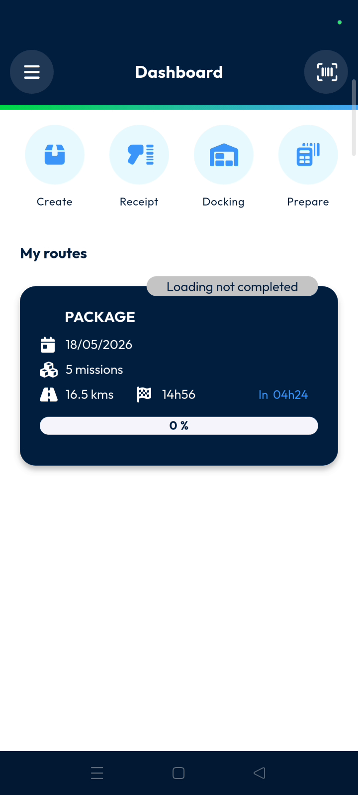
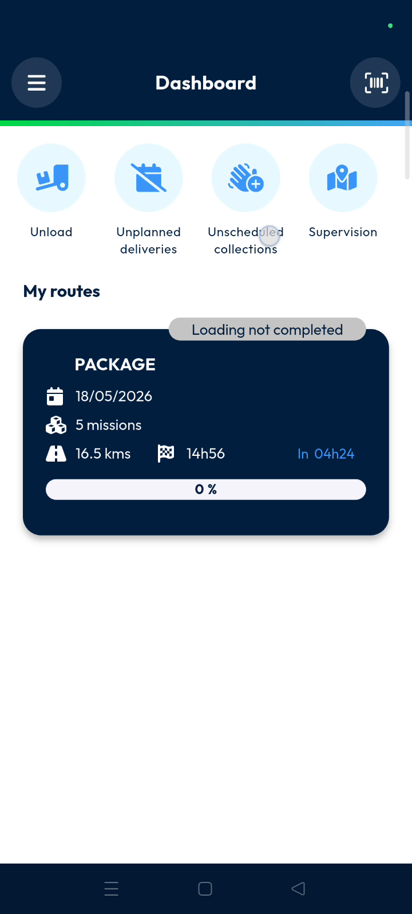
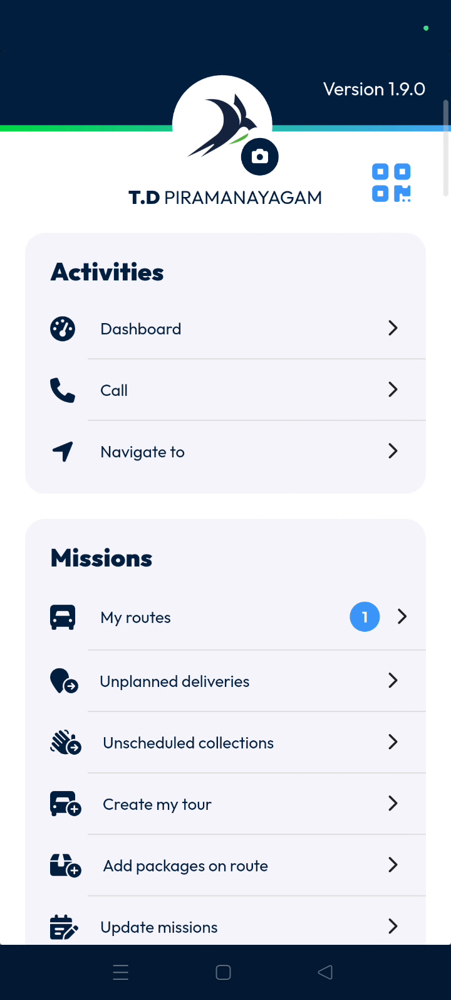

# mobile\_dashboard.

## mobile\_dashboard

## mobile

The mobile dashboard provides real-time visibility into routes, machines, and loading activities. Users can manage operational actions and monitor delivery progress directly from their mobile devices. This feature ensures efficient workflow management for delivery personnel in the field.

#### Getting Started

Prerequisites:

* Nomadia Delivery mobile application installed.
* Active user account and login credentials.
* Assigned operational routes.

Steps:

1. Log in to the Nomadia Delivery mobile application.

2. View the **Dashboard** screen to see your current tasks.

#### Feature Overview

* **Create**: Generate operational actions directly within the mobile app.

* **Receipt**: Manage and track parcel receipt operations.

* **Docking**: Organize activities related to docking during operational workflows.

* **Prepare**: Set up parcels and machines before beginning delivery tasks.

* **Unload**: Handle unloading activities after completing a route.

* **Unplanned Deliveries**: Manage delivery tasks not included in the original route.

* **Unscheduled Collections**: Process collection activities that were not previously scheduled.

* **Supervision**: Access operational visibility and monitoring tools for delivery activities.

* **My Route**: View all routes currently assigned to your account.

* **Information Scan**: Scan parcels to retrieve details and verify operational information.

* **My Latest Action**: Review the most recent operational tasks and scanned machines.

* **Main Menu**: Open the side menu to access all application modules.

#### How To: Track and Manage Routes

1. Open the **My Route** section from the dashboard.

2. Locate the specific **Route Card** for your current assignment.
3. Check the **Loading status** to verify if parcels are ready.

4. Review the **Route progress** bar to see completion status.
5. Monitor the **Total kilometers** and **Total work duration** for the route.

#### How To: Scan Parcels for Verification

1. Tap the **Information scan** icon at the top right corner.

2. Point the camera at the parcel barcode to scan it.
3. Verify the **Parcel details** that appear on the screen.

#### How To: Review Recent Activity

1. Scroll to the **My Latest Action** section on the dashboard.
2. Identify the **Scanned machines** and mission information.
3. Note the **Scanned date and time** for each action.

#### Productivity Tips

* 💡 **Instant Verification**: Use the **Information scan** to quickly verify parcel details without searching menus.
* 💡 **Progress Tracking**: Monitor the **Route progress** bar to stay on schedule during deliveries.
* ⚠️ **Loading Accuracy**: Always check the **Loading status** to ensure parcels aren't "partially loaded" before departure.
