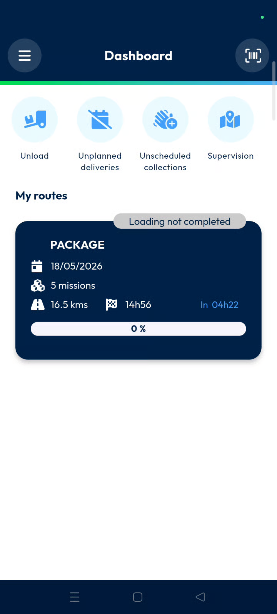
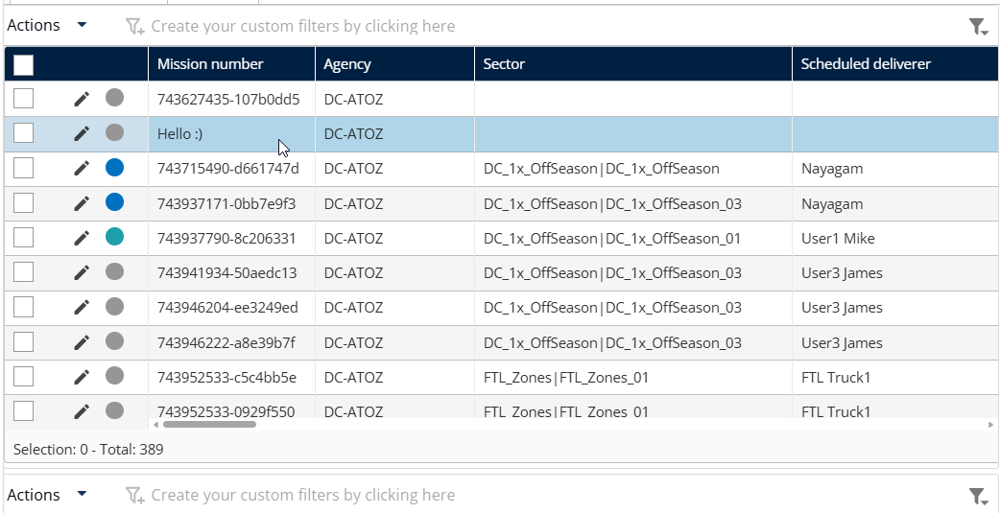

# Create a Mission

Create pickup or delivery missions directly on mobile devices without using the back office. This feature allows drivers and operators to manage new assignments on the go. Mobile missions synchronize instantly with the back office for immediate processing.

#### Getting Started

* Active Nomadia Delivery mobile application.
* Mobile device with a working camera for barcode scanning.
* Proper permissions to access the mobile dashboard.
* Open the **Nomadia Delivery** mobile app on your device.
* Navigate to the mobile dashboard screen.

#### Feature Overview

* **Quick Access:** A dedicated section that provides shortcuts to frequently used tasks and features.

#### How To: Create a Mission

1. Navigate to the **Quick Access** section on the mobile dashboard.
2. Tap the **Create** button.

<figure><figcaption></figcaption></figure>

3. The Create Mission screen displays a list of available mission types. Select **Pickup Mission** to create a mission for collecting parcels from a specified location, or select **Delivery Mission** to create a mission for delivering parcels to a customer destination. Once the appropriate mission type is selected, the application opens the corresponding mission creation form where the required details can be entered.

<figure><figcaption></figcaption></figure>

4. When the instruction popup appears, review the information provided on the screen. After confirming that you understand the instructions, tap _I Understand_ to acknowledge the message and continue with the operation.

<figure><figcaption></figcaption></figure>

5. Tap the **Barcode scanner** at the bottom scan a barcode or enter it manually.
6. Set the mission location by selecting **Search for an address around me** or **My current location**.
7. Tap New address to enter the address

<figure><figcaption></figcaption></figure>

6. Enter the Designation, Valid address
7. Tap the Save button

<figure><figcaption></figcaption></figure>

6. Choose the **Type of container** and **Type of product**.
7. Enter the package **Weight**, **Length**, **Width**, **Height**, and **Volume**.

9. Tap the **Save** button.
10. Tap the **Tick mark** to finish the information entry.
11. Tap **Confirm** on the final confirmation popup.

<figure><figcaption></figcaption></figure>

#### Verify Mission Creation

Once the mission is successfully created:

* The mission becomes available in the system.
* The mission is synchronized with the back office.
* The newly created mission can be processed like any other operational mission.

<figure><figcaption></figcaption></figure>

This completes the Create Mission process.

#### Productivity Tips

* 💡 **Manual Entry**: You can manually type a barcode if the camera cannot read a label.
* 💡 **Address Shortcuts**: Select **Previous Address** to reuse the last selected address, making it faster to create multiple missions for the same location.
* 💡 **Instant Synchronization**: Created missions are immediately available to the back office for management.
