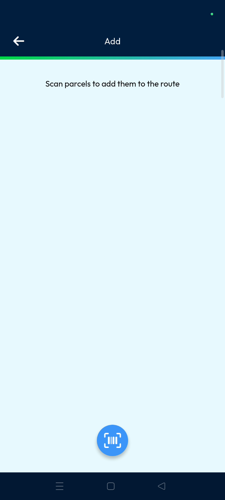
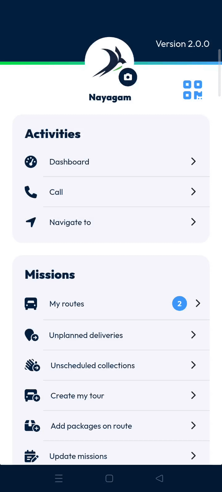
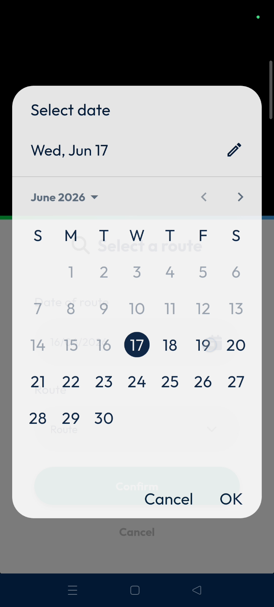
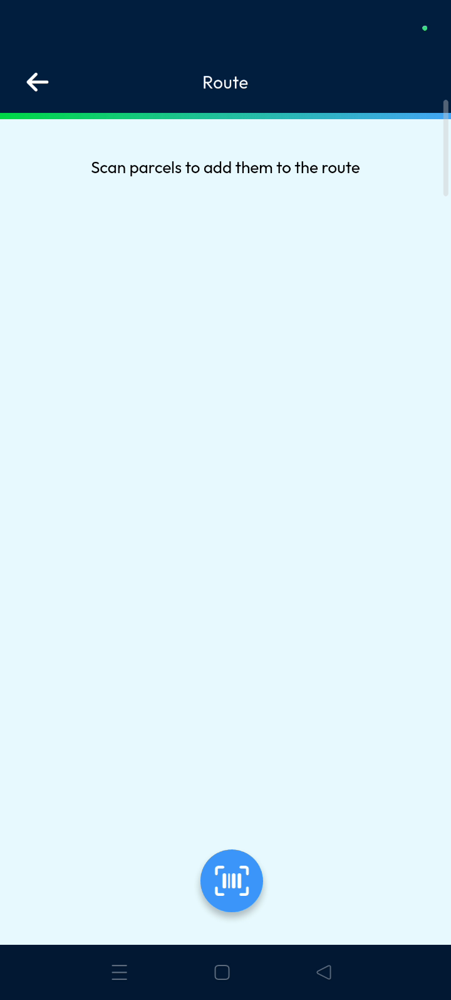
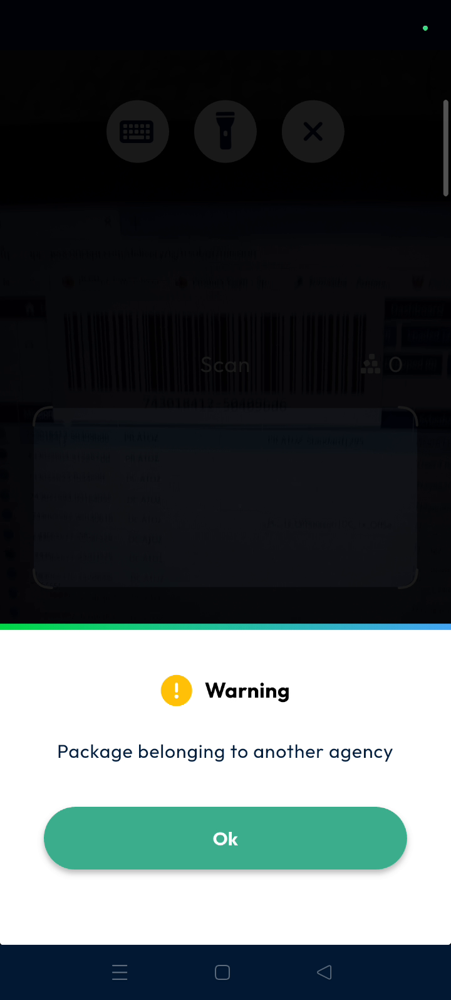

# add_packages_on_route
# mobile

The Add Packages on Route feature allows you to quickly integrate new parcels into an existing delivery schedule. This ensures your drivers have updated workloads without manual paperwork. Achieve better route efficiency and real-time package tracking directly from the mobile interface.

### Getting Started

*   Active driver or dispatcher account.
*   Packages with valid barcodes for scanning.

1. Access the main actions menu on your device.

2. Locate and select the tool to modify existing routes.

### Feature Overview

*   **Add packages on route**: Found in main actions to start the process.

*   **Calendar icon**: Opens the date selector for route filtering.

*   **Route dropdown**: Displays available routes for the selected date.

*   **Barcode scanner**: Activates the camera to identify individual parcels.

*   **Order my parcels**: Toggle to automatically organize the sequence of deliveries.

### How To: Add a Package to an Existing Route

1. Scroll down from the main actions and tap **Add packages on route**,.

2. Tap the **Calendar icon** to choose the date,.

3. Select the correct date and tap **OK**,.

4. Choose the specific route from the dropdown and tap **Confirm**,.

5. Tap the **Barcode scanner** and scan the package,.

6. Tap the package in the list and then tap **Export** to proceed,.

7. Tap the **Tick mark** to finalize the scanning phase,.

8. Review the validation pop-up,.

9. Toggle **Order my parcels** if needed and tap **Confirm**,.

#### Troubleshooting

*   If the package belongs to another agency, a warning appears,. Tap **OK** to continue.

### Productivity Tips

*   💡 **Automatic Sequencing**: Toggle the **Order my parcels** option to let the system optimize your delivery order,.
*   ⚠️ **Cross-Agency Handling**: Be aware that scanning packages from different agencies triggers a warning that requires manual confirmation,.

