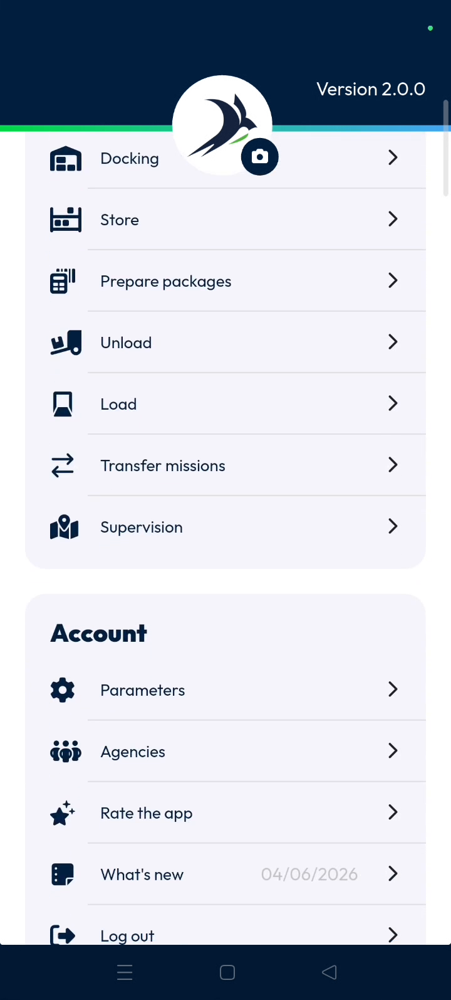
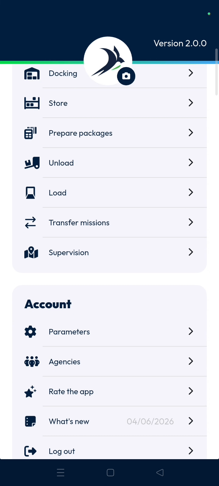
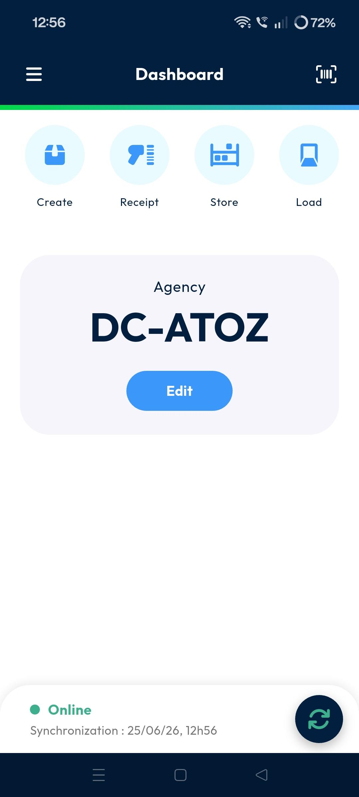

# Agencies

The agencies feature allows you to manage different operational hubs within Nomadia Delivery. It ensures your display shows data specific to a chosen location. Selecting an agency updates your dashboard with the relevant information for that site.

#### Getting Started

* Mobile device with Nomadia Delivery app installed.
* Active user account with agency access permissions.
* Open the **Main actions menu**.
* Tap **Agencies**

#### Feature Overview

* **Agencies**: This screen displays a list of all available locations for selection.
* **Dashboard**: This interface displays the name of the agency you have currently selected.

#### How To: Select an Agency

1. Open the **Main actions menu**.
2. Scroll down through the menu options.
3. Tap on **Agencies**.

4. Select an agency name from the list.

5. View the updated agency name on the **Dashboard**.

<figure><figcaption></figcaption></figure>

