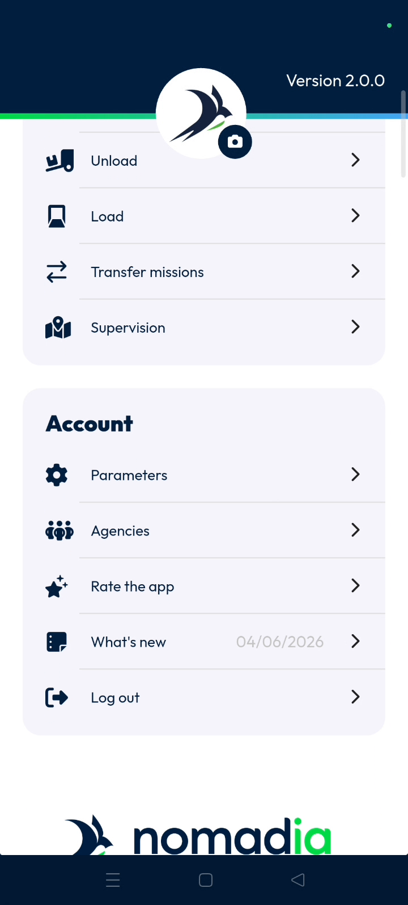
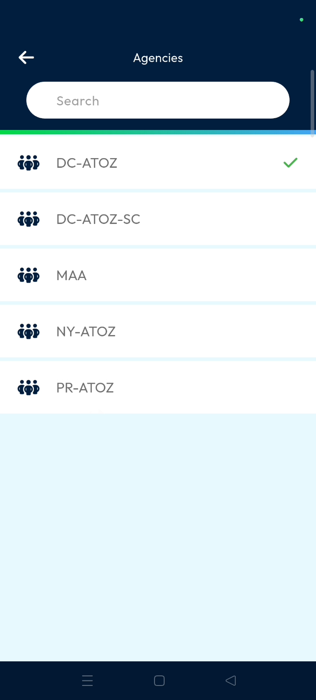
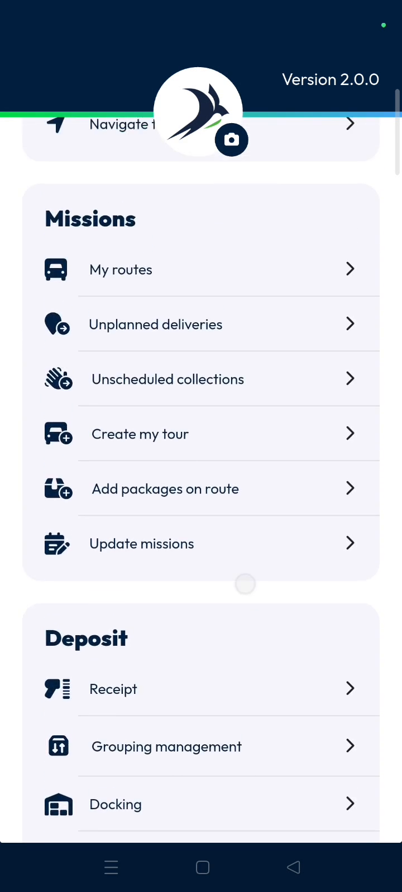

# agencies
# mobile

The agencies feature allows you to manage different operational hubs within Nomadia Delivery. It ensures your display shows data specific to a chosen location. Selecting an agency updates your dashboard with the relevant information for that site.

### Getting Started
*   Mobile device with Nomadia Delivery app installed.
*   Active user account with agency access permissions.

1. Open the **Main actions menu**.

### Feature Overview
*   **Agencies**: This screen displays a list of all available locations for selection.

*   **Dashboard**: This interface displays the name of the agency you have currently selected.

### How To: Select an Agency
1. Open the **Main actions menu**.

2. Scroll down through the menu options.

3. Tap on **Agencies**.

4. Select an agency name from the list.

5. View the updated agency name on the **Dashboard**.

### Productivity Tips
(The provided source material does not contain specific productivity tips or warnings.)

