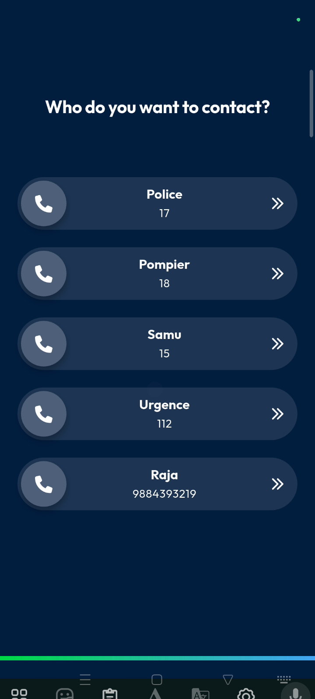
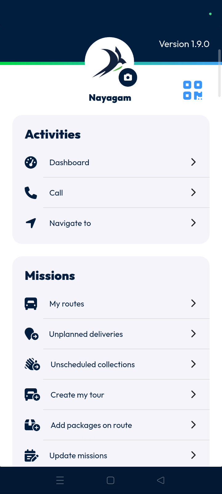
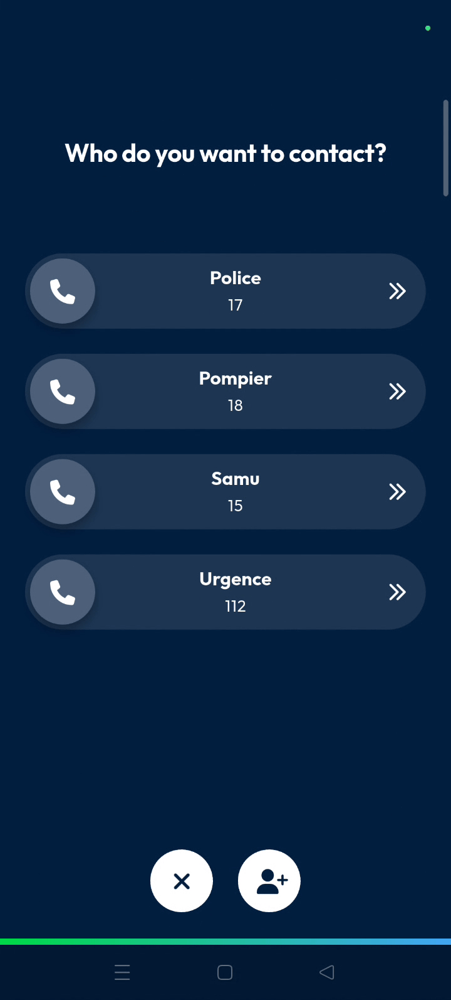
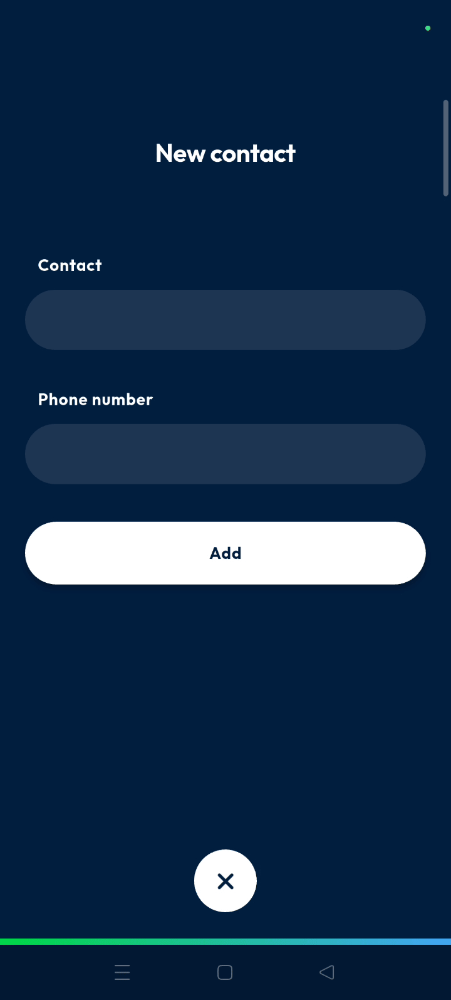
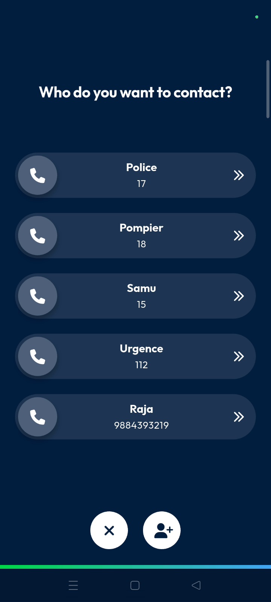

# call
# mobile
The contact management feature allows you to access and update your list of essential phone numbers. It ensures quick access to key contacts while you are in the field.

### Getting Started
*   Mobile device with **Nomadia Delivery** app installed.
*   Active user account.
1. Open the application to the **Main Action Screen**.

### Feature Overview
*   **Call Icon**: Opens the contact list for quick communication.

*   **Contact Page**: Displays all previously configured phone numbers.

*   **Plus Icon**: Opens the form to create a new contact.

*   **Add Button**: Saves the new contact details to your list.

*   **X Icon**: Returns you to the main interface.

### How To: Add a New Contact
1. Tap the **Call Icon** on the **Main Action Screen**.

2. Tap the **Plus Icon** at the bottom of the screen.

3. Enter the contact name in the **Name** box.
4. Enter the phone number in the **Phone Number** box.

5. Tap **Add** to save the information.

6. Tap the **X Icon** at the bottom to return to the **Main Action Screen**.

### Productivity Tips
- 💡 **Quick Access**: Configured numbers allow for fast communication with important contacts.
- 💡 **Future Use**: Saved contacts remain in your list for all future tasks.

