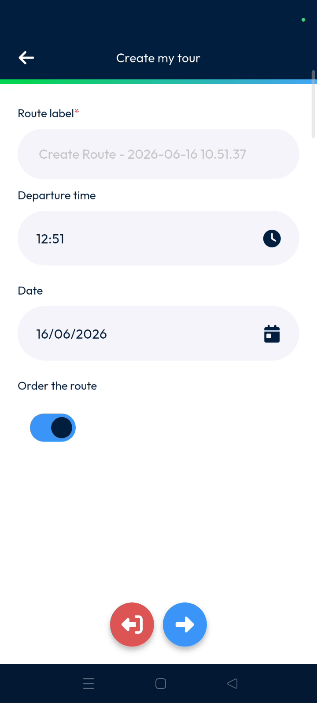
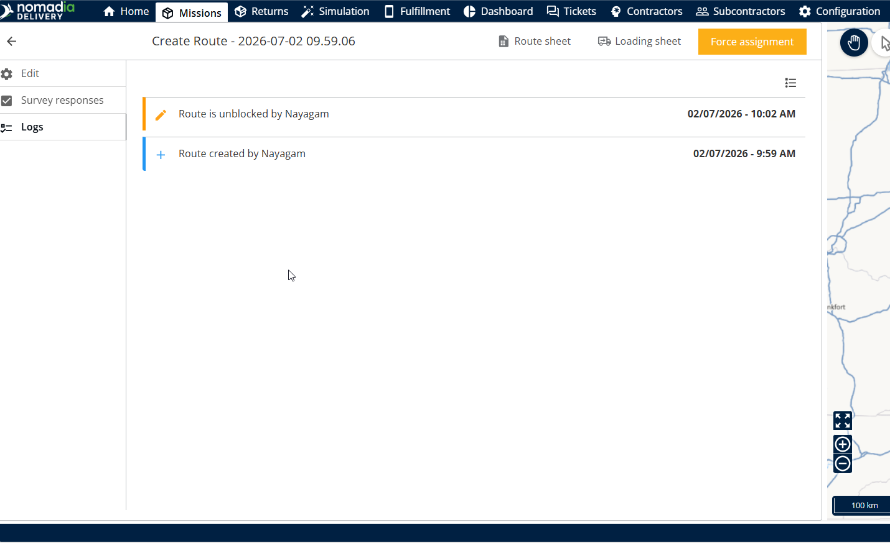

# Create my Tour

The Create My Tour feature allows mobile users to manually build and prioritize specific delivery routes directly within the mobile application. Users can define departure times, scan package barcodes, and confirm route creation in real-time; this ensures fleet activities are accurately captured and organized for daily operations.

#### Getting Started

* Access to the mobile application.
* Scanning hardware or integrated camera for barcodes.
* Open the **missions** section from the main actions menu.&#x20;
* Tap on **create my tool** to start the process.

<figure><figcaption></figcaption></figure>

#### Feature Overview

* **Route label**: Displays the unique identifier for the current route,.
* **Departure time**: Shows the scheduled start time for the delivery tour,.
* **Clock icon**: Opens the time selection interface,.
* **Calendar icon**: Opens the date picker for scheduling,.
* **Order the route**: Toggle used to prioritize the specific route path,.
* **Scan**: Activates the scanner to register package barcodes,.

#### How To: Create a Route

1. Tap on **create my tour** in the **missions** menu.&#x20;
2. Enter a **Route label**.&#x20;
3. Tap the **Clock icon** next to the time,.
4. Select the time and tap **OK**,.

4. Tap the **Calendar icon** next to the date,.
5. Select the date and tap **OK**,.

6. Adjust the **order the route** toggle to optimize your path,.
7. Tap the **next icon** at the bottom of the screen,.
8. Tap **scan** to scan the package barcode,.
9. Tap **next** once scanning is complete,.
10. Tap the **tick mark.**

<figure><figcaption></figcaption></figure>

11. Tap **confirm** on the confirmation pop-up.

<figure><figcaption></figcaption></figure>

12. Route has been created successfully.&#x20;

<figure><figcaption></figcaption></figure>

#### Productivity Tips

* 💡 **Route Prioritization**: Toggle the **order the route** option to prioritize the specific path you are taking,.
