# createamission
# mobile

Create pickup or delivery missions directly on mobile devices without using the back office. This feature allows drivers and operators to manage new assignments on the go. Mobile missions synchronize instantly with the back office for immediate processing.

### Getting Started

*   Active Nomadia Delivery mobile application.
*   Mobile device with a working camera for barcode scanning.
*   Proper permissions to access the mobile dashboard.

1. Open the **Nomadia Delivery** mobile app on your device.
2. Navigate to the mobile dashboard screen.

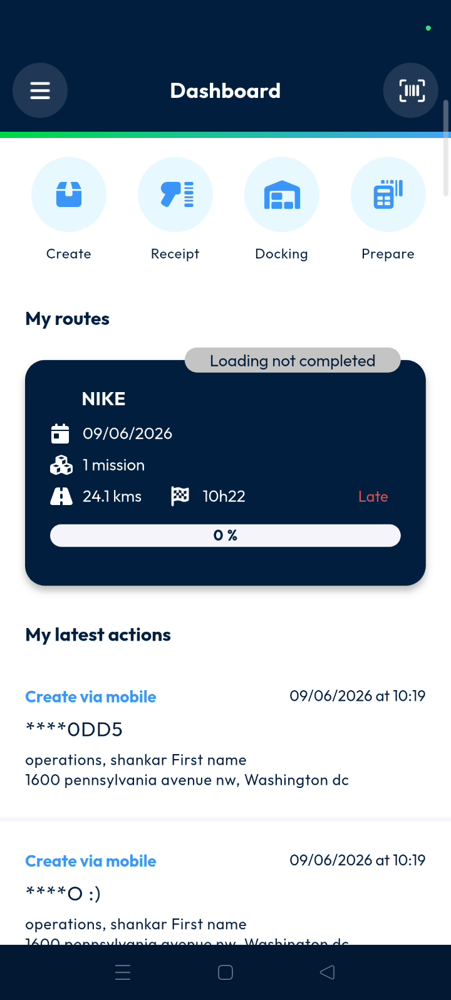

### Feature Overview

*   **Quick Access**: A dashboard section for starting frequent tasks quickly.

*   **Create**: The button used to initiate the mission setup process.

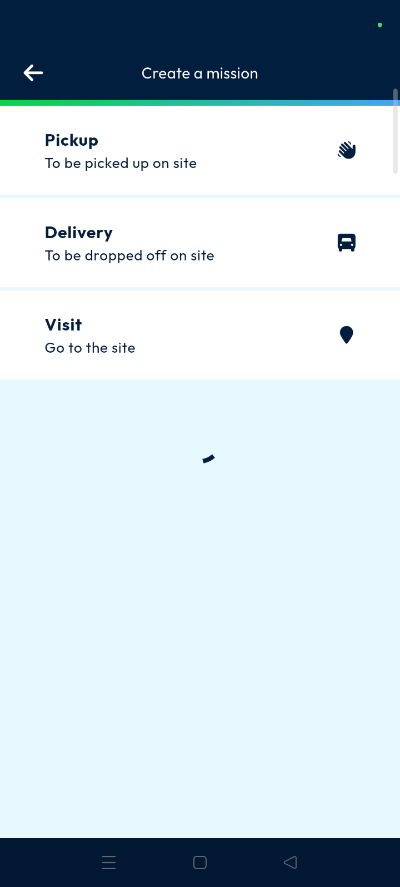

*   **QR code scanner**: A tool that uses the device camera to capture barcode information.

### How To: Create a Mission

1. Navigate to the **Quick Access** section on the mobile dashboard.

2. Tap the **Create** button.

3. Select **Pickup mission** or **Delivery mission** from the list.

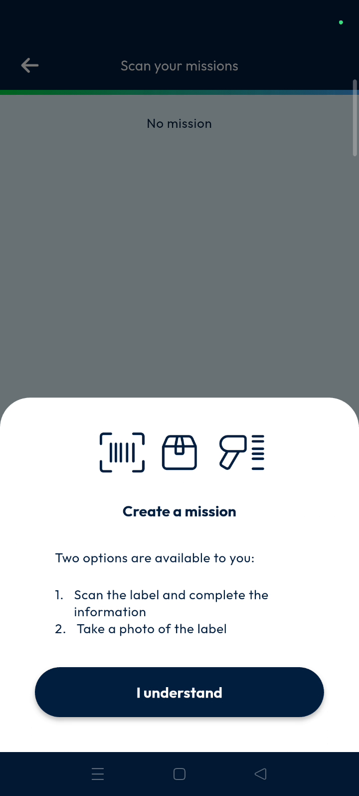

4. Tap **I understand** on the instruction popup.

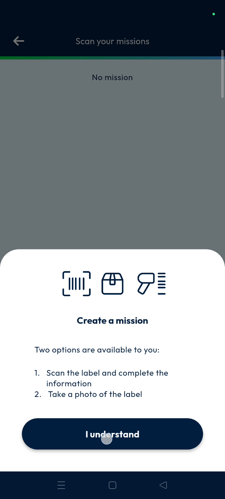

5. Tap the **QR code scanner** to scan a barcode or enter it manually.

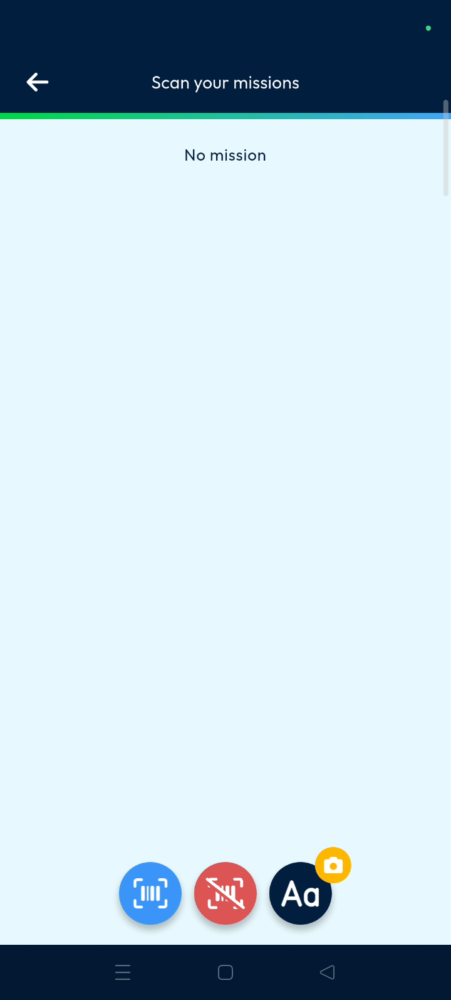

6. Set the mission location by selecting **Search for an address around me** or **My current location**.

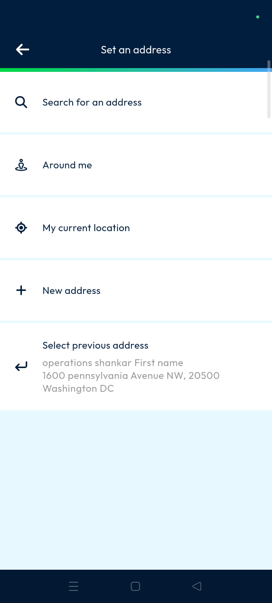

7. Choose the **Type of container** and **Type of product**.

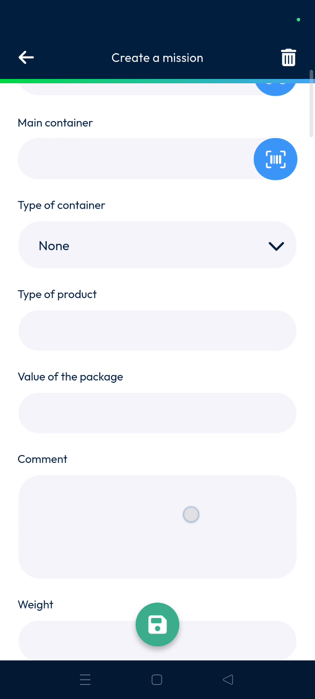

8. Enter the package **Weight**, **Length**, **Width**, **Height**, and **Volume**.

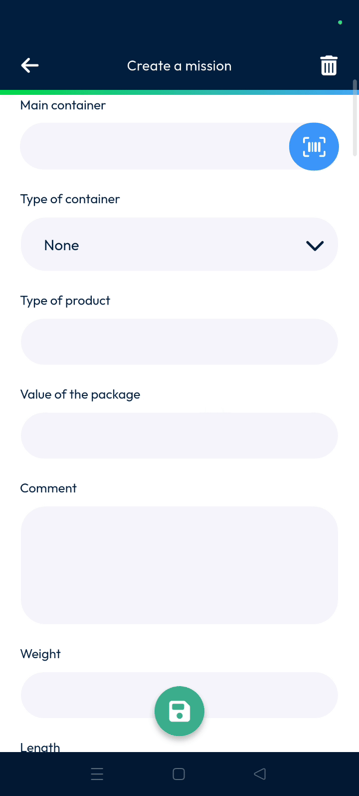

9. Tap the **Save** button.

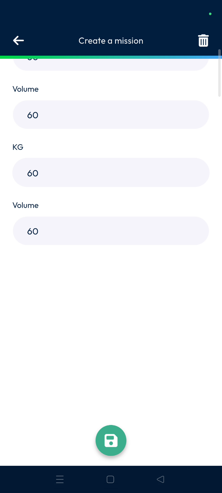

10. Tap the **Tick mark** to finish the information entry.

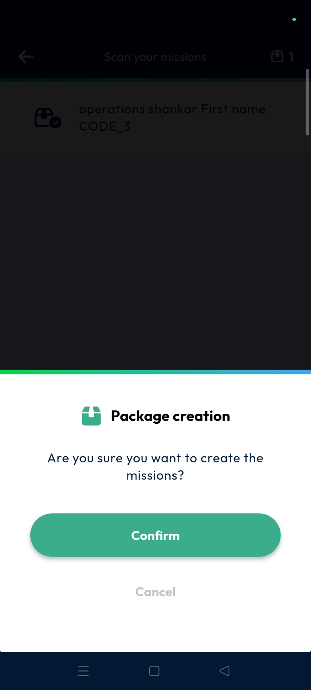

11. Tap **Confirm** on the final confirmation popup.

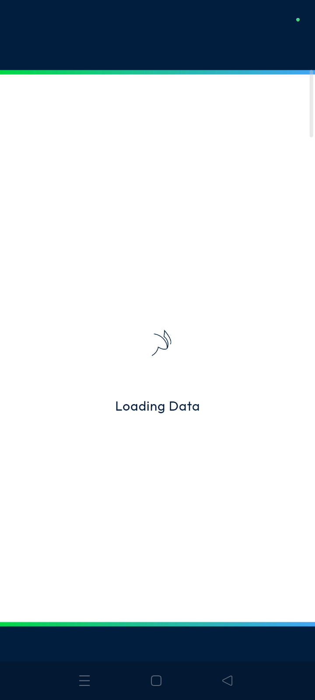

### Productivity Tips

- 💡 **Manual Entry**: You can manually type a barcode if the camera cannot read a label.
- 💡 **Address Shortcuts**: Select a **Previous address** to quickly set locations for returning customers.
- 💡 **Instant Synchronization**: Created missions are immediately available to the back office for management.

