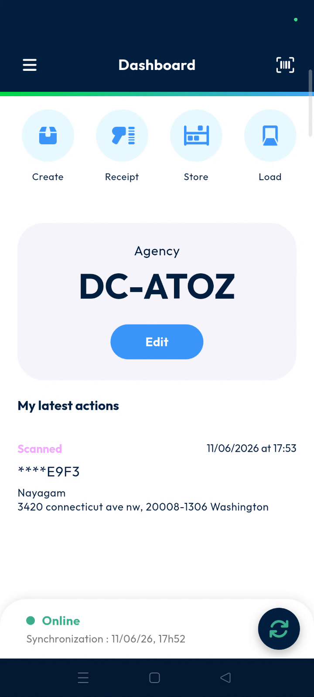
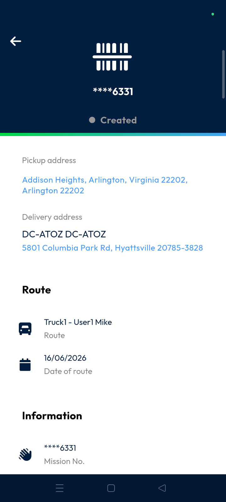

# dashboard
# dashboard

The **dashboard** provides immediate access to your essential daily operational tools, including agency management, barcode scanning, and data synchronization. Use this screen to ensure you are working with the correct agency and have the most up-to-date information from the back office.

### Getting Started

To use the **dashboard**, you must meet the following requirements:
*   A mobile device with an integrated camera.
*   Valid login credentials for the **Nomadia Delivery** application.
*   An active internet connection for initial data synchronization.

1. Log in to the application.

### Feature Overview

*   **Agency selection**: Displays agencies associated with your account and allows you to switch between them.

*   **Information scan**: Uses the device camera to retrieve details about parcels, machines, or activities via barcodes.

*   **Online synchronization**: Monitors the connection between the mobile app and the back-office system.

### How To: Select an Agency

1. View the **Agency selection** pop-up that appears if you have multiple agencies.

2. Select the required agency from the list.

3. Confirm the **dashboard** refreshes to display the active agency.

### How To: Scan a Barcode

1. Tap **information scan**.

2. Point the device camera at the barcode.
3. Review the parcel or activity details displayed on the screen.

### How To: Synchronize Data

1. Locate the **Online synchronization** section to review your current status.

2. Tap the **Refresh** button.

3. Verify the **last synchronized timestamp** updates to the current time.

### Productivity Tips

- 💡 **Latest Updates**: Use the **Refresh** button regularly to download the newest data from the back office.
- 💡 **Instant Information**: Use the **information scan** to quickly access details about machines or operational activities without manual searching.

