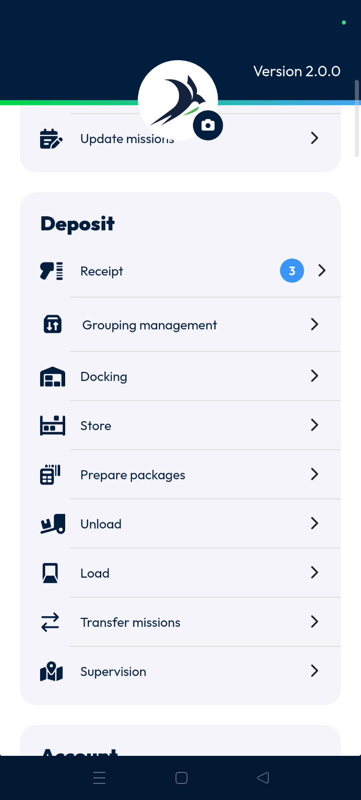
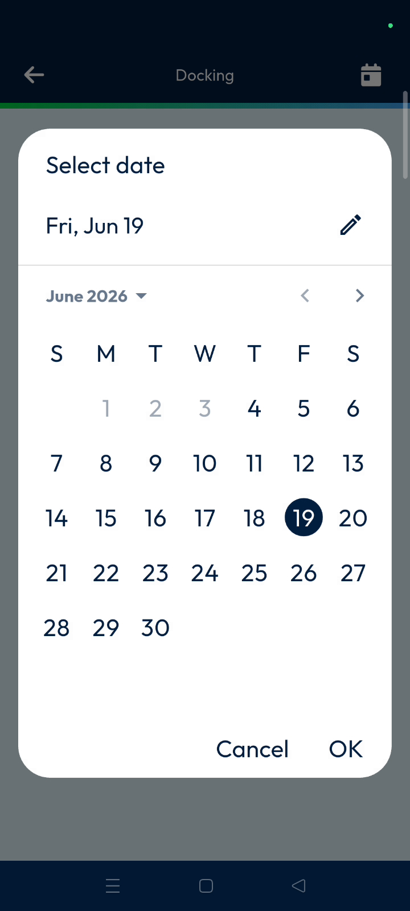
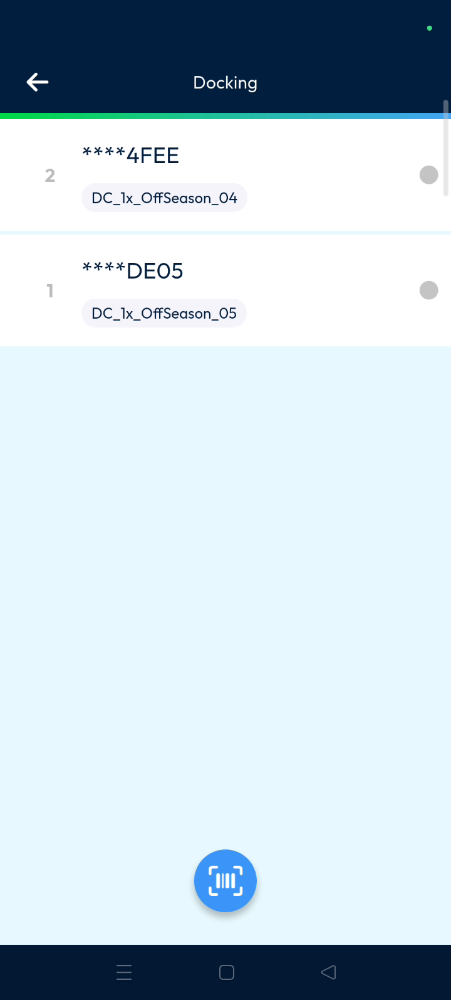
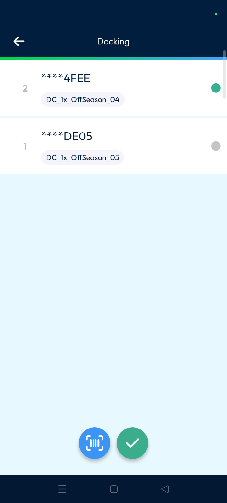
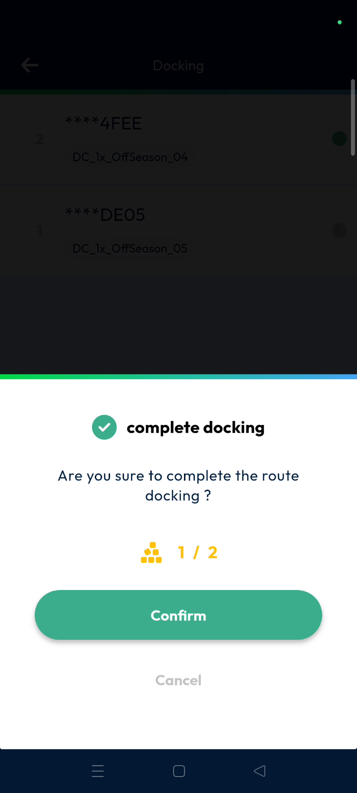
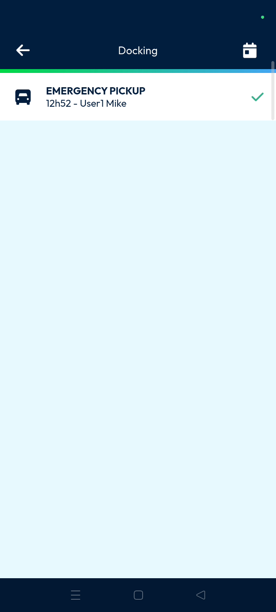

# docking
# mobile

Docking prepares packages before loading them onto delivery routes. This feature ensures parcels are correctly assigned to a specific route for a particular day. It streamlines the logistics workflow by organizing inventory before it leaves the warehouse.

### Getting Started

*   Mobile device with the Nomadia Delivery app installed.
*   Access to the **Main Actions** menu.
*   Parcels with scannable barcodes.

1. Open the Nomadia Delivery app to the **Main Actions** screen.

2. Tap on **Docking**.

### Feature Overview

*   **Calendar Icon**: Use this to filter and select routes for a specific day.

*   **Barcode Scanner**: Activate this tool to scan parcel identifiers for docking.

*   **Green Small Circle**: This indicator confirms that a parcel has been successfully scanned and docked.

*   **Tick Mark**: Tap this icon to finalize the scanning session for a route.

*   **To Be Loaded Status**: Monitor this status in the back office to track progress.

### How To: Dock Parcels for a Route

1. Tap on **Docking** from the main actions.

2. Tap the **Calendar Icon** at the top right corner.

3. Select the desired date and tap **OK**.

4. Tap the specific **Route** you wish to process.

5. Tap the **Barcode Scanner** icon.

6. Scan the parcel barcodes.

7. Verify the **Green Small Circle** appears on the right side of the parcel.

8. Tap the **Tick Mark**.

9. Tap **Confirm** on the pop-up asking to complete the route docking.

### Productivity Tips

*   💡 **Back Office Verification**: View the docking status in the **Machine Logs** to confirm completion from the office.
*   ⚠️ **Status Checks**: Tap the **To Be Loaded Status** in the back office to ensure all items are accounted for.

