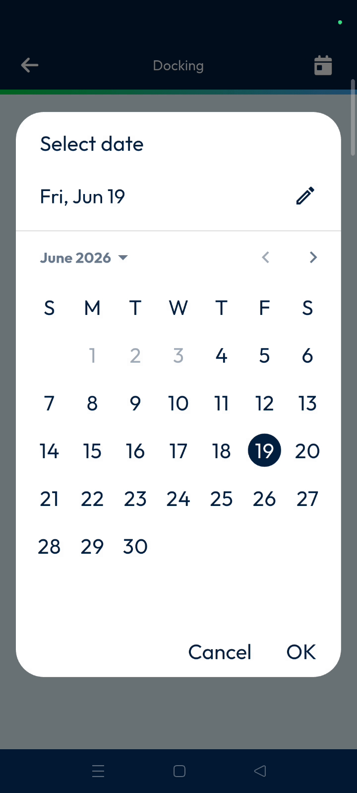
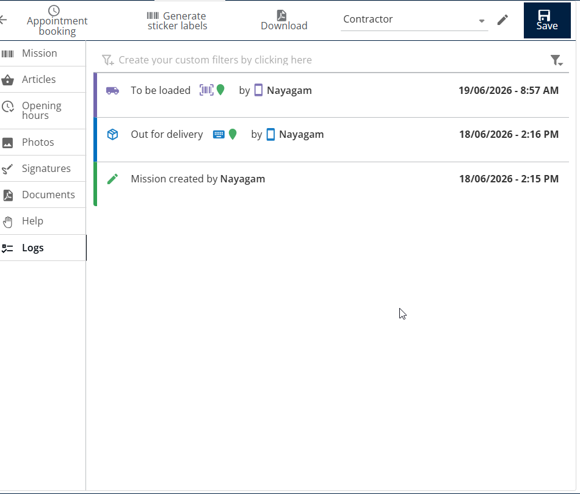

# Docking

Docking prepares packages before loading them onto delivery routes. This feature ensures parcels are correctly assigned to a specific route for a particular day. It streamlines the logistics workflow by organizing inventory before it leaves the warehouse.

#### Getting Started

* Mobile device with the Nomadia Delivery app installed.
* Access to the **Main Actions** menu.
* Parcels with scannable barcodes.
* Open the Nomadia Delivery app to the **Main Actions** screen.
* Tap on **Docking**.

#### Feature Overview

* **Calendar Icon**: Use this to filter and select routes for a specific day.
* **Barcode Scanner**: Activate this tool to scan parcel identifiers for docking.
* **Green Small Circle**: This indicator confirms that a parcel has been successfully scanned and docked.
* **To Be Loaded Status**: Monitor this status in the back office to track progress.

#### How To: Dock Parcels for a Route

1. Tap on **Docking** from the main actions.
2. Tap the **Calendar Icon** at the top right corner.
3. Select the desired date and tap **OK**.

4. Tap the specific **Route** you wish to process.
5. Tap the **Barcode Scanner** icon.

6. Scan the parcel barcodes.
7. Verify the **Green Small Circle** appears on the right side of the parcel.
8. Tap the **Tick Mark**.

9. Tap **Confirm** on the pop-up asking to complete the route docking.

#### Productivity Tips

* 💡 **Back Office Verification**: View the docking status in the **Missions Logs** to confirm completion from the office.

<figure><figcaption></figcaption></figure>
