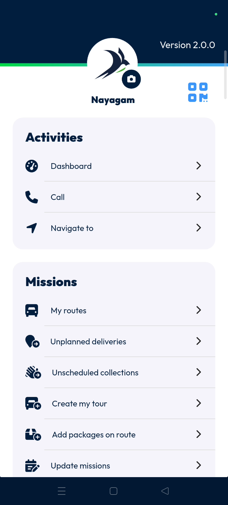
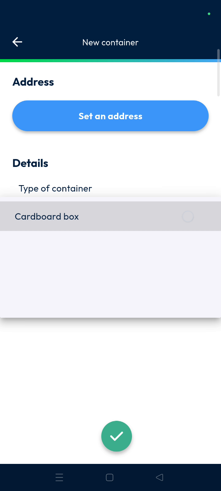
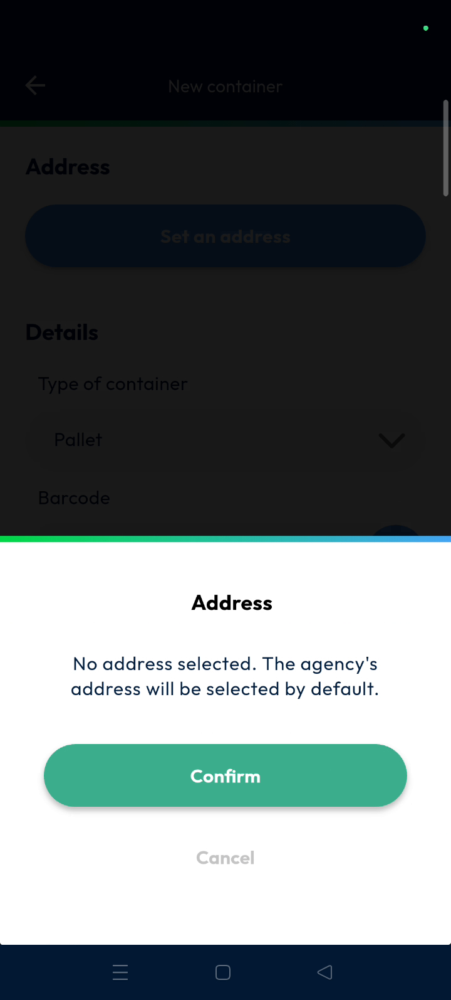
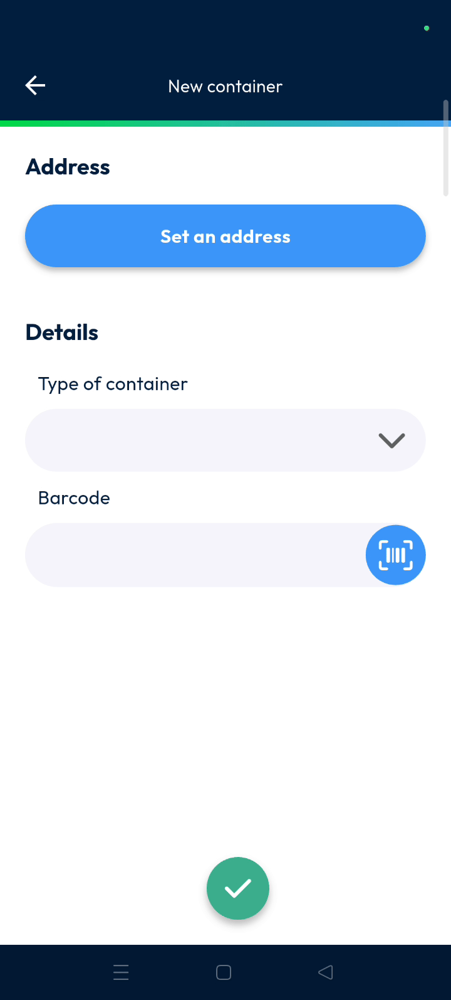
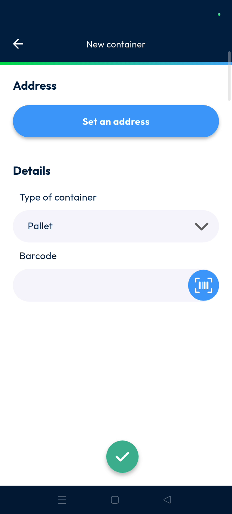

# group_management
# mobile

Group management allows multiple processes or machines to be grouped together inside a container, pallet, or transport unit. This feature helps dispatchers organize items into single entities for easier transport tracking. Users can complete the grouping process quickly by scanning items and assigning them to specific containers.

### Getting Started

*   Prerequisites: Ensure the **can aggregate several machines** setting is enabled for your container types.
*   System Requirements: Access to the **Main actions** menu in the mobile application.

1.  From the **Main actions** screen, scroll down to find the management options.

    

2.  Tap on **Group Management** to open the feature.

    

### Feature Overview

*   **Barcode Scanner**: Use this tool at the bottom of the screen to identify machines.

    

*   **Set an Address**: This field allows you to assign a destination to the container.

    

*   **Type of Container**: This dropdown menu provides options like **Pallet**, **Parcel**, or **Parts**.

    

*   **Confirm**: Use this button to finalize the group and complete the process.

    

### How To: Create a Machine Group

1.  Open the **Group Management** page from the main menu.

    

2.  Tap the scan icon to scan the first machine.

    

3.  Tap and scan additional machines to add them to the same group.

    

4.  Tap the tick mark once all machines are scanned.

    

5.  Tap **Set an Address** on the **New Container** page.

    

6.  Search for an address or tap **Around Me** to use your current location.

    

7.  Tap **Type of Container** and select the appropriate unit from the menu.

    

8.  Scan the container **Barcode** or tap the tick mark to proceed.

    

9.  Tap **Confirm** to complete the grouping.

    

#### Troubleshooting
*   If you see a "No address selected" popup, the system will use the **Agency of Address** by default.

    

### Productivity Tips

*   💡 **Quick Location**: Use the **Around Me** button to quickly set the address to your current GPS position.
*   ⚠️ **Container Settings**: You must enable **can aggregate several machines** in settings or container types will not be selectable.

