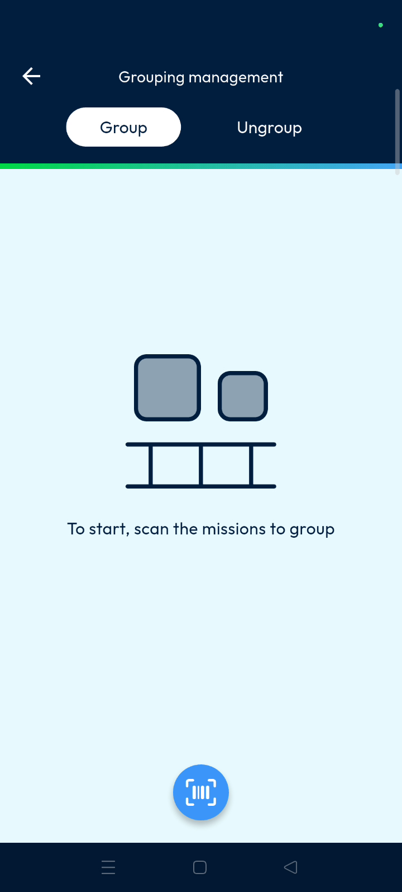
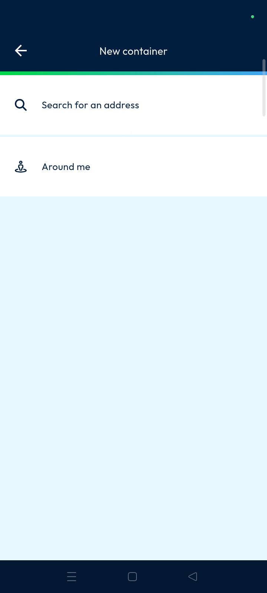
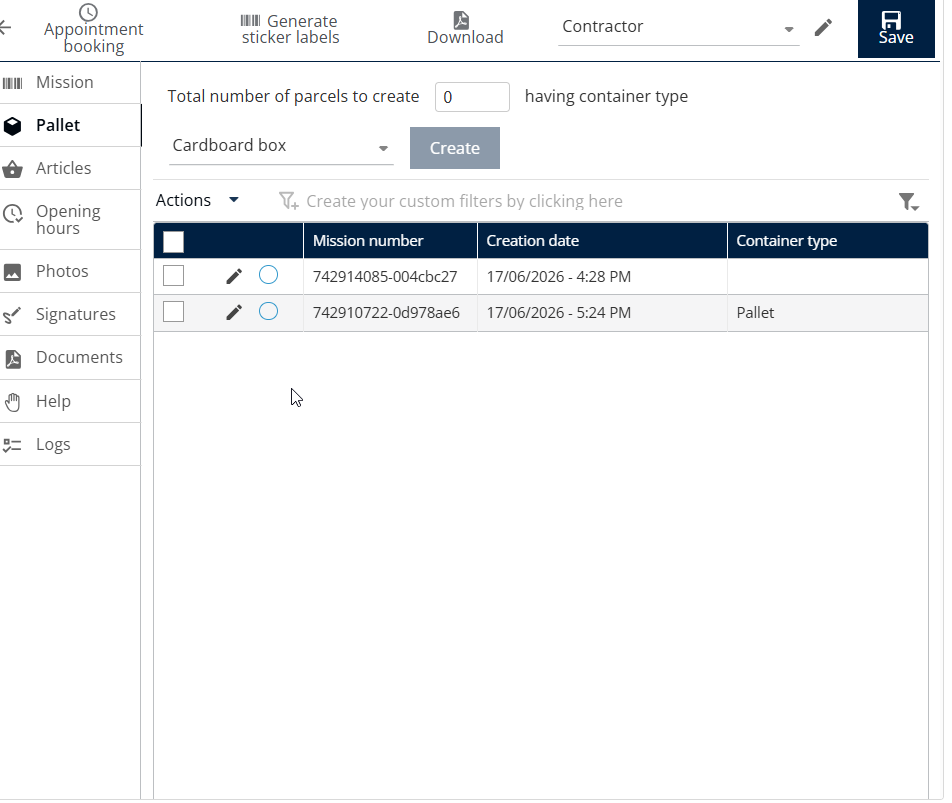
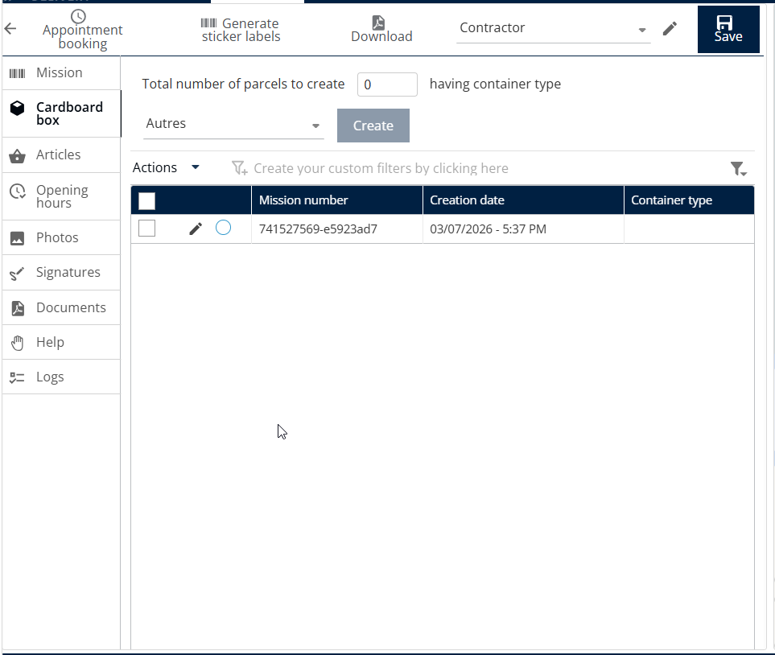

# Group Management

Group management allows multiple processes or missions to be grouped together inside a container, pallet, or transport unit. This feature helps dispatchers organize items into single entities for easier transport tracking. Users can complete the grouping process quickly by scanning items and assigning them to specific containers.

#### Getting Started

* Prerequisites: Ensure the **can aggregate several missions** setting is enabled for your container types.
* System Requirements: Access to the **Main actions** menu in the mobile application.
* From the **Main actions** screen, scroll down to find the management options.
* Tap on **Group Management** to open the feature.

<figure><figcaption></figcaption></figure>

#### Feature Overview

* **Barcode Scanner**: Use this tool at the bottom of the screen to identify machines.
* **Set an Address**: This field allows you to assign a destination to the container.
* **Type of Container**: This dropdown menu provides options like **Pallet**, **Parcel**, or **Parts**.

#### How To: Create a Machine Group

1. Open the **Group Management** page from the main menu.
2. Tap the scan icon to scan the first missions.

3. Tap and scan additional machines to add them to the same group.

<figure><figcaption></figcaption></figure>

4. Tap the tick mark once all missions are scanned.
5. **Optional:** Set an address if you want to assign a different address to the container..

6. Search for an address from the global address list.

7. Tap **Type of Container** and select the appropriate unit from the menu.
8. Scan the container **Barcode** or tap the tick mark to proceed.

6. Tap **Confirm** to complete the grouping.

If you see a "No address selected" popup, the system will use the **Agency of Address** by default.

7. The selected missions are grouped into a container in the Back Office.

<figure><figcaption></figcaption></figure>

#### Ungroup a Child Mission

1. On the **Ungroup** page, tap the **Scan** icon for the container.

<figure><figcaption></figcaption></figure>

2. Select the child mission(s) to be ungrouped and tap the **Tick** icon.

<figure><figcaption></figcaption></figure>

3. Tap **Confirm** to proceed with the ungroup operation.
4. The selected mission(s) will be successfully removed from the group.
5. The updated mission status can be viewed in the Back Office.

<figure><figcaption></figcaption></figure>

#### Productivity Tips

* 💡 **Quick Location**: Use **Around Me** to filter addresses near your current GPS location.
* ⚠️ **Prerequisite Configuration**: Ensure that the **Can Aggregate Several Missions** option is enabled before creating child missions. This setting allows multiple missions to be grouped and managed as child missions within a single container.
