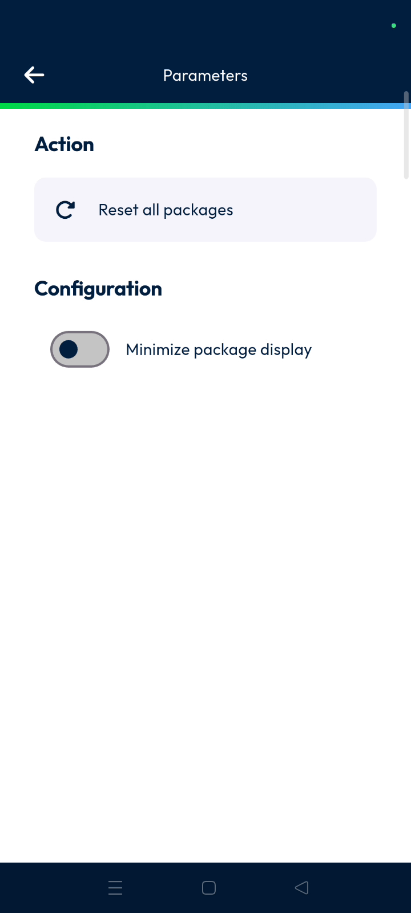
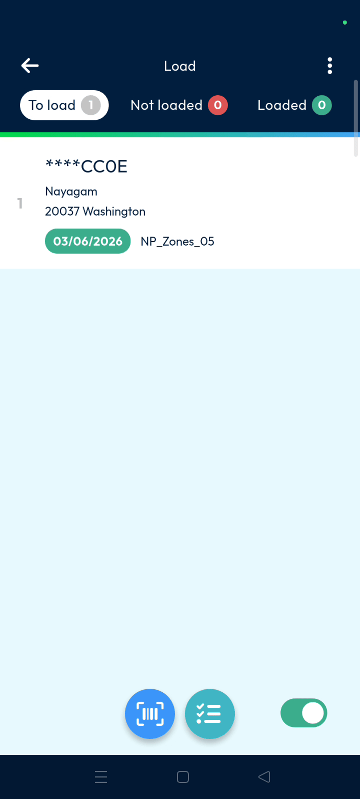
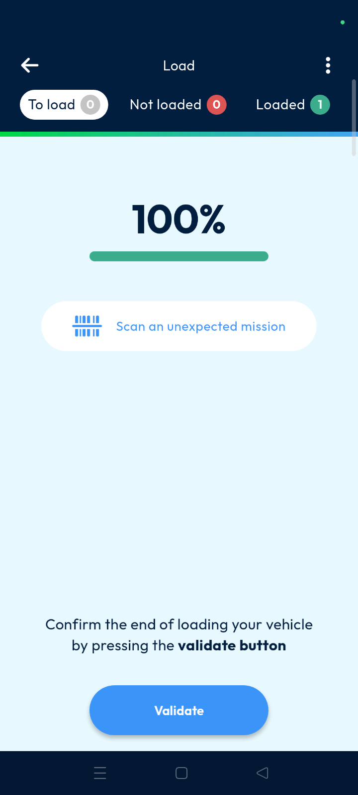

# mobile_loading
# mobile

The Nomadia Delivery mobile loading feature allows delivery users to manage parcel statuses and track loading activities. Users can verify parcels and machines before starting their routes to ensure efficient preparation. This workflow streamlines the transition from the warehouse to the vehicle.

### Getting Started

*   ND mobile application installed on the device.
*   An assigned route available in the application.

1.  Open the assigned route from the **Dashboard**.

2.  Select **Load my vehicle** to start the process.

### Feature Overview

*   **To Load**: Displays all parcels and machines pending loading.

*   **Not Loaded**: Lists parcels that are not yet inside the vehicle.

*   **Loaded**: Shows parcels that are successfully loaded into the vehicle.

*   **Sub-status Toggle**: Switches the view to verify loaded and pending parcels.

*   **Ellipse Menu**: Opens additional operation options in the top right corner.

### How To: Load Parcels via Scanning

1.  Access the scan functionality to load parcels quickly.

2.  Scan the parcel barcode to automatically update the loading status.

### How To: Load Parcels Manually

1.  Identify the parcel entry in the list if a physical scan is unavailable.
2.  Long press on the parcel entry to update the status manually.

### How To: Finish the Loading Workflow

1.  Verify all loaded parcels and machines in the list.
2.  Select **Validate** to confirm loading completion.

3.  Tap on **Confirm** when the pop-up asks to finish loading.

#### Troubleshooting: Unexpected Machines
If an unexpected parcel or machine is scanned, the application identifies it as an **Unexpected machine**.

### Productivity Tips

- 💡 **Reset Progress**: Use **Reset all packages** in the ellipse menu to clear all statuses and restart.
- 💡 **Cleaner View**: Use the **Configuration** option to minimize operation panels for a cleaner interface.
- ⚠️ **Scanning Issues**: Perform a manual scan via long press if the physical barcode scanner fails.

