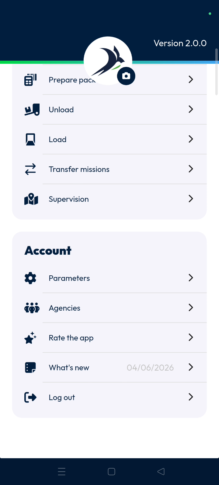
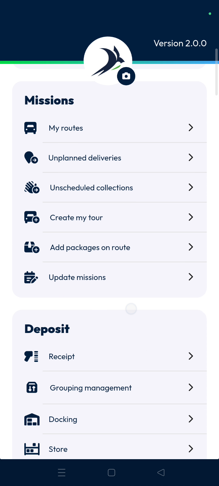

# logout
# mobile

The **Logout** feature allows you to securely terminate your current application session. Dispatchers and planners use this to exit the mobile interface and protect account data. Completing this process ensures your specific login is closed properly.

### Getting Started

*   Active login session on the **Nomadia Delivery** mobile application.
*   Access to the **Main Actions** menu.

1.  Open the application to the home screen.

2.  Access the **Main Actions** list.

    

### Feature Overview

*   **Logout**: A feature located at the bottom of the action list that ends the current session.

    

### How To: Log Out

1.  Open the **Main Actions** menu.

    

2.  Scroll down to the bottom of the list.

    

3.  Tap **Logout**.

    

### Productivity Tips

- 💡 **Session Termination**: Tapping **Logout** will immediately exit you from that particular login session.

