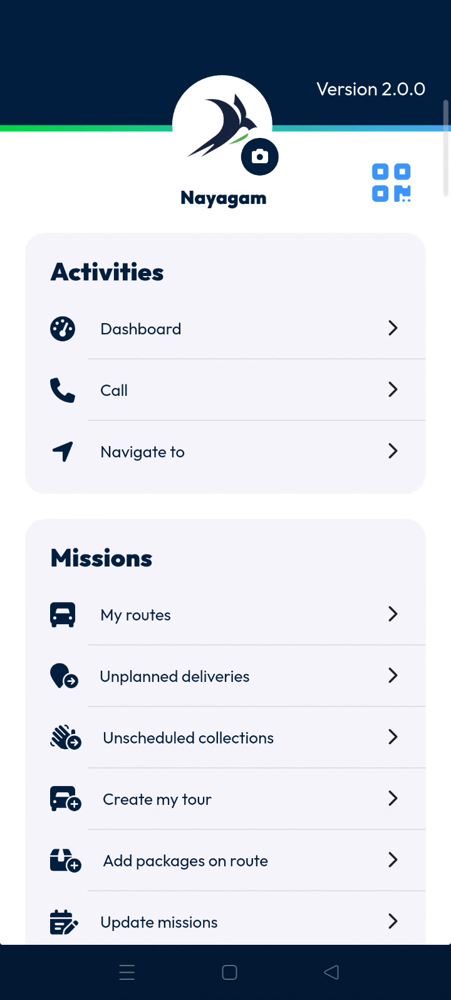

# Log out

The **Logout** feature allows you to securely terminate your current application session. Warehouse operators, dock agents & deliverers use this to exit the mobile interface and protect account data. Completing this process ensures your specific login is closed properly.

#### Getting Started

* Active login session on the **Nomadia Delivery** mobile application.
* Access to the **Main Actions** menu.
* Open the application to the home screen.
* Access the **Main Actions** list.

#### Feature Overview

* **Logout**: A feature located at the bottom of the action list that ends the current session.

#### How To: Log Out

1. Open the **Main Actions** menu.
2. Scroll down to the bottom of the list.
3. Tap **Logout**.

<figure><figcaption></figcaption></figure>

#### Productivity Tips

* 💡 **Session Termination**: Tapping **Logout** will immediately exit you from that particular login session.
