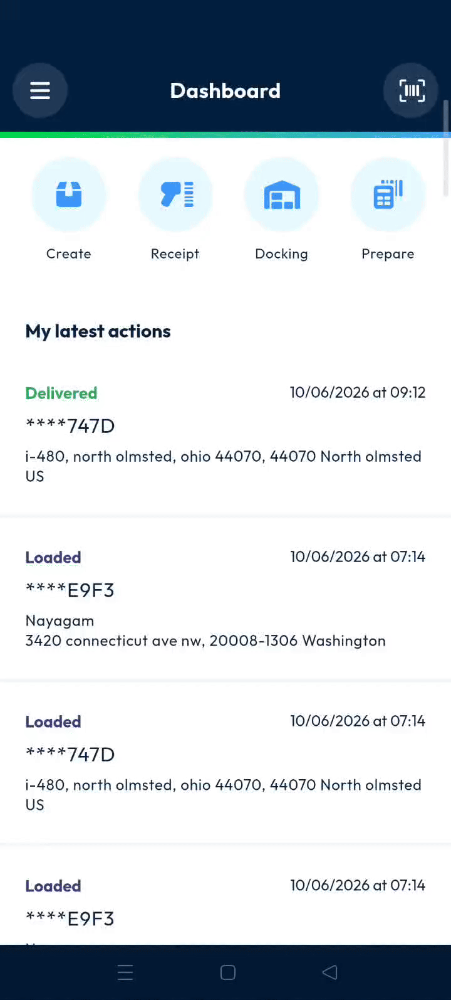
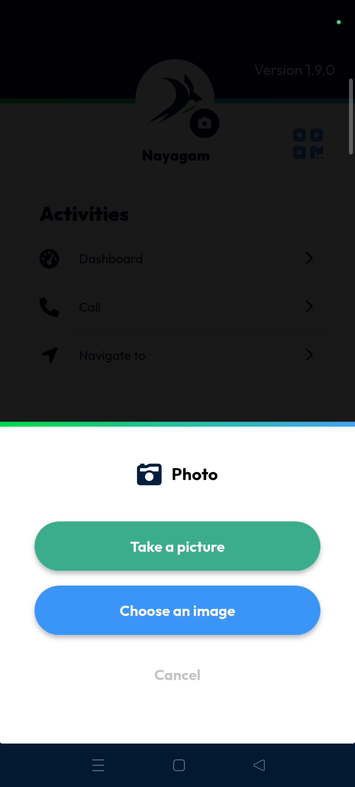
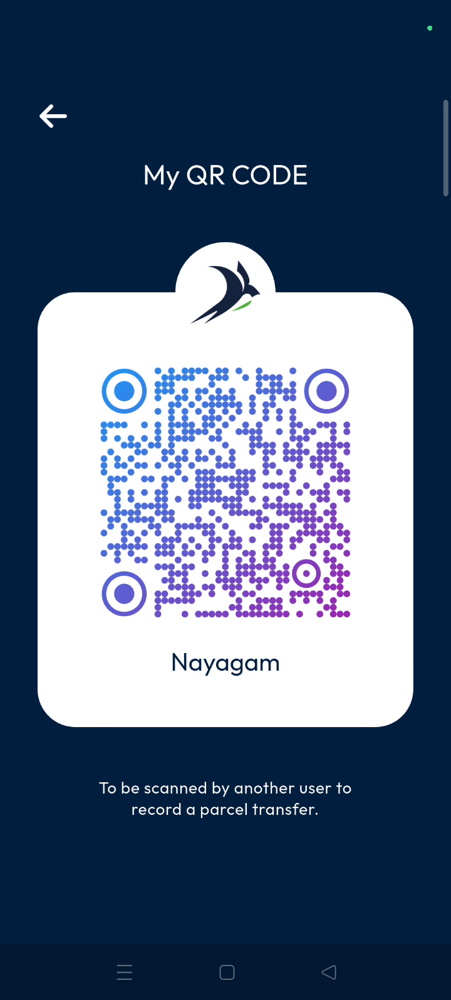

# Main Actions

The main actions menu allows you to manage your profile and view essential app information. Use this area to customize your identity and facilitate transfers between users. You will achieve a personalized profile and better coordination with other team members.

#### Getting Started

* Active account on the **Nomadia Delivery** mobile app.
* Access to the mobile device camera for photo updates.
* Open the app and start on the **dashboard** screen.
* Tap the **three-line menu** in the top left corner.

#### Feature Overview

* **Application Logo**: Displays your current profile picture in the sidebar.&#x20;
* **Version Number**: Shows the current software version in the upper right corner.&#x20;
* **QR Code Icon**: Provides access to your unique code for transfer operations.&#x20;

<figure><figcaption></figcaption></figure>

#### How To: Update Profile Image

1. Tap the **camera icon** displayed inside the logo area.

2. Select **choose an image** to pick a file from your gallery.
3. Select **take a picture** to capture a new photo with your camera.
4. Tap **cancel** to stop the operation without making changes.

#### How To: Use QR Code for Transfers

1. Tap the **QR code icon** located next to the logo.
2. Display the **QR code** for another user to scan.
3. Tap the **back arrow** in the top left corner to exit.

#### Productivity Tips

* 💡 **Personal Transfers**: Share your QR code with other users to record a personal transfer between team members.
* ⚠️ **Cancel Changes**: Tap **cancel** if you select the wrong photo option to avoid updating your logo by mistake.
