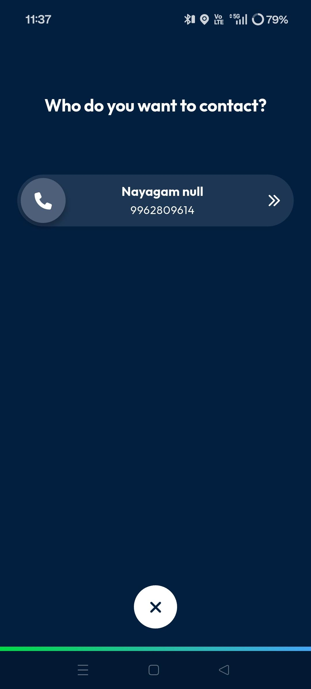
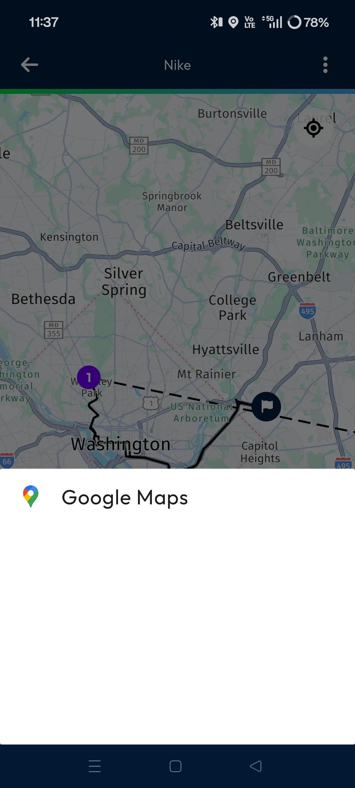
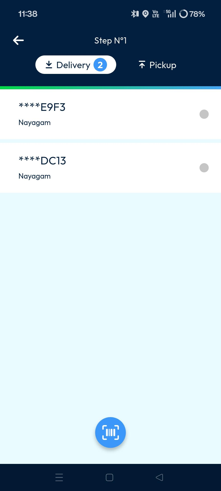
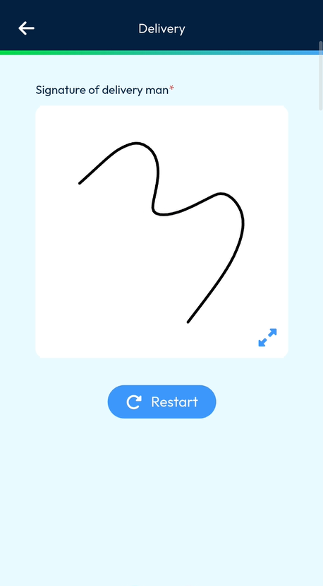
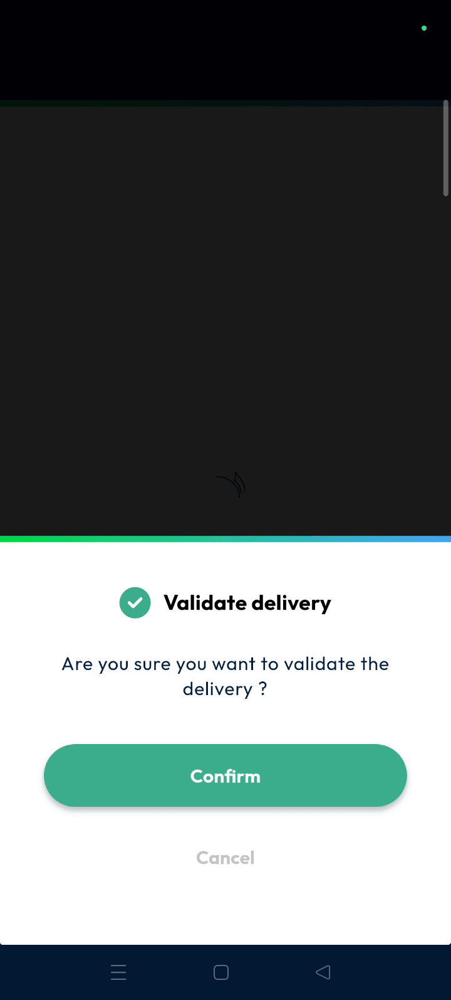
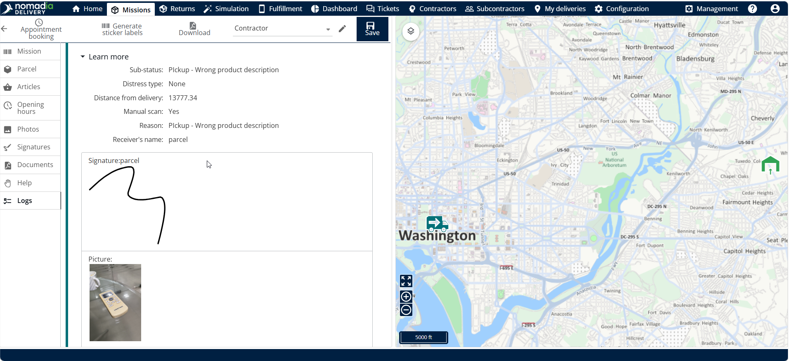

# My Route

The **My Roots** page provides drivers with access to all delivery routes currently assigned to their account. Users can track delivery progress, access navigation, and perform fulfillment tasks directly from their mobile device. This feature ensures real-time synchronization between the driver's actions and the back-office system.

#### Getting Started

To access your assigned work, ensure you meet these requirements:

* A valid **Nomadia Delivery** mobile account.
* At least one route assigned to your profile.
* Completed loading operations for the current route.
* Open the **delivery mobile application**.
* Navigate to My Routes

#### Feature Overview

* The **My Routes** page displays all routes currently assigned to the logged-in user. It provides a centralized workspace for managing daily delivery operations and monitoring route progress. Each route card displays essential information, including the route name, assigned missions, delivery progress, and current route status. Users can select a route to view detailed route information, access navigation, track mission completion, and perform delivery-related actions. This page helps drivers efficiently manage their assigned routes and stay updated on delivery activities throughout the day.

* **Fulfillment page**: Opens automatically if loading operations are already complete.
* **Route Name**: Shows the identifier of the active route at the top of the screen.
* **Progress Bar**: Tracks current stops, completed stops, and remaining stops visually.
* **Map View**: Provides a visual representation of the route sequence and machine locations.
* **Three Dots**: Access operation activities like **Refresh My Tour** or **Optimize My Tour**.
* **Missions List**: Displays cards for each machine containing customer info and delivery status.

<figure><figcaption></figcaption></figure>

#### How To: Interact with Customers

1. Locate the specific **Mission** card in your list.
2. Tap the **Phone Icon** to view the customer's phone number and call them.

<figure><figcaption></figcaption></figure>

3. Tap the **Navigation** icon to launch Google Maps and receive turn-by-turn directions to the customer's location. This helps drivers quickly navigate to the destination.

<figure><figcaption></figcaption></figure>

#### How To: Perform a Delivery

1. Open the **Mission** card once you reach the destination.
2. Tap the **Play Button** to begin the process.

<figure><figcaption></figcaption></figure>

3. To complete a delivery, tap **Delivery** and scan the parcel's QR code or barcode. Once the scan is successful, you can continue with the delivery confirmation process.

<figure><figcaption></figcaption></figure>

4. Long-press the delivery to select **Validation Without Scan** if manual entry is needed.
5. Tap **Confirm** on the validation pop-up.

6. Tap the **Right Arrow** to proceed to the proof-of-delivery step and capture a photo of the delivered parcel. The photo serves as evidence that the delivery has been completed successfully.

7. Tap the **Tick Mark** to proceed to the signature capture screen. Ask the recipient to sign on the device to acknowledge successful receipt of the parcel.

<figure><figcaption></figcaption></figure>

8. Tap the **Next Arrow** to proceed to the final confirmation step and provide the delivery person's signature. This signature confirms that the delivery process has been completed.

<figure><figcaption></figcaption></figure>

9. Tap **Confirm** to validate the delivery details and finalize the delivery process. The delivery information is then synchronized with the back-office system.

#### Back Office Synchronization

Once delivery is confirmed:

* Delivery status is updated in the back office.
* Delivered missions appear in green.
* Captured signatures are available in the back office.
* Delivery photos are available in the back office.
* Delivery logs are updated automatically.

<figure><figcaption></figcaption></figure>

#### Productivity Tips

* 💡 **Automatic Redirection**: The app automatically moves you to the fulfillment page if loading is already done.
* 💡 **Visual Tracking**: Completed missions appear in green on the map and mission list for easy identification.
* 💡 **Live Sync**: All signatures and photos are immediately available in the back office once confirmed.
* ⚠️ **Mandatory Calls**: Calling the customer may be mandatory before continuing depending on your specific user rights.
