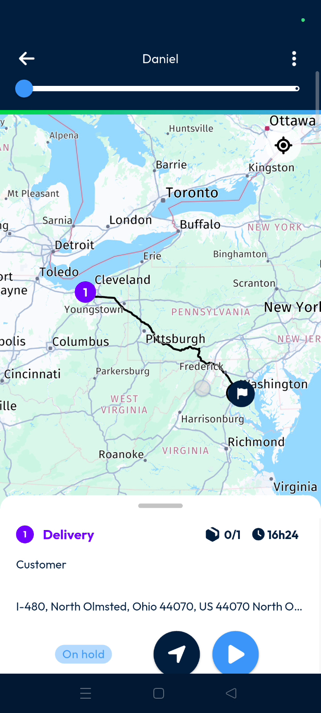
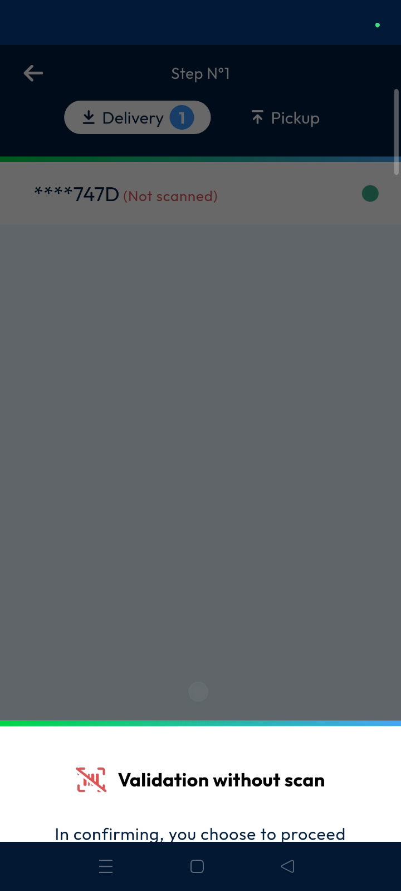

# My Route

The **My Roots** page provides drivers with access to all delivery routes currently assigned to their account. Users can track delivery progress, access navigation, and perform fulfillment tasks directly from their mobile device. This feature ensures real-time synchronization between the driver's actions and the back-office system.

#### Getting Started

To access your assigned work, ensure you meet these requirements:

* A valid **Nomadia Delivery** mobile account.
* At least one route assigned to your profile.
* Completed loading operations for the current route.
* Open the **delivery mobile application**.
* Navigate to My Routes

#### Feature Overview

* **My Routes page**: Displays all routes currently assigned to the logged-in user.

* **Fulfillment page**: Opens automatically if loading operations are already complete.
* **Route Name**: Shows the identifier of the active route at the top of the screen.
* **Progress Bar**: Tracks current stops, completed stops, and remaining stops visually.
* **Map View**: Provides a visual representation of the route sequence and machine locations.
* **Three Dots**: Access operation activities like **Refresh My Tour** or **Optimize My Tour**.
* **Missions List**: Displays cards for each machine containing customer info and delivery status.

#### How To: Interact with Customers

1. Locate the specific **Mission** card in your list.
2. Tap the **Phone Icon** to view the customer's phone number and call them.

<figure><figcaption></figcaption></figure>

3. Tap the **Navigation Icon** to open **Google Maps** for GPS guidance.

<figure><figcaption></figcaption></figure>

#### How To: Perform a Delivery

1. Open the **Mission** card once you reach the destination.
2. Tap the **Play Button** to begin the process.

3. Select **Delivery** and scan the parcel **QR code** or **Barcode**.
4. Long-press the delivery to select **Validation Without Scan** if manual entry is needed.

5. Tap **Confirm** on the validation pop-up.
6. Choose a delivery option, such as **Dropped on the Doorstep**.

7. Tap the **Right Arrow** to capture a delivery photo.

8. Tap the **Tick Mark** to collect the **Signature of the Recipient**.

<figure><figcaption></figcaption></figure>

9. Tap the **Next Arrow** to provide the **Signature of the Delivery Man**.

<figure><figcaption></figcaption></figure>

10. Tap **Confirm** to validate and sync the delivery with the back office.

#### Productivity Tips

* 💡 **Automatic Redirection**: The app automatically moves you to the fulfillment page if loading is already done.
* 💡 **Visual Tracking**: Completed missions appear in green on the map and mission list for easy identification.
* 💡 **Live Sync**: All signatures and photos are immediately available in the back office once confirmed.
* ⚠️ **Mandatory Calls**: Calling the customer may be mandatory before continuing depending on your specific user rights.
