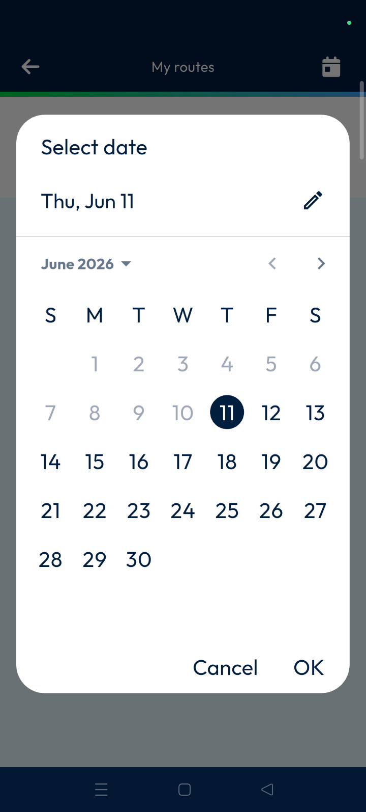
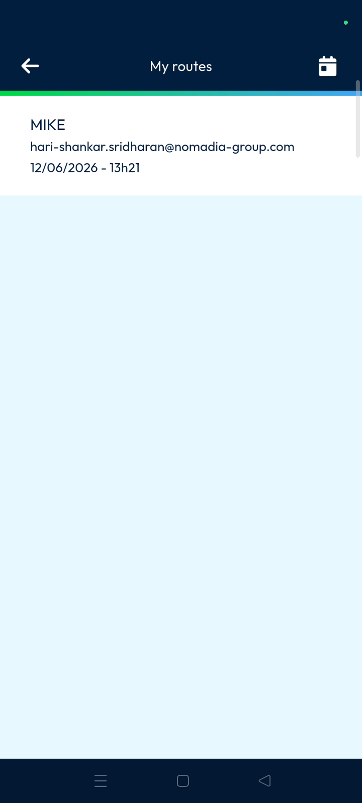
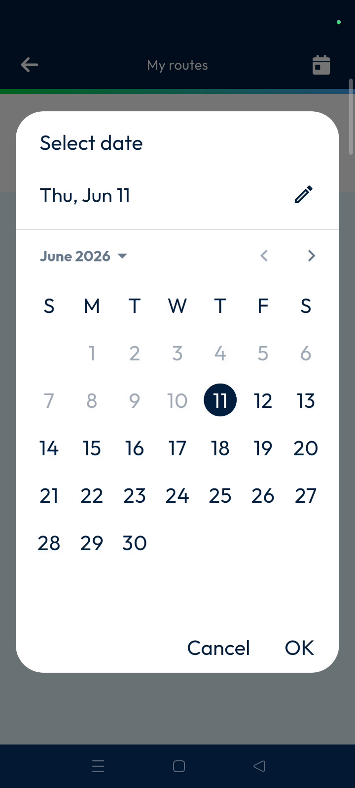
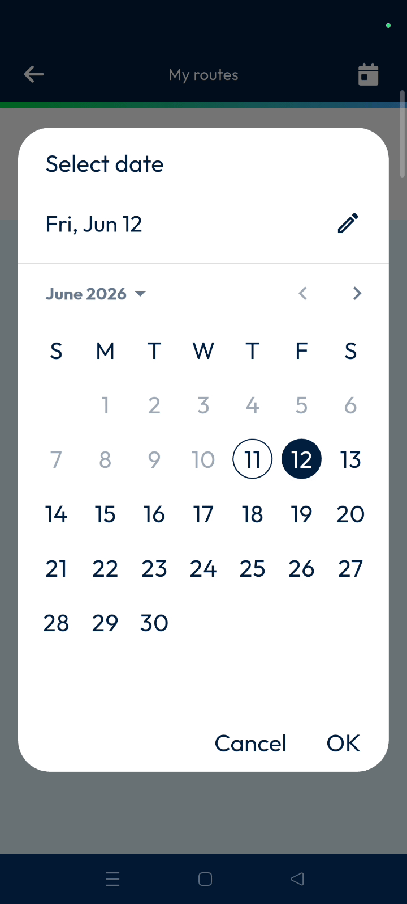

# my_routes
# my_routes

Access and manage your daily route schedules and delivery activities. Use this feature to view current assignments and plan for future delivery tasks efficiently,.

### Getting Started

*   Active Nomadia Delivery account.
*   Assigned routes for the selected date.

1.  Open the main actions menu.
2.  Tap **My Roots** to view assigned routes,.

### Feature Overview

*   **My Roots Page**: Displays the route schedule and associated delivery activities for the selected date,.

*   **Calendar Icon**: Opens a date picker in the upper right corner to change the viewed schedule,.

*   **Back Arrow**: Navigation button in the upper left corner to return to the main actions menu,.

### How To: View and Change Route Schedules

1.  Tap **My Roots** from the main actions menu,.

2.  Tap the **calendar icon** in the upper right corner,.

3.  Select a date, such as tomorrow's date, from the calendar,.

4.  Tap **OK** to confirm the selected date,.

5.  Review the refreshed route list for the selected day,.

6.  Tap the **back arrow** to exit the schedule view,.

### Productivity Tips

*   💡 **Future Planning**: Use the calendar to review route plans for future dates and stay prepared,.

