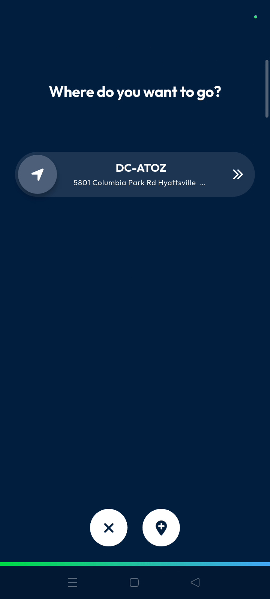
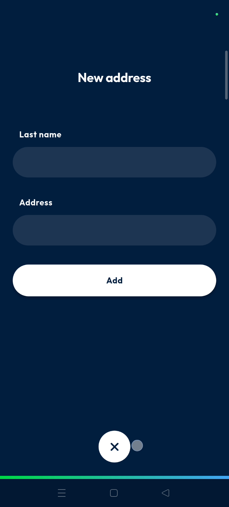
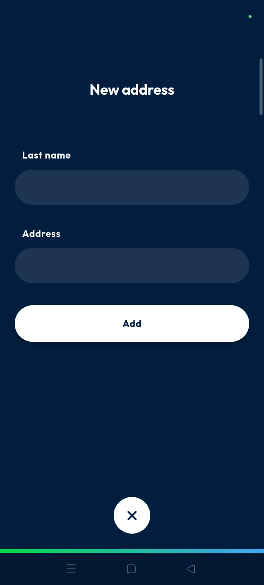
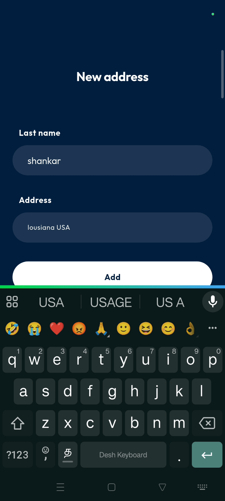
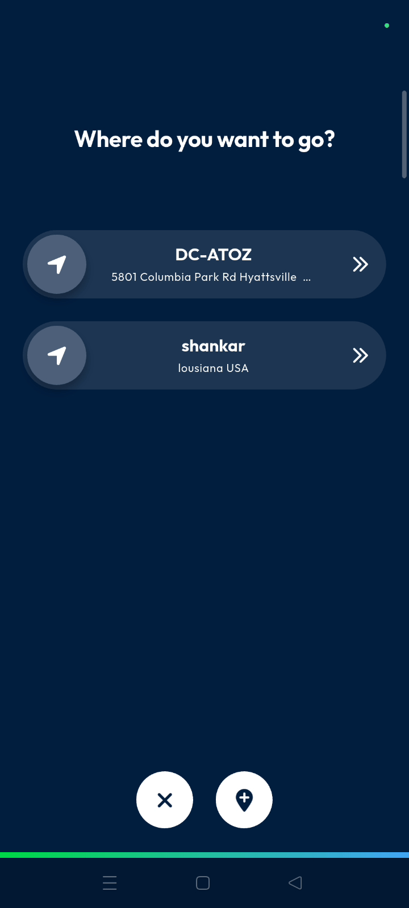

# navigate_to
# navigate_to

The **navigate_to** feature allows you to access and manage your saved navigation locations. Use this to quickly select destinations and streamline your route planning process.

### Getting Started

*   Ensure you have the Nomadia Delivery app installed.
*   Log in to your account.

1.  Open the application to the **main action screen**.

2.  Tap the **navigate to** icon.

### Feature Overview

*   **Navigate To icon**: Opens the menu to view or add navigation points.

*   **Where do you want to go page**: Displays all locations currently saved in the application.

*   **Plus button**: Initiates the process to save a new destination.

*   **Name field**: Input area for the custom label of a location.
*   **Address field**: Input area for the physical destination address.
*   **Add**: Saves the entered information to your destination list.
*   **X button**: Returns you to the **main access page**.

### How To: Add a New Destination

1.  Tap the **navigate to** icon on the **main action screen**.

2.  Tap the **plus button** at the bottom of the **where do you want to go** page.

3.  Tap the **name field** and enter a location name.

4.  Tap the **address field** and enter the destination address.

5.  Tap **add** to save the new location.

6.  Verify the new address appears in the list of available destinations.

7.  Tap the **X button** at the bottom to return to the **main access page**.

### Productivity Tips

- 💡 **Quick Navigation**: Save frequent destinations to the list for instant access during route execution.

