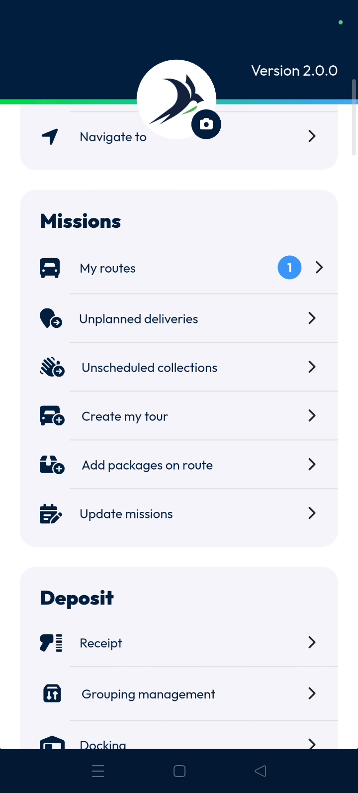
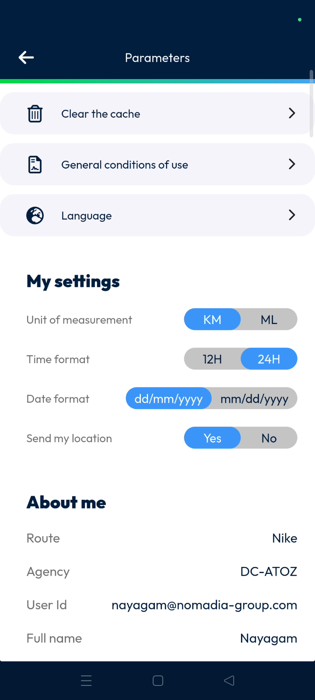
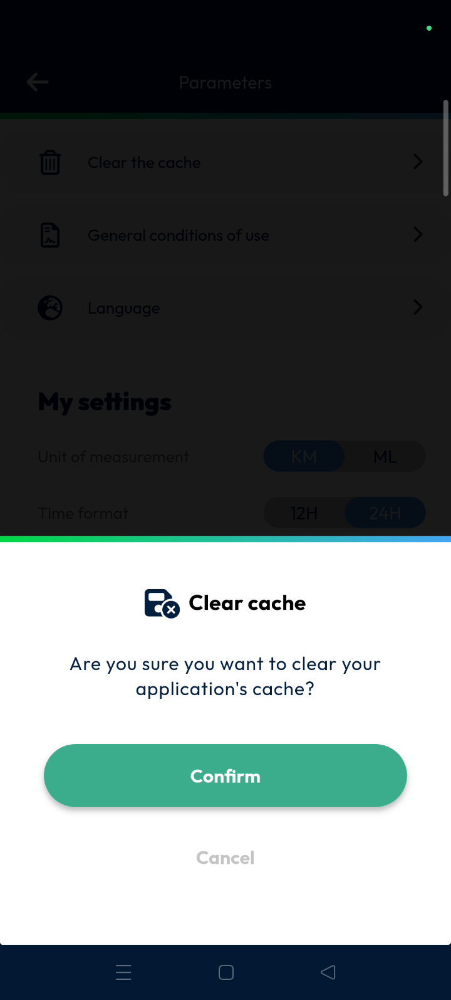

# parameters
# mobile

The **parameters** feature allows you to customize your application settings and view device information. Use this to adjust distance units, time formats, and language preferences to suit your workflow. It also provides tools to clear application data and verify synchronization status.

### Getting Started

*   Access to the Nomadia Delivery mobile application.
*   An active user account and valid login.

1. Open the **Main actions** menu.
2. Scroll down to the bottom of the list.
3. Tap **Parameters** to open the settings page.

### Feature Overview

*   **Clear the catch**: Clears stored application data to resolve performance issues.
  

*   **General conditions of use**: Displays the legal terms for using the application.
  

*   **Language**: Sets your preferred interface language.
  

*   **Unit of measurement**: Switches distance displays between kilometers and miles.
  

*   **Time format**: Sets the clock display to 12-hour or 24-hour format.
  

*   **Date format**: Choose between DDMMYY or MMDDYY formats.
  

*   **About me**: Provides technical details like synchronization status and connection type.
  

### How To: Clear Application Cache

1. Tap the gear icon next to **Clear the catch**.
   

3. Review the confirmation pop-up.
   

5. Tap **Confirm** to clear the catch.
   

### How To: Change Unit Measurements

1. Navigate to the **My settings** section.
2. Tap **Unit of measurement**.
3. Select either **Kilometer** or **Milll**.
   

### Productivity Tips

*   ⚠️ **Cache Confirmation**: You must tap **Confirm** on the pop-up for the application's catch to be cleared.
*   💡 **Connection Monitoring**: Use the **About me** section to check your **Wi-Fi** status and **synchronization status**.

