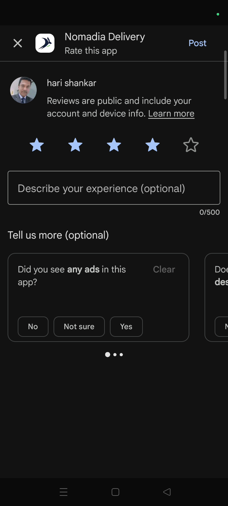
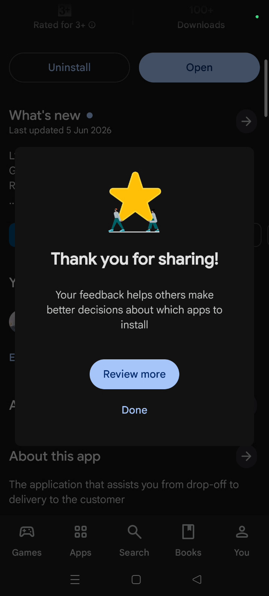
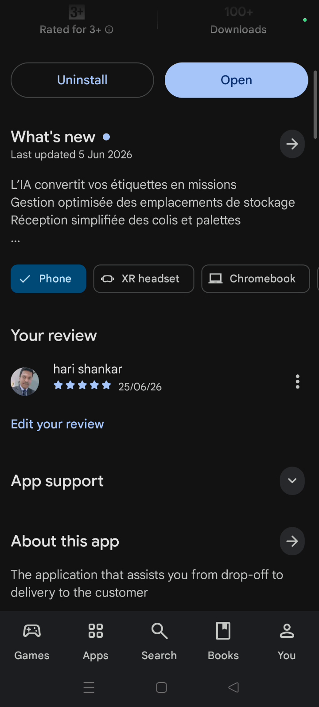

# Rate the app

The Rate the App feature allows you to share feedback on your experience with Nomadia Delivery directly through the app. By providing a star rating, you help improve the platform's performance and usability for all users.

#### Getting Started

* Nomadia Delivery app installed on a mobile device.
* An active Google Play Store account.
* Stable internet connection.
* Open the Nomadia Delivery app to the **Main Actions** screen.
* Scroll down to the bottom of the menu.

#### Feature Overview

* **Rate the App feature**: Redirects you to the official Google Play store page for feedback.
* **Star Rating**: Displays a scale from 1 to 5 to evaluate the application.
* **Post**: Submits your chosen star rating to the store.
* **Review More**: Opens a detailed view of existing ratings and feedback.

#### How To: Rate the App

1. Tap **Rate the App feature** from the main actions list.+

2. Scroll down on the **Google Play Nomadia Delivery** page to find the rating section.
3. Select a star rating from 1 to 5.

4. Tap **Post** to submit your feedback.

5. Tap **Done** to exit the rating screen.

#### How To: View App Reviews

1. Tap **Review More** after submitting your rating.

2. Review the displayed ratings from other users.

#### Productivity Tips

* 💡 **Instant Update**: Your latest rating is displayed immediately after you tap the post button.
* 💡 **Feedback Check**: Use the review more option to stay informed about other users' experiences and tips.
