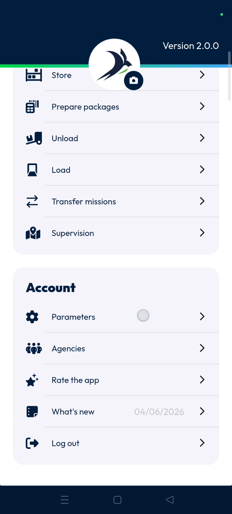
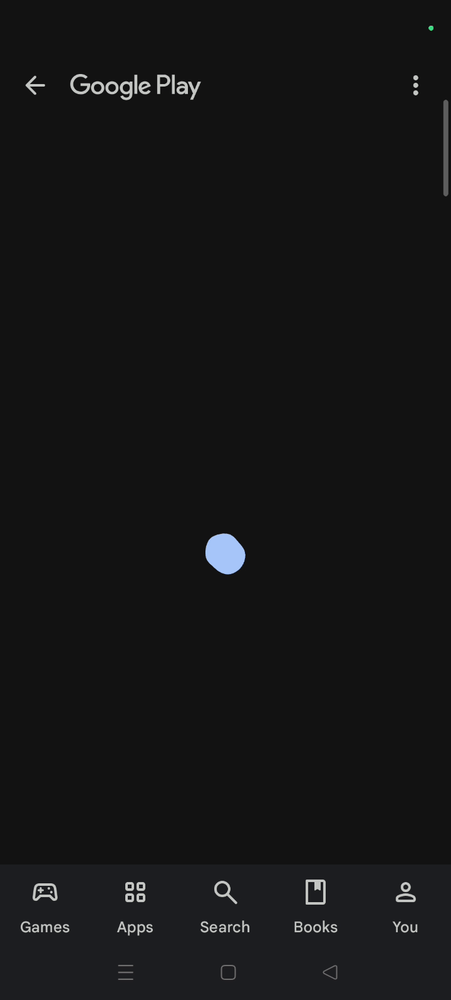
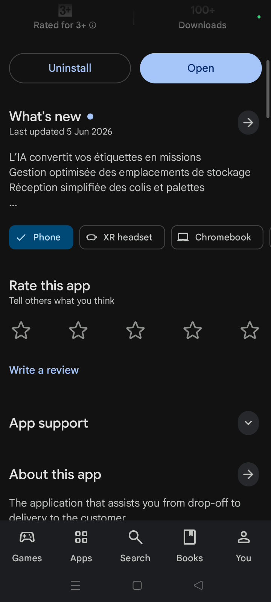
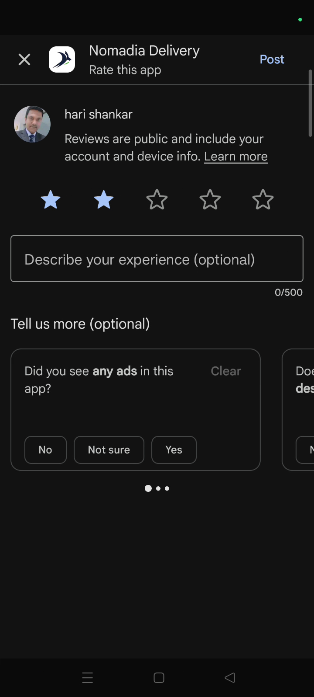
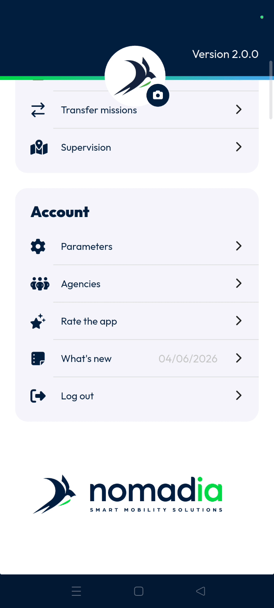

# ratetheapp
# mobile

The Rate the App feature allows you to share feedback on your experience with Nomadia Delivery directly through the app. By providing a star rating, you help improve the platform's performance and usability for all users.

### Getting Started

*   Nomadia Delivery app installed on a mobile device.
*   An active Google Play Store account.
*   Stable internet connection.

1. Open the Nomadia Delivery app to the **Main Actions** screen.

    

2. Scroll down to the bottom of the menu.

    

### Feature Overview

*   **Rate the App feature**: Redirects you to the official Google Play store page for feedback.
    
    

*   **Star Rating**: Displays a scale from 1 to 5 to evaluate the application.

    

*   **Post**: Submits your chosen star rating to the store.

    

*   **Review More**: Opens a detailed view of existing ratings and feedback.

    

### How To: Rate the App

1. Tap **Rate the App feature** from the main actions list.

    

2. Scroll down on the **Google Play Nomadia Delivery** page to find the rating section.
3. Select a star rating from 1 to 5.

    

4. Tap **Post** to submit your feedback.

    

5. Tap **Done** to exit the rating screen.

    

### How To: View App Reviews

1. Tap **Review More** after submitting your rating.

    

2. Review the displayed ratings from other users.
3. Tap **Done** to complete the process.

    

### Productivity Tips

- 💡 **Instant Update**: Your latest rating is displayed immediately after you tap the post button.
- 💡 **Feedback Check**: Use the review more option to stay informed about other users' experiences and tips.

