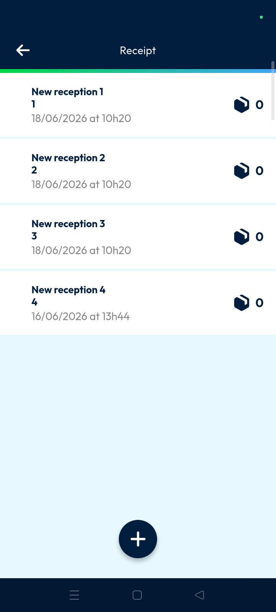
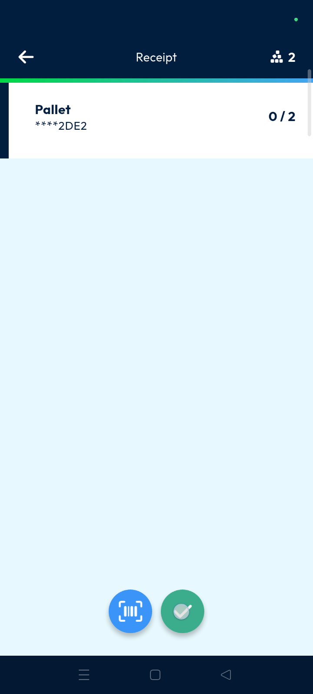
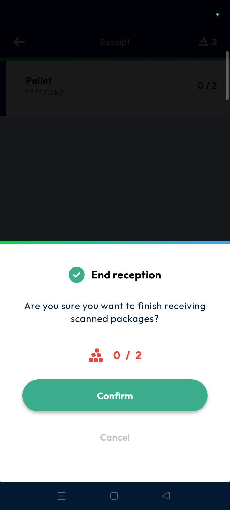
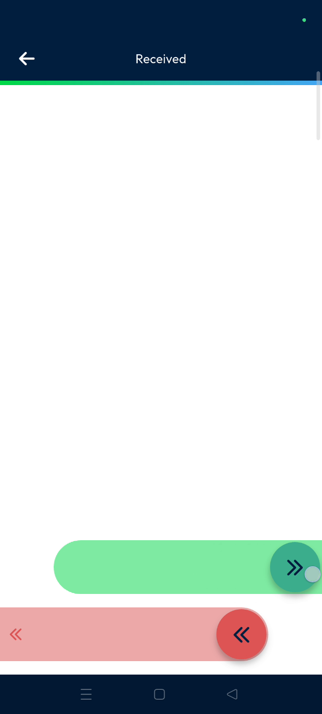
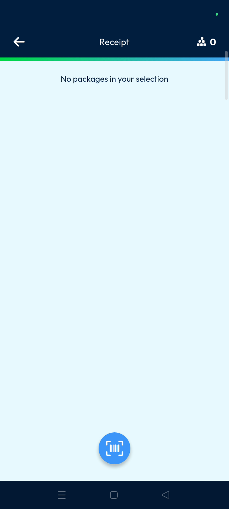
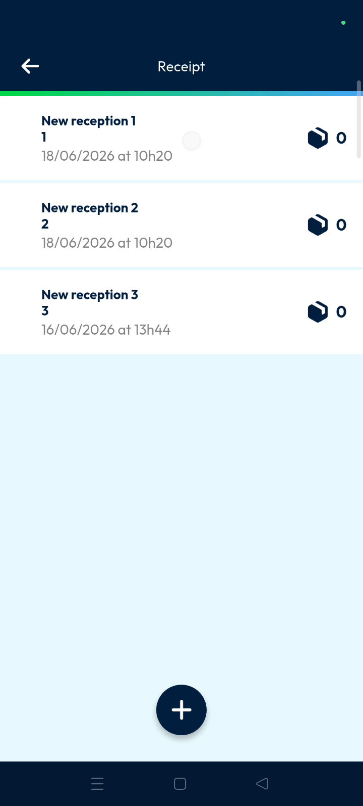
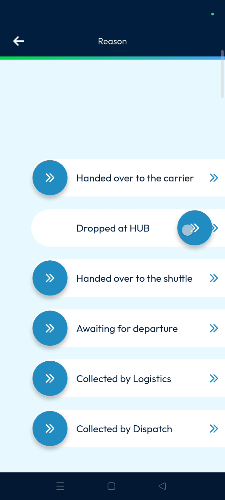
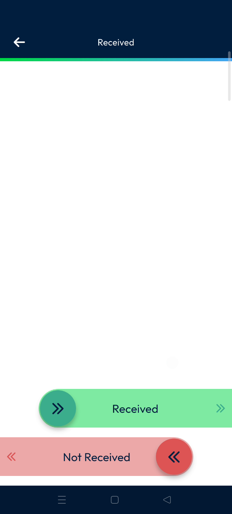
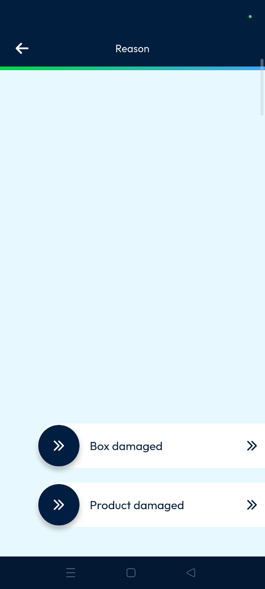
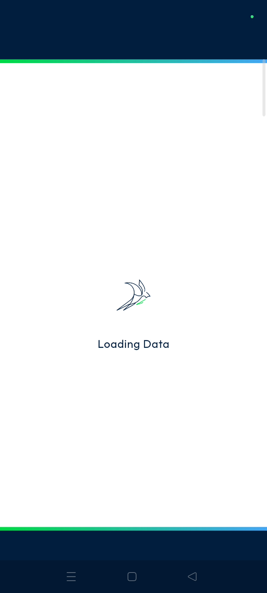

# receipt
# mobile

**Nomadia Delivery** Receipt is used to acknowledge parcels arriving at a hub, warehouse, airport, or agency. This feature ensures all incoming shipments are correctly logged and updated in the system. Users can quickly process large volumes of incoming freight through scanning or manual status updates.

### Getting Started

*   A mobile device with the **Nomadia Delivery** app installed.
*   Required back-office configurations for sub-statuses.

1. Scroll down to the **Receipt** option in the main action menu.

2. Tap on **Receipt**.

### Feature Overview

*   **Multiple Receptions Page**: Displays the current list of receptions available for processing.

*   **Barcode Scanner**: Uses the device camera to scan and identify parcels.

*   **Tick Mark**: Initiates the final confirmation process for the selected parcels.

*   **Confirm**: Finalizes the status change and finishes the receiving process in the pop-up window.

*   **Sub Status**: Provides specific reasons for the receipt status based on company configuration.

### How To: Scan a Parcel for Receipt

1. Select any reception from the list.

2. Tap the **Barcode Scanner**.

3. Scan the parcel barcode to change its status.

4. Select the scanned parcel in the list.

5. Tap on the **Tick Mark**.

6. Tap **Confirm** on the pop-up stating "Are you sure you want to finish...".

### How To: Update Status Manually

1. Long press the parcel you wish to update.

2. Toggle the **Received** status.

3. Toggle the specific **Sub Status** required (e.g., "Drop the hub").

4. Tap the **Tick Mark**.

5. Tap **Confirm** on the confirmation pop-up.

### How To: Record Damaged Parcels

1. Long press the target parcel.
2. Tap on **Not Received**.

3. Toggle a reason such as **Box Damaged** or **Product Damaged**.

4. Tap the **Tick Mark**.

5. Tap **Confirm** to finish the process.

### Productivity Tips

*   💡 **Back Office Monitoring**: View all reception updates and machine logs in the back office immediately after confirmation.
*   ⚠️ **Configuration Limits**: Sub-statuses are limited to what has been defined in your back-office configuration.

