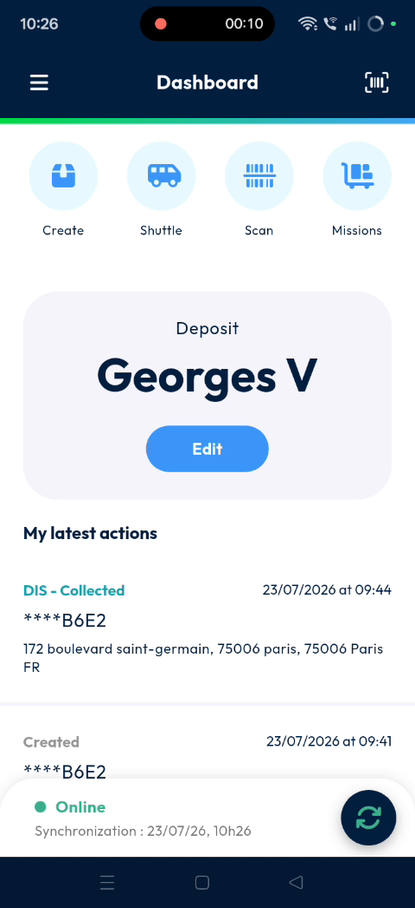
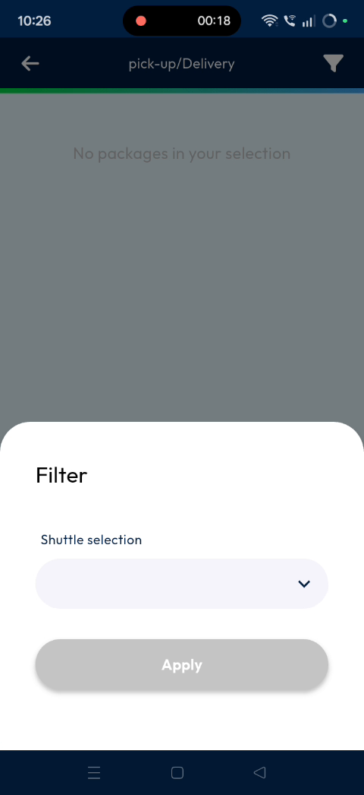
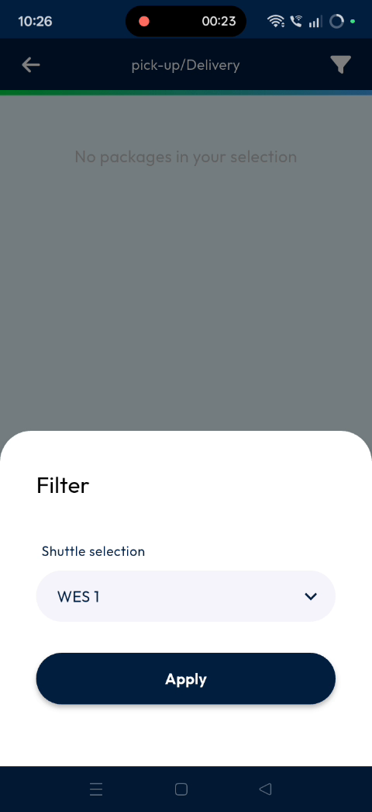
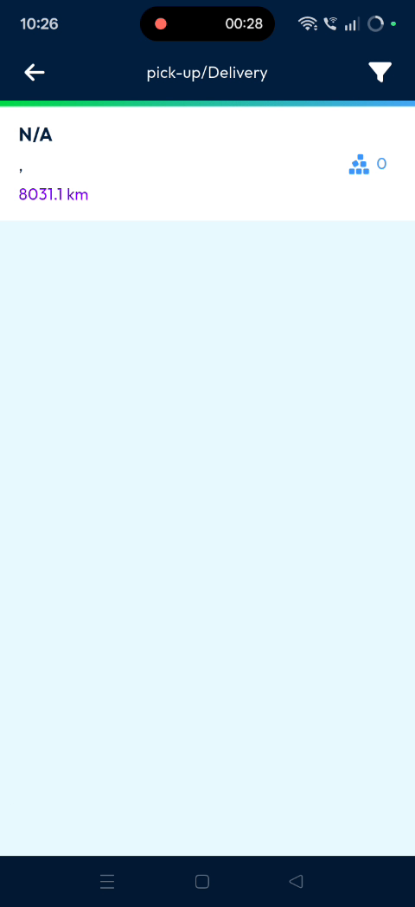
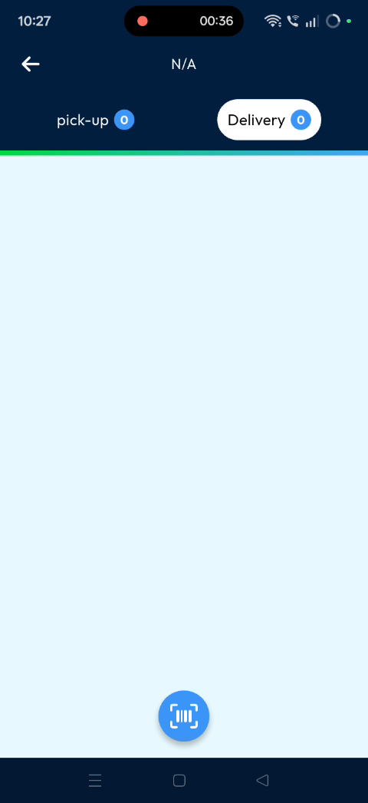

# shuttlemanagement.
# shuttlemanagement
Manage shuttle operations and parcel scanning effectively within the mobile application. This feature ensures parcels are processed at the correct locations, preventing logistics errors,. Use this guide to handle scanning and resolve location-based errors.

### Getting Started
*   Mobile application installed and updated.
*   Valid user login credentials,.
*   Active shuttle assignments for the current site.

1. Log into the mobile application,.

2. Tap on **Shuttle** from the main menu,.

### Feature Overview
*   **Shuttle Selection**: Choose the specific shuttle assigned to your current task,.

*   **Apply Button**: Confirms the selection of the highlighted shuttle.

*   **Start Button**: Activates the scanning interface for the selected shuttle,.

### How To: Manage Shuttle Scanning and Errors
1. Tap on **Shuttle**.

2. Select the required shuttle from the list.

3. Tap **Apply**.

4. Tap the specific shuttle record again to open it.

5. Tap **Start** to begin the process,.

6. Scan the **parcel** barcode,.

#### Troubleshooting
If the scanned parcel is not assigned to your current site, a pop-up appears,. The message states the package is not expected at the current site,.

### Productivity Tips
- ⚠️ **Incorrect Site Scanning**: Scanning a parcel at a site where it is not expected triggers a warning pop-up,.

