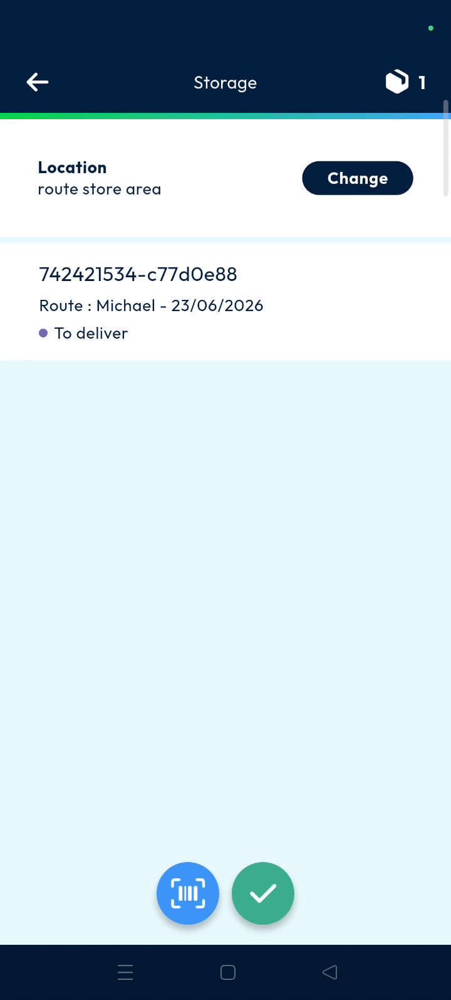
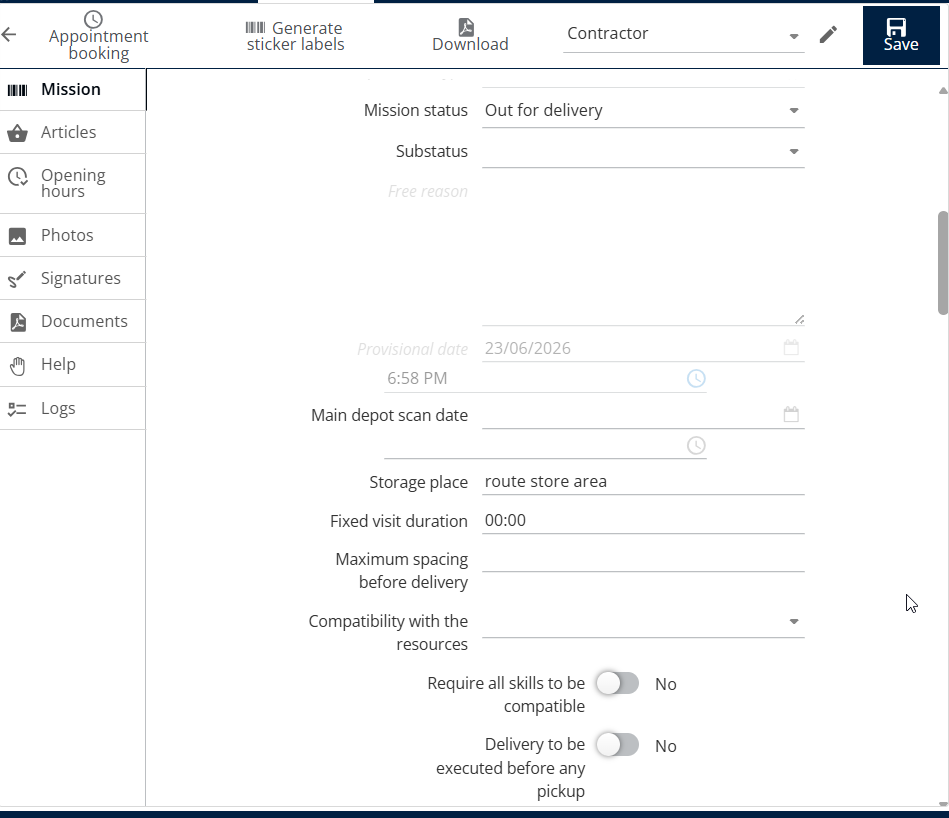

# Store

The store feature allows you to validate dedicated docking areas where parcels are temporarily stored before delivery. This tool helps you identify and track which store a parcel belongs to for better operational visibility. Dispatchers and deliverers can use this to manage parcels effectively before they reach the customer.

#### Getting Started

* Access to the **Nomadia Delivery** mobile application.
* A parcel with a valid barcode for scanning.
* Open the application and navigate to the **Main Actions** menu.
* Tap the **Store** button.

#### Feature Overview

* **Store**: Represents a dedicated docking area for temporary parcel storage.
* **Barcode Scanner**: A tool used to scan parcel labels to link them to the assigned store.
* **Storage Place**: A field in the back office where the validated store name is displayed for tracking.

#### How To: Validate a Store

1. Navigate to the **Main Actions** menu.
2. Tap **Store**.

3. Define the **Store Name**.
4. Tap on **Validate**.

**Note**: You can identify the docking area by either manually entering the docking area name or by scanning its QR code, if one is available. This ensures that parcels are accurately associated with the correct docking location.

5. Tap the **Barcode Scanner** to scan a parcel.
6. Verify the **Store Name** is displayed on the screen.
7. Tap on the **Tick Mark**.
8. Tap on **Confirm** in the validation pop-up.

#### Productivity Tips

* 💡 **Operational Visibility**: Use the store validation feature to accurately track exactly which docking area a parcel is located in.
* ⚠️ **Back Office Verification**: Always check the **Storage Place** field in the back office to ensure the store was saved successfully.

<figure><figcaption></figcaption></figure>
