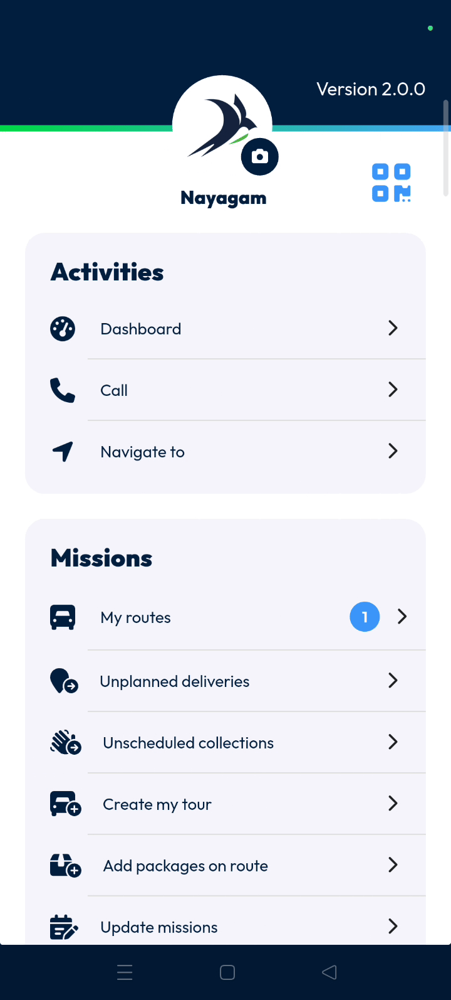
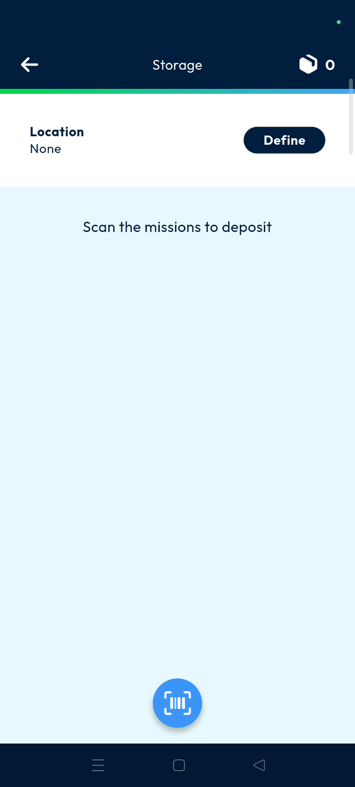
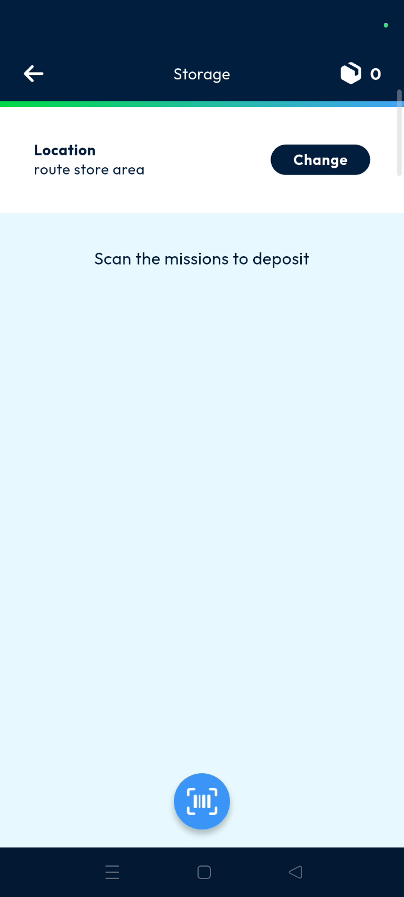
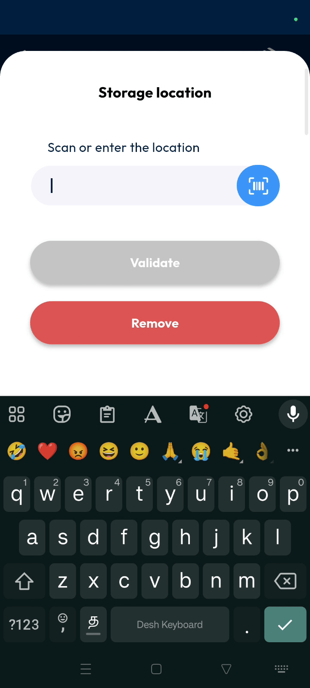
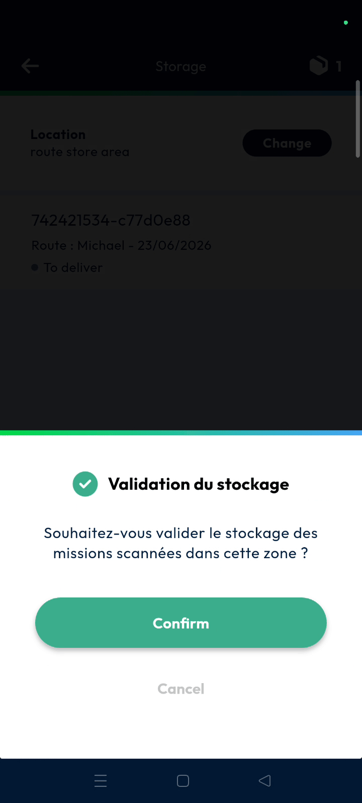

# store
# mobile

The store feature allows you to validate dedicated docking areas where parcels are temporarily stored before delivery. This tool helps you identify and track which store a parcel belongs to for better operational visibility. Dispatchers and deliverers can use this to manage parcels effectively before they reach the customer.

### Getting Started

*   Access to the **Nomadia Delivery** mobile application.
*   A parcel with a valid barcode for scanning.

1. Open the application and navigate to the **Main Actions** menu.

2. Tap the **Store** button.

### Feature Overview

*   **Store**: Represents a dedicated docking area for temporary parcel storage.

*   **Barcode Scanner**: A tool used to scan parcel labels to link them to the assigned store.

*   **Storage Place**: A field in the back office where the validated store name is displayed for tracking.

### How To: Validate a Store

1. Navigate to the **Main Actions** menu.

2. Tap **Store**.

3. Define the **Store Name**.

4. Tap on **Validate**.

5. Tap the **Barcode Scanner** to scan a parcel.

6. Verify the **Store Name** is displayed on the screen.

7. Tap on the **Tick Mark**.

8. Tap on **Confirm** in the validation pop-up.

### Productivity Tips

*   💡 **Operational Visibility**: Use the store validation feature to accurately track exactly which docking area a parcel is located in.
*   ⚠️ **Back Office Verification**: Always check the **Storage Place** field in the back office to ensure the store was saved successfully.

