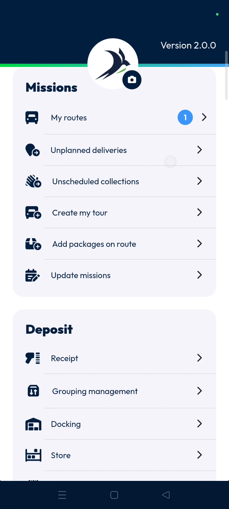
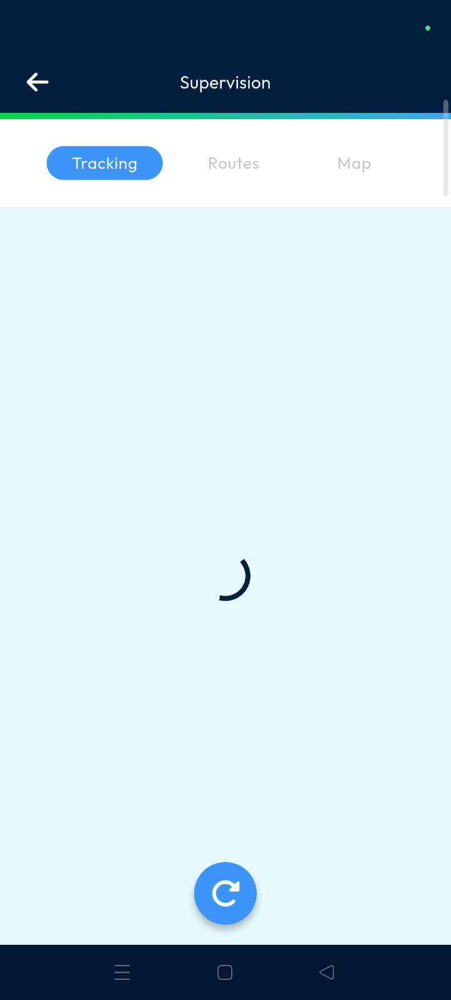
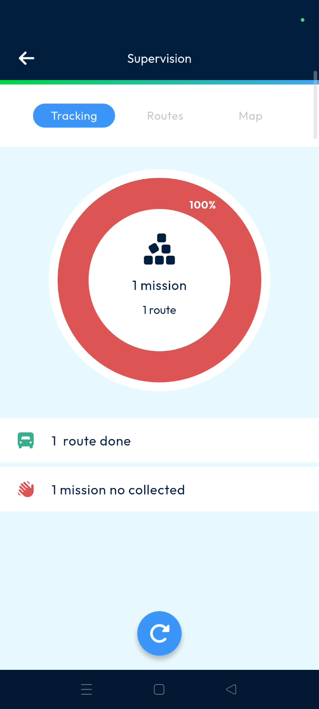
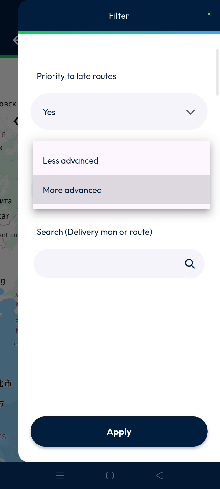
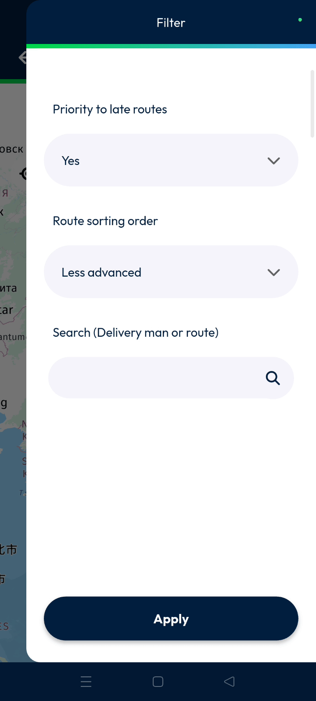

# supervision
# mobile

The Supervision feature provides real-time visibility into your delivery operations directly from your mobile device. Dispatchers can track route progress, monitor customer deliveries, and use geographic map views to ensure efficiency.

### Getting Started

*   Active Nomadia Delivery mobile application.
*   Assigned driver routes and machine collection tasks.

1. Scroll down the list of main actions in the app.
   

3. Tap the **Supervision** button to open the dashboard.
   

### Feature Overview

*   **Tracking**: Displays the total percentage of completed routes and active machines for the current period.
  

*   **Roads**: Lists individual routes including customer names, deliverer assignments, and pending hours.
  

*   **Map**: Visualizes customer locations and delivery points on an interactive map.
  

*   **Filter**: Provides options to refine the dashboard view based on priority, start order, or search terms.
  

### How To: Monitor Real-Time Progress

1. Open the **Supervision** page and select the **Tracking** tab.
   

3. Check the percentage of routes completed at the top of the screen.
   

5. Scroll down to see specific machine collection statuses for each route.
   

### How To: View Route Details

1. Tap the **Roads** tab from the main Supervision screen.
   

3. Review customer names and assigned deliverers for each entry.
   

5. Refresh the page to display the most recent data from the field.
   

### How To: Filter and Search the Dashboard

1. Tap the **Map** tab to view customer locations.
   

3. Tap the **Filter** icon in the top right corner.
   

5. Select **Yes** or **No** under **Priority to Late Routes**.
   

7. Choose **Less Advanced** or **More Advanced** in the **Route Start Order** section.
   

9. Enter a delivery band or route name in the **Search** box.
    

11. Tap **Apply** to save your filter selections.
    

### Productivity Tips

*   💡 **Real-Time Accuracy**: Use the refresh function frequently to ensure you are seeing the latest data from your deliverers.
*   💡 **Fast Navigation**: Search by delivery band or road name to find specific information without scrolling through long lists.

