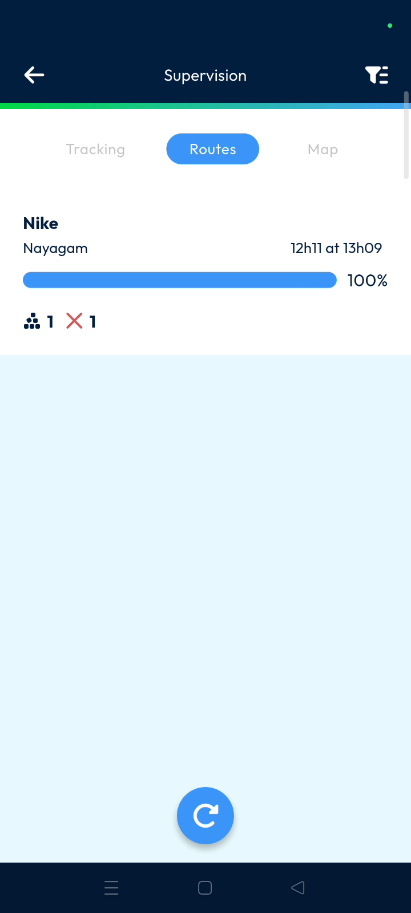
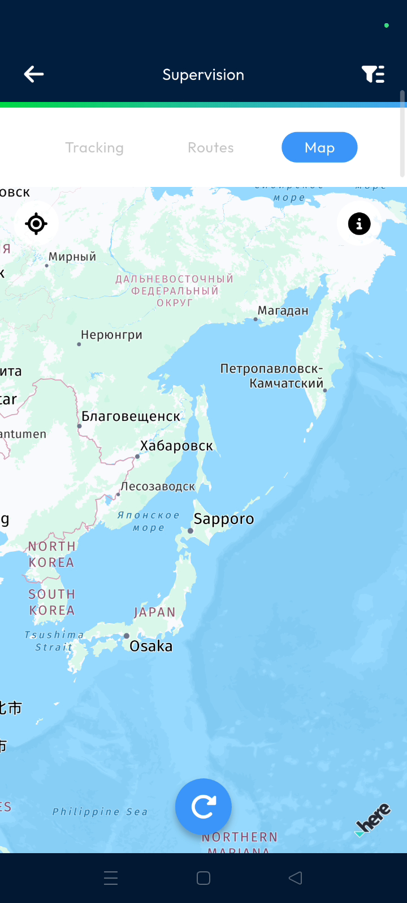

# Supervision

The Supervision feature provides real-time visibility into your delivery operations directly from your mobile device. Dispatchers can track route progress, monitor customer deliveries, and use geographic map views to ensure efficiency.

#### Getting Started

* Active Nomadia Delivery mobile application.
* Assigned driver routes and machine collection tasks.
* Scroll down the list of main actions in the app.
* Tap the **Supervision** button to open the dashboard.

<figure><figcaption></figcaption></figure>

#### Feature Overview

* **Tracking**: Displays the total percentage of completed routes and active machines for the current period.
* **Routes**: Lists individual routes including customer names, deliverer assignments, and pending hours.
* **Map**: Visualizes customer locations and delivery points on an interactive map.
* **Filter**: Provides options to refine the dashboard view based on priority, start order, or search terms.

#### How To: Monitor Real-Time Progress

1. Open the **Supervision** page and select the **Tracking** tab.
2. Check the percentage of routes completed at the top of the screen.
3. Scroll down to see specific machine collection statuses for each route.

<figure><figcaption></figcaption></figure>

#### How To: View Route Details

1. Tap the **Routes** tab from the main Supervision screen.
2. Review customer names and assigned deliverers for each entry.
3. Refresh the page to display the most recent data from the field.

<figure><figcaption></figcaption></figure>

4. Tap the Maps icon to open the location in Maps.

<figure><figcaption></figcaption></figure>

#### How To: Filter and Search the Dashboard

1. Tap the **Filter** icon in the top right corner.
2. Select **Yes** or **No** under **Priority to Late Routes**.
3. Choose **Less Advanced** or **More Advanced** in the **Route Start Order** section.
4. Enter a delivery band or route name in the **Search** box.
5. Tap **Apply** to save your filter selections.

<figure><figcaption></figcaption></figure>

#### Productivity Tips

* 💡 **Real-Time Accuracy**: Use the refresh function frequently to ensure you are seeing the latest data from your deliverers.
* 💡 **Fast Navigation**: Search by delivery band or road name to find specific information without scrolling through long lists.
