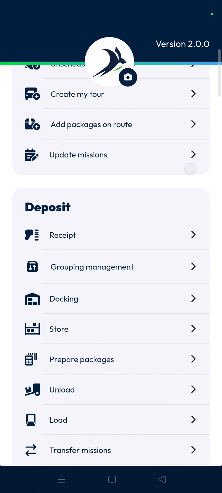
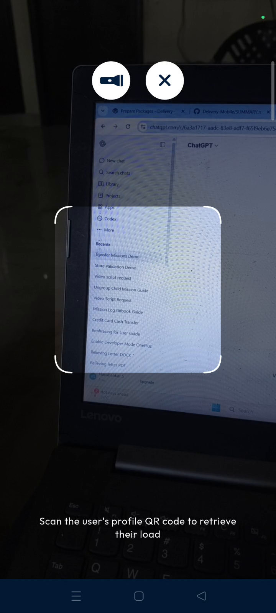
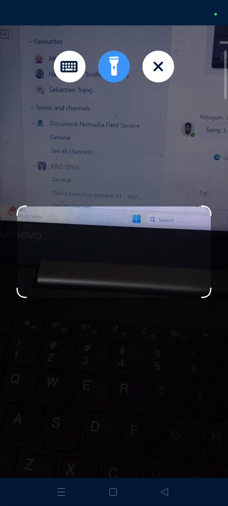
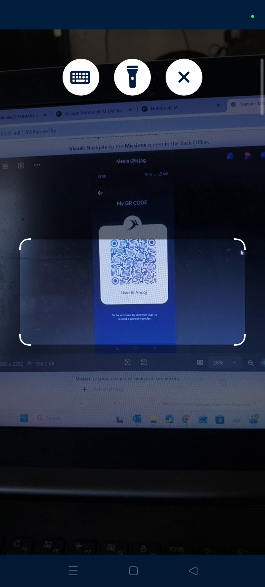
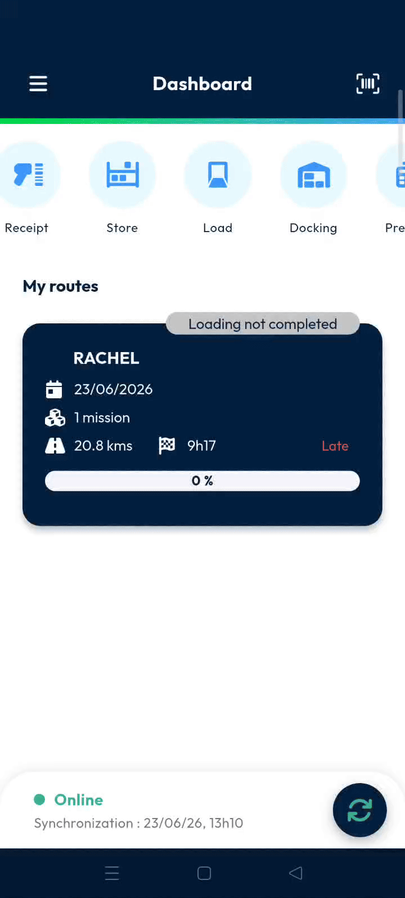
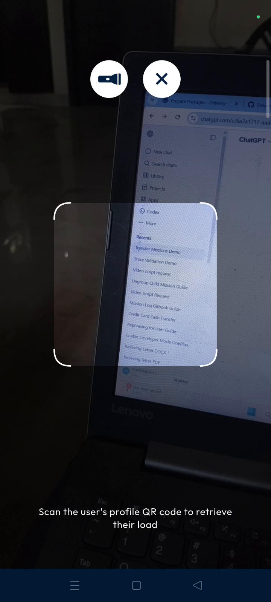
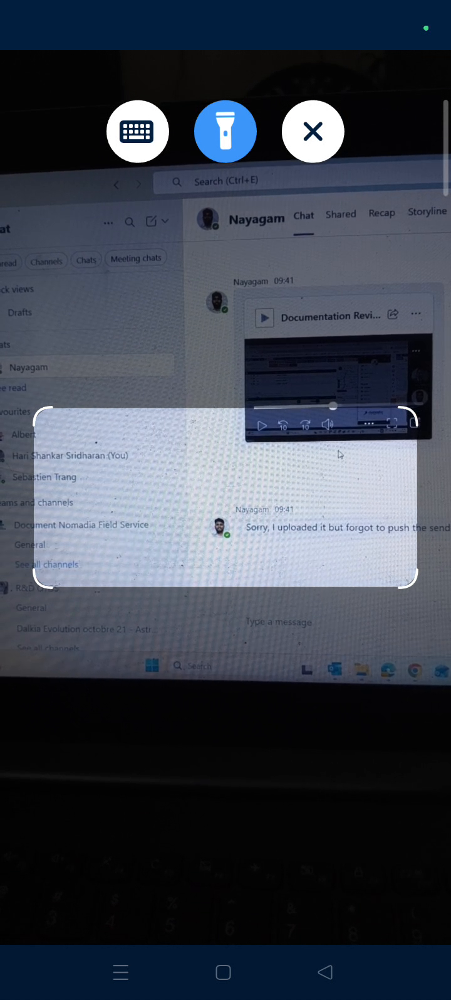

# transfer_missions
# mobile

Reassign machines between deliverers instantly using numeric delivery. This feature allows dispatchers to manage route changes and operational issues efficiently. You will achieve a seamless transfer of delivery tasks confirmed in your system.

### Getting Started

*   Active Nomadia Delivery mobile account.
*   Mobile device with a functioning camera for scanning.
*   Access to the **Main actions menu**.

1. Open the Nomadia Delivery app on your mobile device.
2. Access the **Main actions menu**.

### Feature Overview

*   **transfer machines**: Initiates the process to move a delivery task from one user to another.

*   **machine's detail**: Displays specific task information to ensure the correct machine is selected for transfer.

*   **barcode scanner**: Uses the device camera to identify user profiles and machines.

*   **I understand**: A confirmation button that acknowledges the scanning instructions.

### How To: Transfer Machines

1. Open the **Main actions menu**.
2. Tap **transfer machines**.

3. Choose the machine you want to transfer.

4. Review the **machine's detail** to ensure accuracy.

5. Read the popup regarding user profile scanning.
6. Tap **I understand**.

7. Tap the **barcode scanner**.

8. Scan the user's profile barcode.
9. Scan the machines you would like to transfer.

10. Confirm the transferred mission appears in the **back office**.

### Productivity Tips

*   💡 **Operational Agility**: Use this feature to handle sudden route changes or issues without manual paperwork.
*   ⚠️ **Accuracy Check**: Always review the machine details before scanning to prevent transferring the wrong delivery task.

