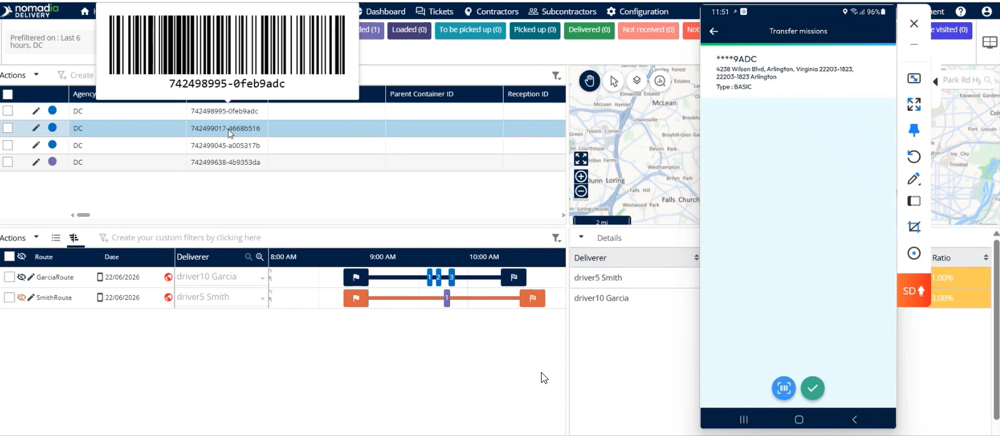

# Transfer Missions

Reassign machines between deliverers instantly using numeric delivery. This feature allows dispatchers to manage route changes and operational issues efficiently. You will achieve a seamless transfer of delivery tasks confirmed in your system.

#### Getting Started

* Active Nomadia Delivery mobile account.
* Mobile device with a functioning camera for scanning.
* Access to the **Main actions menu**.
* Open the Nomadia Delivery app on your mobile device.
* Access the **Main actions menu**.

#### Feature Overview

* **Transfer machines**: Initiates the process to move a delivery task from one user to another.
* **Machine's detail**: Displays specific task information to ensure the correct machine is selected for transfer.
* **I understand**: A confirmation button that acknowledges the scanning instructions.

#### How To: Transfer Machines

1. Open the **Main actions menu**.
2. Tap **transfer machines**.

3. Choose the machine you want to transfer.
4. Review the **machine's detail** to ensure accuracy.
5. Read the popup regarding user profile scanning.
6. Tap **I understand**.

<figure><figcaption></figcaption></figure>

7. Tap the **barcode scanner**.
8. Scan the user's profile barcode.
9. Scan the machines you would like to transfer.

<figure><figcaption></figcaption></figure>

10. Confirm the transferred mission appears in the **back office**.

<figure><figcaption></figcaption></figure>

#### Productivity Tips

* 💡 **Operational Agility**: Use this feature to handle sudden route changes or issues without manual paperwork.
* ⚠️ **Accuracy Check**: Always review the machine details before scanning to prevent transferring the wrong delivery task.
