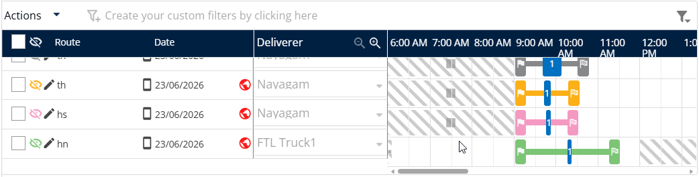

# Transfer Missions

Reassign missions between deliverers instantly using numeric delivery. This feature allows dispatchers to manage route changes and operational issues efficiently. You will achieve a seamless transfer of delivery tasks confirmed in your system.

#### Getting Started

* Active Nomadia Delivery mobile account.
* Mobile device with a functioning camera for scanning.
* Access to the **Main actions menu**.
* Open the Nomadia Delivery app on your mobile device.
* Access the **Main actions menu**.

#### Feature Overview

* **Transfer missions**: Initiates the process to move a delivery task from one user to another.
* **Mission's detail**: Displays specific task information to ensure the correct mission is selected for transfer.
* **I understand**: A confirmation button that acknowledges the scanning instructions.

#### How To: Transfer Machines

1. Open the **Main actions menu**.
2. Tap **transfer machines**.

<figure><figcaption></figcaption></figure>

3. &#x20;Scan the QR code of the receiving driver's device.

<figure><figcaption></figcaption></figure>

3. Read the information displayed in the **User Profile Scanning** pop-up.
4. Tap **I Understand** to continue.
5. Scan the QR code of the parcel that you want to transfer.
6. Tap the **✓** (Tick) icon to select the parcel.

<figure><figcaption></figcaption></figure>

7. Tap **Confirm** to transfer the selected parcel.

<figure><figcaption></figcaption></figure>

8. A **Synchronization Successful** message is displayed to confirm that the transfer has been completed successfully.

<figure><figcaption></figcaption></figure>

9. Confirm the transferred mission appears in the **back office**.

<figure><figcaption></figcaption></figure>

#### Productivity Tips

* 💡 **Operational Agility**: Use this feature to handle sudden route changes or issues without manual paperwork.
* ⚠️ **Accuracy Check**: Always review the mission details before scanning to prevent transferring the wrong delivery task.
