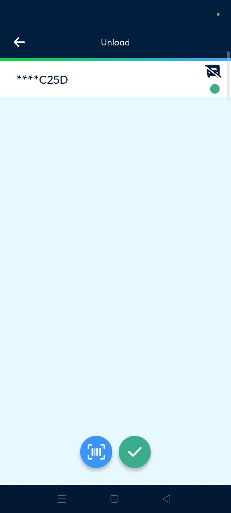
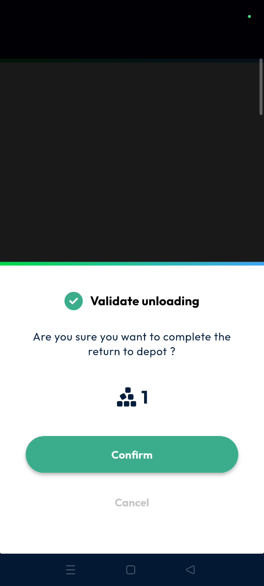
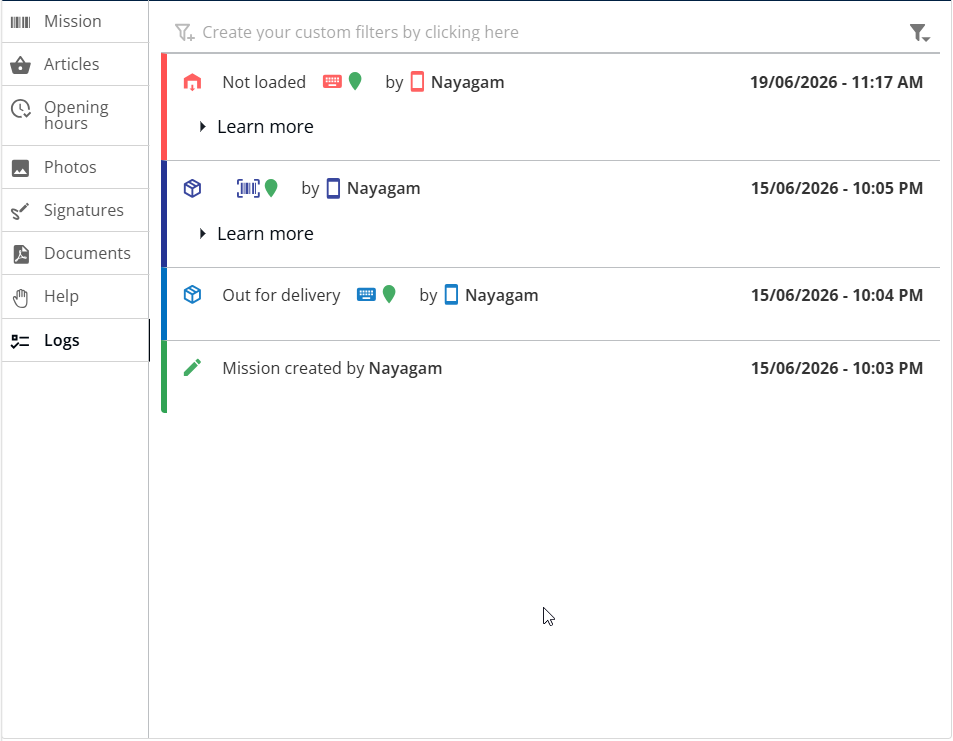

# Unload

The Unload feature allows drivers to return undelivered parcels to the depot or port efficiently. It ensures accurate inventory tracking by updating the parcel status in real-time for both the driver and the dispatcher,. Using this tool guarantees that every item is accounted for at the end of a route.

#### Getting Started

Prerequisites for using the unload feature:

* The mobile application must be open on the main screen.
* Parcels must be marked as undelivered to be eligible for unloading.
* A stable connection is required to sync status updates to the back office.
* Locate the **Main Actions** section on your mobile device.
* Tap the **Unload** button to start the return process.

<figure><figcaption></figcaption></figure>

#### Feature Overview

* **Unload**: Initiates the return flow for parcels that could not be delivered
* **Green Circle**: Indicates that a parcel has been successfully scanned and recognized by the system.&#x20;

#### How To: Unload Parcels

1. Tap the **Unload** button from the main actions menu.
2. Scan the barcode of the parcel you wish to unload.
3. Confirm that a small **Green Circle** appears next to the parcel entry.
4. Tap the **Tick Mark** once all desired parcels are scanned.

5. Select **Confirm** on the pop-up asking to "complete the return to the port."

6. Tap the **Edit Button** next to the package to verify the unloading status in the log.

<figure><figcaption></figcaption></figure>

#### Productivity Tips

* 💡 **Back Office Sync**: Dispatchers can see the unloading status immediately in the back office after the driver confirms.&#x20;
* ⚠️ **Verification Requirement**: Always look for the green circle after scanning to ensure the parcel is correctly logged for return.&#x20;
