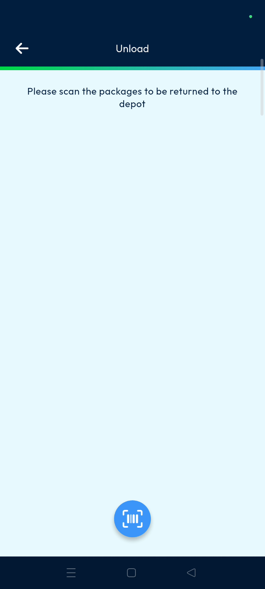
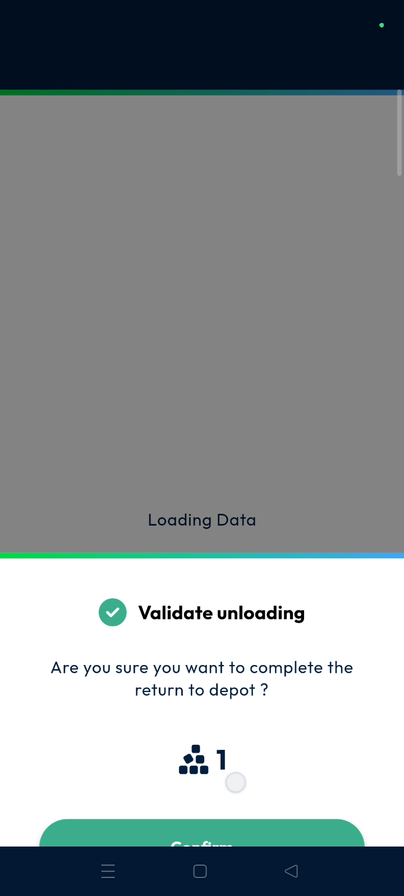
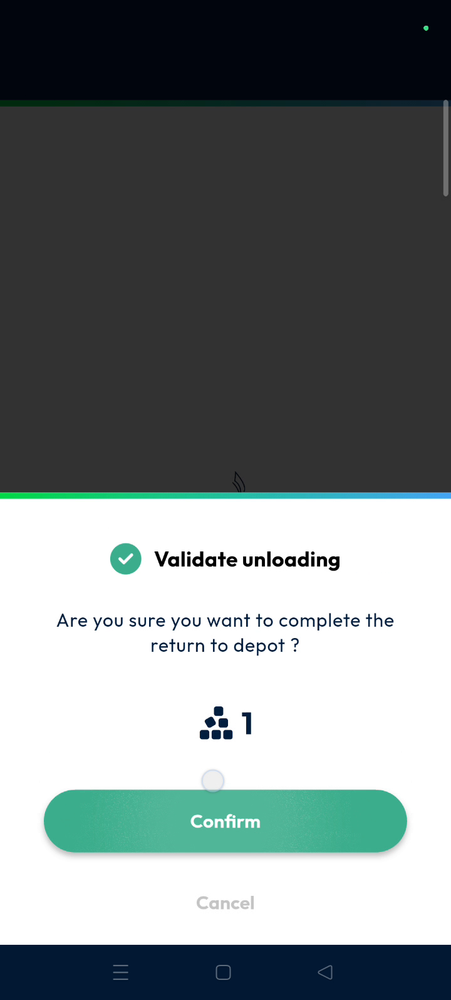
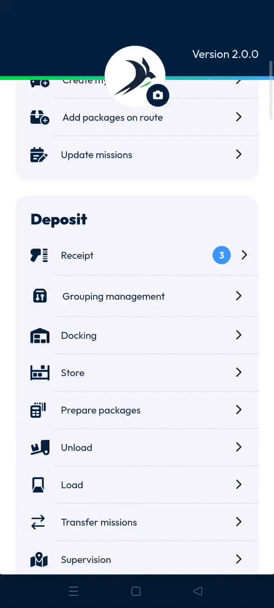
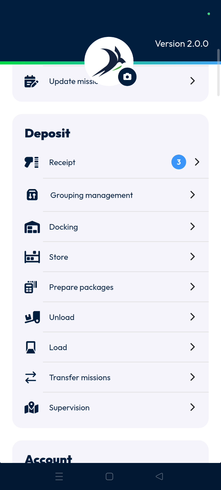

# unload
# mobile

The Unload feature allows drivers to return undelivered parcels to the depot or port efficiently. It ensures accurate inventory tracking by updating the parcel status in real-time for both the driver and the dispatcher,. Using this tool guarantees that every item is accounted for at the end of a route.

### Getting Started

Prerequisites for using the unload feature:
*   The mobile application must be open on the main screen.
*   Parcels must be marked as undelivered to be eligible for unloading.
*   A stable connection is required to sync status updates to the back office.

Steps to begin:
1. Locate the **Main Actions** section on your mobile device.

2. Tap the **Unload** button to start the return process.

### Feature Overview

*   **Unload**: Initiates the return flow for parcels that could not be delivered,.

*   **Green Circle**: Indicates that a parcel has been successfully scanned and recognized by the system,.

*   **Tick Mark**: Saves the current selection of scanned parcels and moves to the confirmation screen,.

*   **Confirm**: Finalizes the return action and updates the machine's log,.

*   **Edit Button**: Provides access to the detailed machine log for a specific package,.

### How To: Unload Parcels

1. Tap the **Unload** button from the main actions menu.

2. Scan the barcode of the parcel you wish to unload.

3. Confirm that a small **Green Circle** appears next to the parcel entry.

4. Tap the **Tick Mark** once all desired parcels are scanned.

5. Select **Confirm** on the pop-up asking to "complete the return to the port."

6. Tap the **Edit Button** next to the package to verify the unloading status in the log.

### Productivity Tips

*   💡 **Back Office Sync**: Dispatchers can see the unloading status immediately in the back office after the driver confirms,.
*   ⚠️ **Verification Requirement**: Always look for the green circle after scanning to ensure the parcel is correctly logged for return,.

