# unplanned_deliveries
# mobile

Manage parcels that have not yet been assigned to a delivery route using the unplanned delivery feature. This tool allows you to identify, load, and schedule unassigned packages into your daily delivery plan. By following these steps, you will ensure every parcel is accounted for and ready for dispatch,.

### Getting Started

To manage unplanned deliveries, ensure you have an active dispatcher account and your mobile device's camera is functioning for scanning.

*   Active Nomadia Delivery mobile application.
*   Parcels with valid barcodes or QR codes.
*   Assigned delivery routes available in the system.

1. Open the application and locate the **Main Action Screen**.

   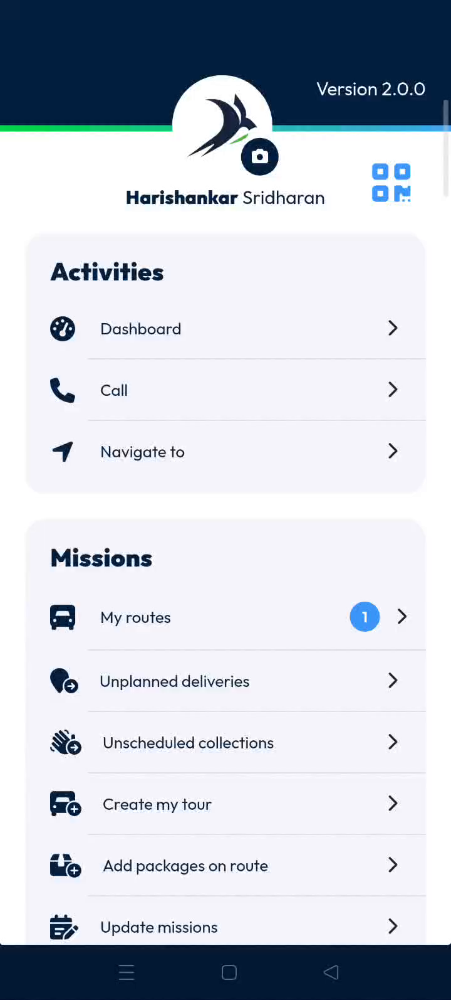

2. Tap **Unplanned Delivery** to view passes awaiting assignment.

   

### Feature Overview

*   **Unplanned Delivery Space**: Displays all parcels currently awaiting a route assignment in one central list,.

   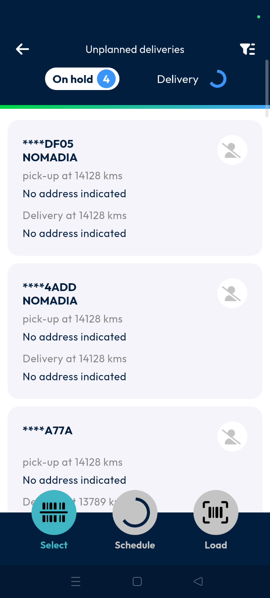

*   **Scan Icon**: Activates the camera to quickly identify a parcel by scanning its barcode,.

   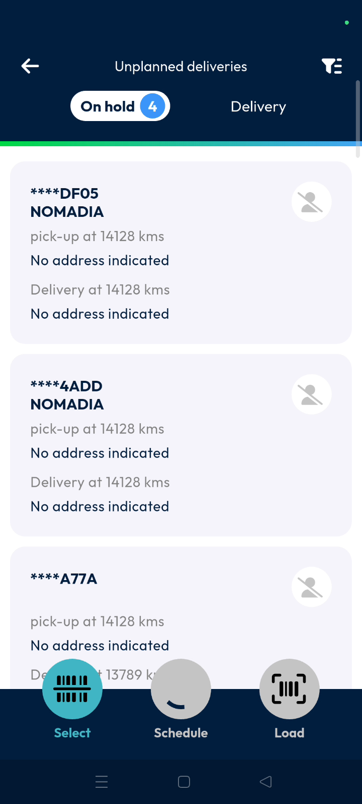

*   **QR Codes Icon**: Provides access to parcel management actions after a selection is made,.

   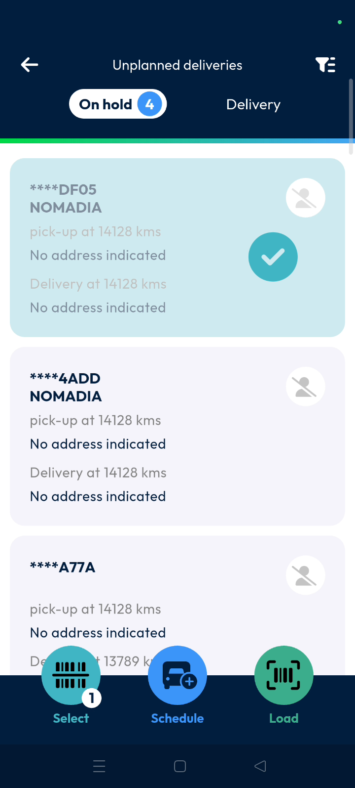

*   **Schedule**: Opens the date and route selection menu to assign selected parcels to the delivery plan,.

   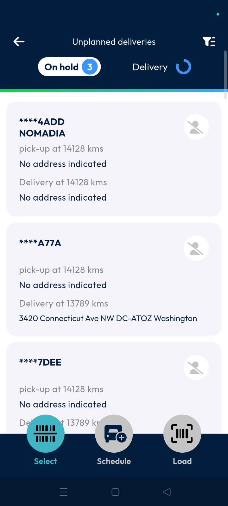

### How To: Load and Assign Unplanned Deliveries

#### Identifying and Loading Parcels
1. Tap the **Scan icon** and scan the parcel barcode for quick identification,.

   

2. Select a single parcel or multiple parcels from the list,.
3. Long press the parcel to open the action pop-up menu,.

   

4. Tap **Select a reason** from the options provided,.

   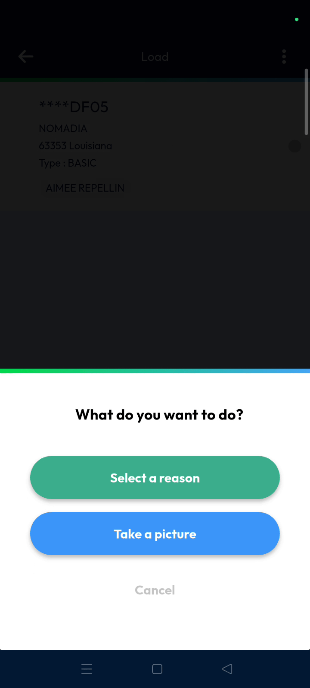

5. Tap **Load** to mark the parcel as ready for delivery,.

   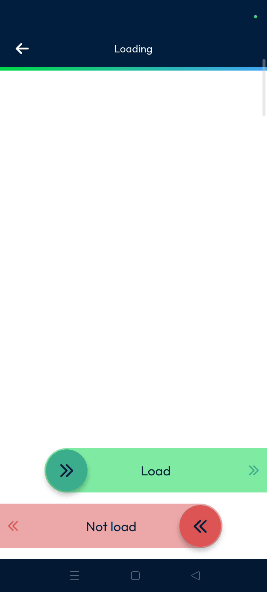

6. Tap the **Tick Mark** at the top of the screen,.

   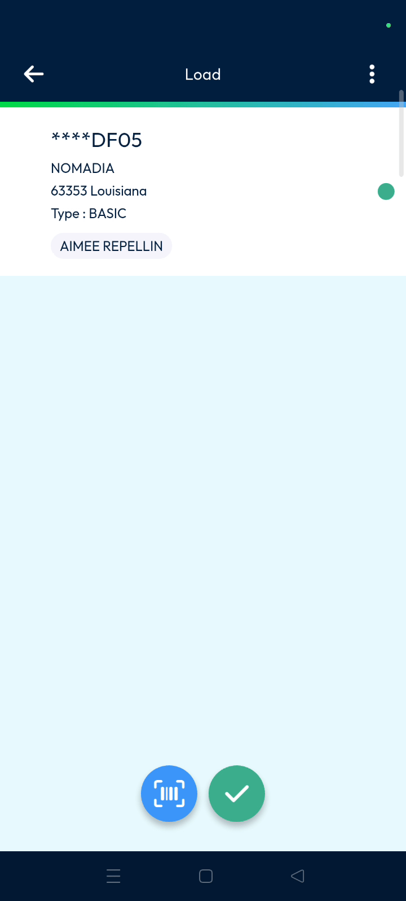

7. Tap **Confirm** when asked if you want to finish loading,.

   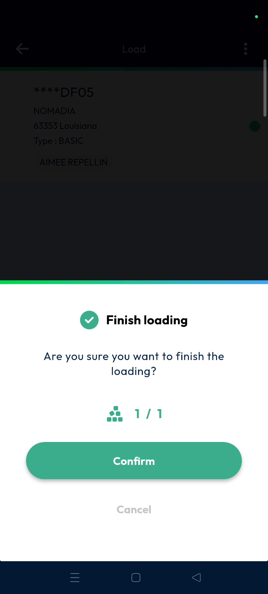

8. Tap **OK** on the status message to proceed to your first checkpoint,.

#### Assigning Parcels to a Route
1. Tap **Schedule** to begin the assignment process,.
2. Select the delivery date and tap **OK**,.

   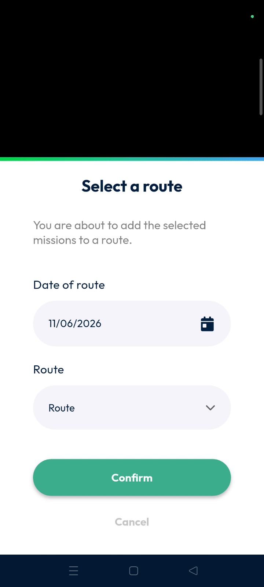

3. Select the desired route from the drop-down menu and tap **Confirm**,.

   

4. Tap **Confirm** again to validate the addition of the parcel to the route,.

   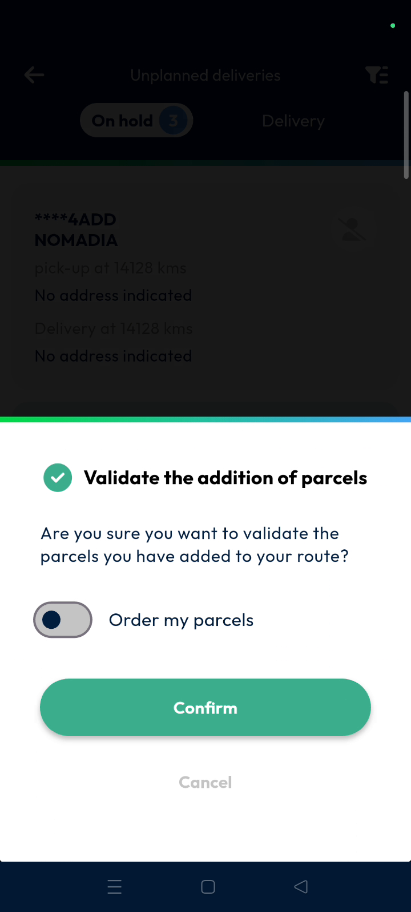

5. Tap **OK** on the final confirmation message,.

### Productivity Tips

- 💡 **Barcode Efficiency**: Use the scan icon to instantly find a specific parcel instead of scrolling through the list.
- 💡 **Bulk Processing**: Select multiple parcels at once to assign several deliveries to a route in a single action,.
- 💡 **Visual Verification**: Check for the small green circle next to a parcel to confirm it has been successfully loaded,.

