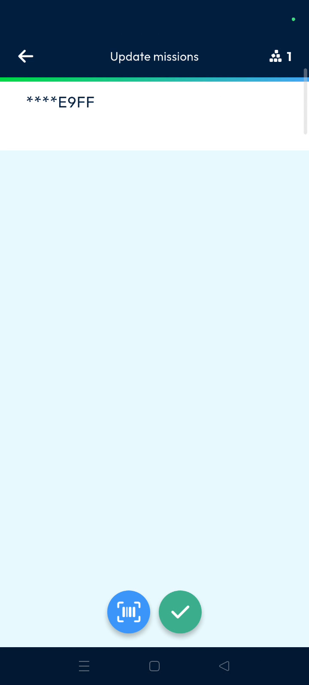
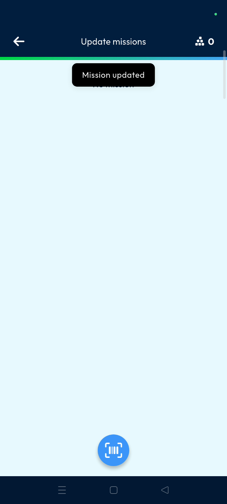
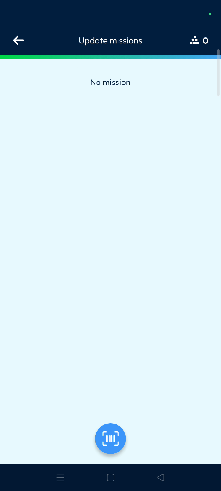
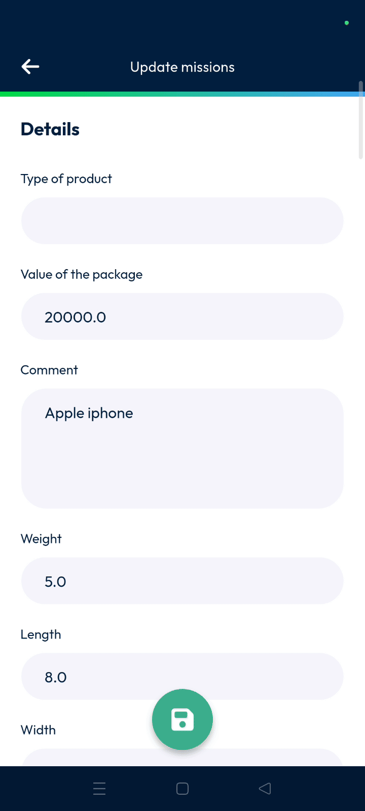
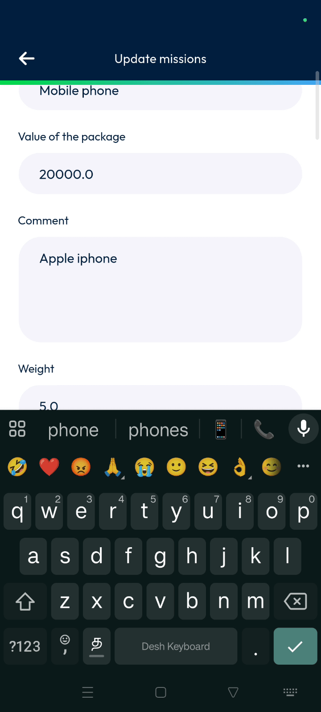

# update_missions
# mobile

The update missions feature allows users to modify mission information by scanning parcel barcodes directly on a mobile device. This streamlines the data entry process and ensures accurate records for dispatchers and planners. Users can quickly verify and save mission updates to keep the logistics system current.

### Getting Started

*   Mobile device with a functioning camera for scanning.
*   Authorized access to the **Nomadia Delivery** mobile application.

1. Open the mobile application and locate the **Main actions** menu.

2. Scroll down to find the **Update missions** option.

### Feature Overview

*   **Barcode scanner icon**: Launches the device camera to read parcel barcodes for mission identification.

*   **Tick mark**: Confirms the scanned item and proceeds to the detailed information page.

*   **Save**: Submits all changes made to the mission details to the database.

*   **Edit icon**: Located in the back office to view and verify the successful mission update.

### How To: Update a Mission

1. Tap on **Update missions** from the **Main actions** screen.

2. Tap the **Barcode scanner icon** to scan the parcel.

3. Tap the **Tick mark** to display the details page.

4. Enter the details that you want to update.

5. Tap on **Save** once you enter the required details.

### Productivity Tips

- 💡 **Verification**: View the updated mission page in the back office by tapping the **Edit icon** to confirm changes.

