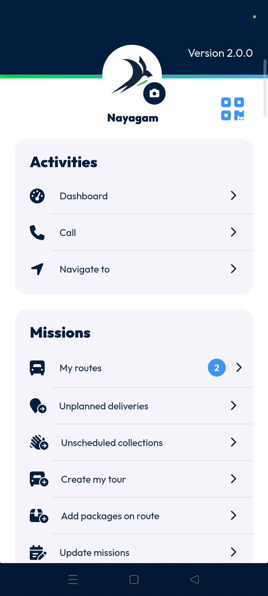
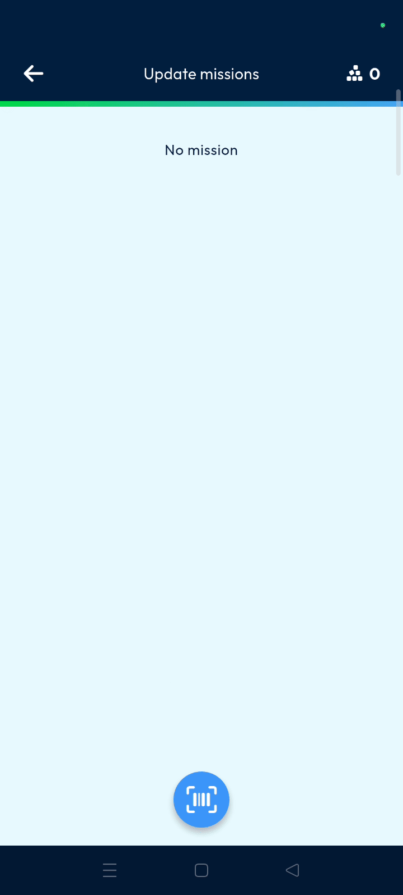
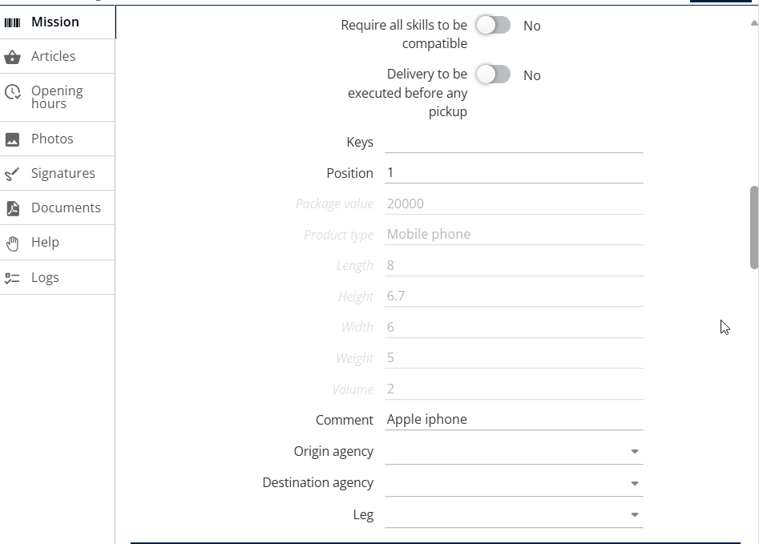

# Update Missions

The update missions feature allows users to modify mission information by scanning parcel barcodes directly on a mobile device. This streamlines the data entry process and ensures accurate records for dispatchers and planners. Users can quickly verify and save mission updates to keep the logistics system current.

#### Getting Started

* Mobile device with a functioning camera for scanning.
* Authorized access to the **Nomadia Delivery** mobile application.
* Open the mobile application and locate the **Main actions** menu.
* Scroll down to find the **Update missions** option.

#### Feature Overview

* **Barcode scanner icon**: Launches the device camera to read parcel barcodes for mission identification.
* **Tick mark**: Confirms the scanned item and proceeds to the detailed information page.
* **Save**: Submits all changes made to the mission details to the database.
* **Edit icon**: Located in the back office to view and verify the successful mission update.

#### How To: Update a Mission

1. Tap on **Update missions** from the **Main actions** screen.

2. Tap the **Barcode scanner icon** to scan the parcel.

3. Tap the **Tick mark** to display the details page.
4. Enter the details that you want to update.
5. Tap on **Save** once you enter the required details.

#### Productivity Tips

* 💡 **Verification**: View the updated mission page in the back office by tapping the **Edit icon** to confirm changes.

<figure><figcaption></figcaption></figure>
