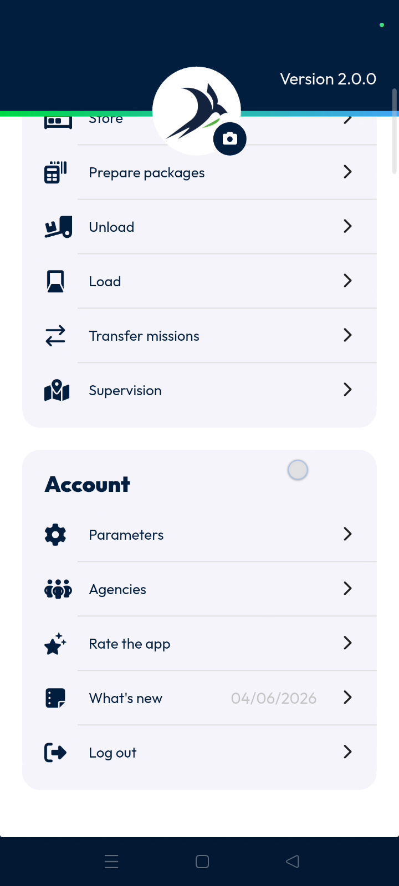
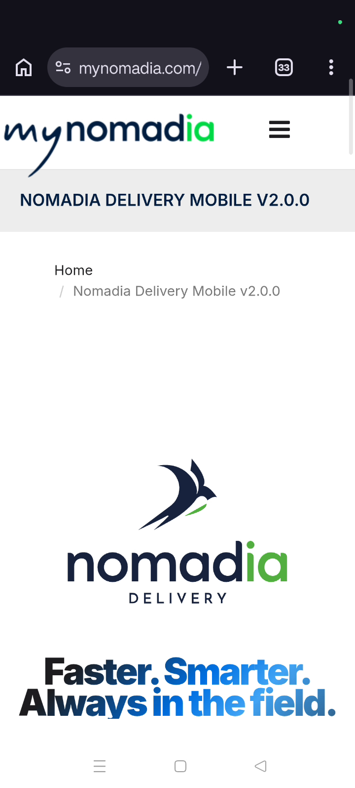
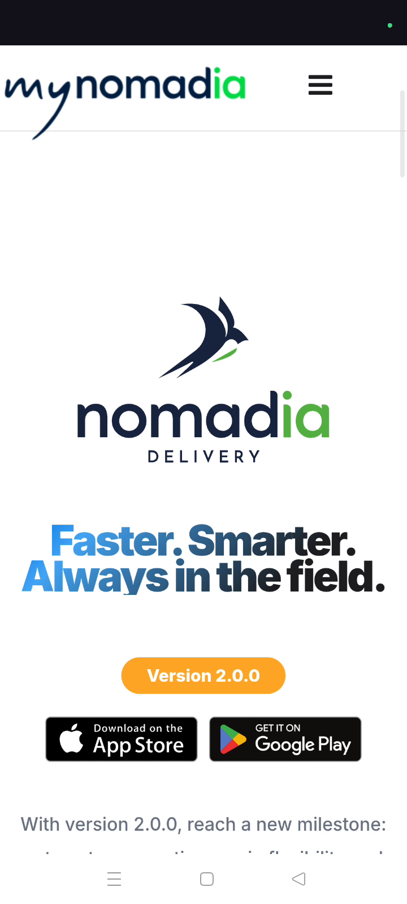

# what'snew
# mobile

The "What's New" feature provides users with immediate access to information regarding the latest product updates,. Planners and dispatchers can use this tool to stay informed about recent improvements made to **Nomadia Delivery**,. This ensures that the team is always aware of the most current software capabilities,.

### Getting Started

*   Access to the **Nomadia Delivery** mobile application,.
*   An active user account with permissions to view system updates,.

1.  Open the application to reach the **Main Actions** menu,.

### Feature Overview

*   **What's New**: This button navigates the user to the update summary screen,.

*   **Latest Update Page**: This screen displays all current feature descriptions and recent changes,.

### How To: Access Latest Updates

1.  Locate the **Main Actions** section at the top of the interface,.

2.  Tap down within the menu options,.

3.  Tap on the **What's New** option,.

4.  Review the **Latest Update Page** to see recent changes to **Nomadia Delivery**,.

### Productivity Tips

- 💡 **Stay Updated**: Regularly check this section to read about recent feature updates and optimize your workflow,.

