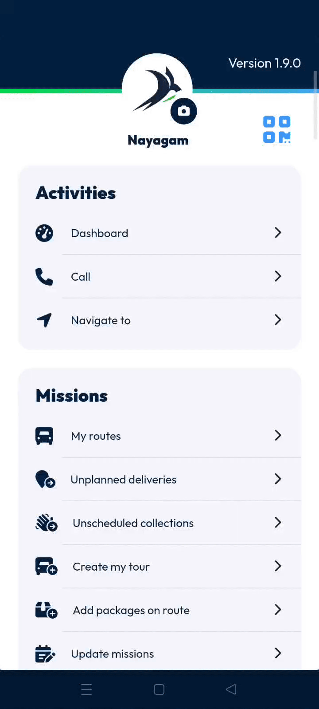

# Call

The contact management feature allows you to access and update your list of essential phone numbers. It ensures quick access to key contacts while you are in the field.

#### Getting Started

* Mobile device with **Nomadia Delivery** app installed.
* Active user account.
* Open the application to the **Main Action Screen**.

#### Feature Overview

* **Call Icon**: Opens the contact list for quick communication.
* **Contact Page**: Displays all previously configured phone numbers.

<figure><figcaption></figcaption></figure>

#### How To: Add a New Contact

1. Tap the **Call Icon** on the **Main Action Screen**.

2. Tap the **Plus Icon** at the bottom of the screen.
3. Enter the contact name in the **Name** box.
4. Enter the phone number in the **Phone Number** box.
5. Tap **Add** to save the information.

<figure><figcaption></figcaption></figure>

6. Tap the **X Icon** at the bottom to return to the **Main Action Screen**.

#### Productivity Tips

* 💡 **Quick Access**: Configured numbers allow for fast communication with important contacts.
* 💡 **Future Use**: Saved contacts remain in your list for all future tasks.
