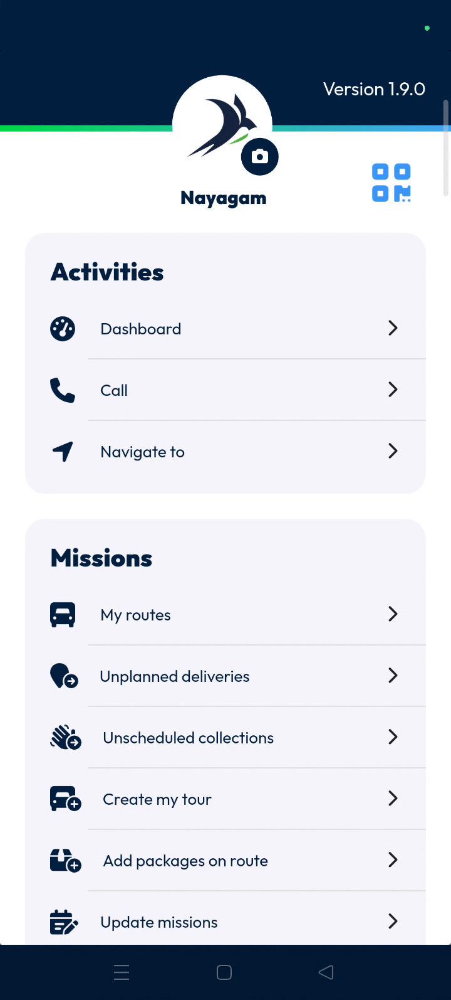

# Navigate to

The **navigate to** feature allows you to access and manage your saved navigation locations. Use this to quickly select destinations and streamline your route planning process.

#### Getting Started

* Ensure you have the Nomadia Delivery app installed.
* Log in to your account.
* Open the application to the **main action screen**.
* Tap the **navigate to** icon.

#### Feature Overview

* **Navigate To icon**: Opens the menu to view or add navigation points.
* **Where do you want to go page**: Displays all locations currently saved in the application.

#### How To: Add a New Destination

1. Tap the **navigate to** icon on the **main action screen**.

2. Tap the **plus button** at the bottom of the **where do you want to go** page.
3. Tap the **name field** and enter a location name.
4. Tap the **address field** and enter the destination address.
5. Tap **add** to save the new location.

6. Verify the new address appears in the list of available destinations.
7. Tap the **X button** at the bottom to return to the **main access page**.

#### Productivity Tips

* 💡 **Quick Navigation**: Save frequent destinations to the list for instant access during route execution.
* 💡 Location navigation to the agency is enabled by default in the app
