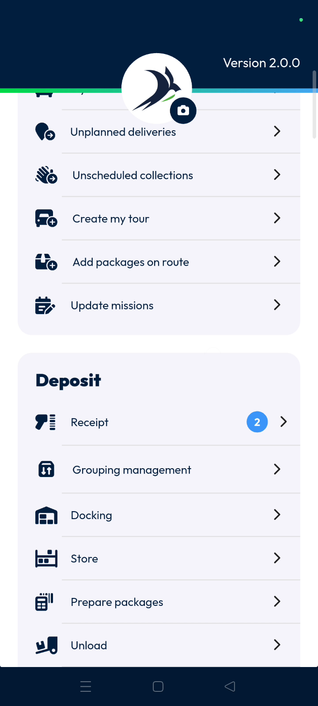
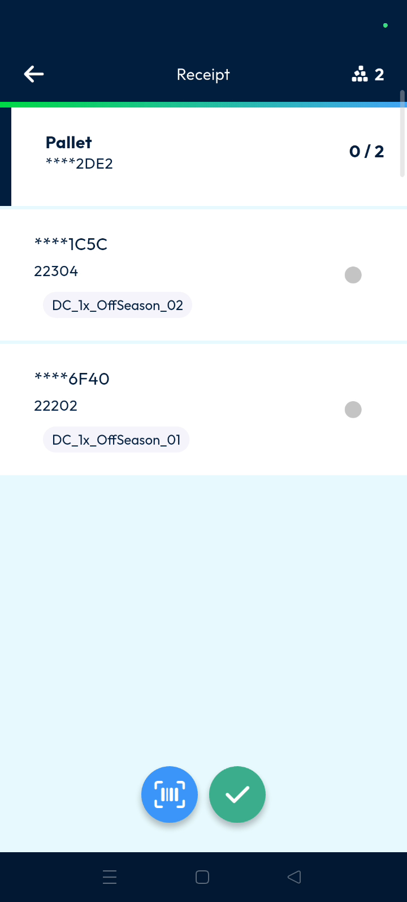
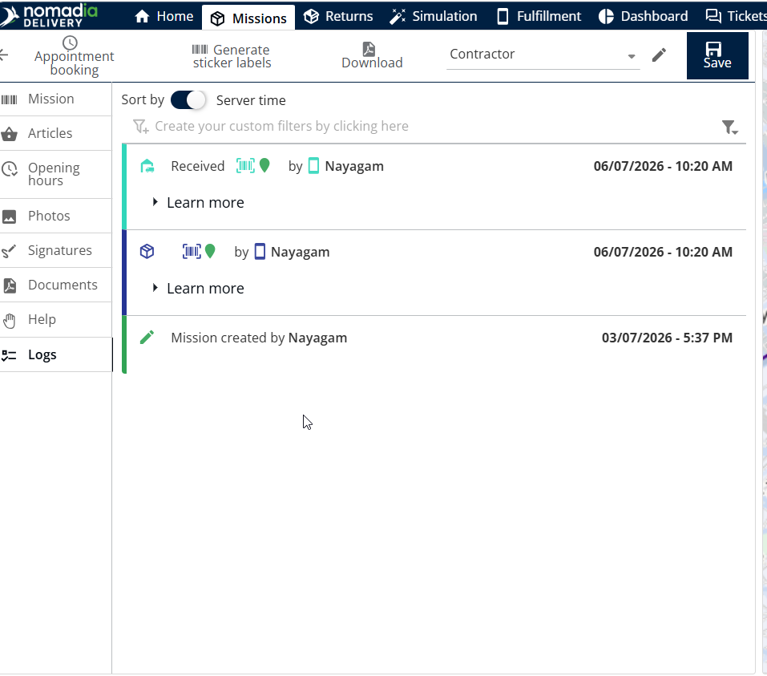
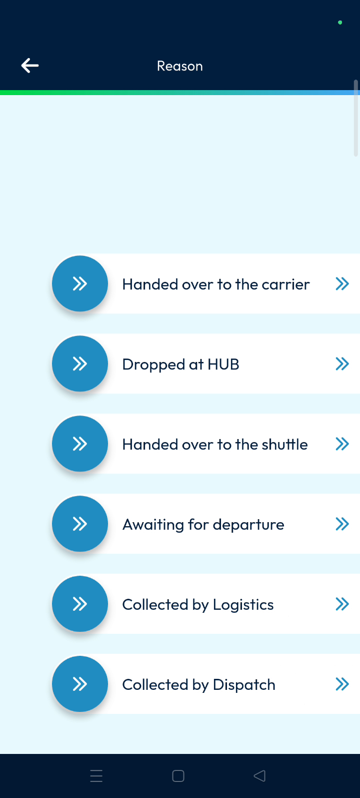
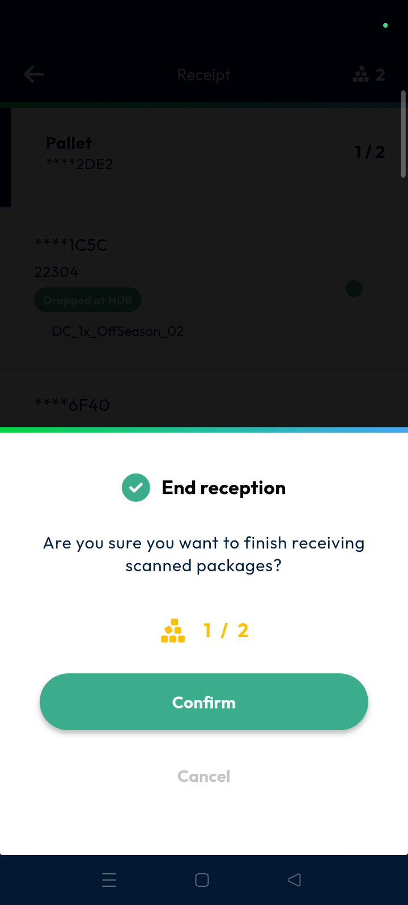
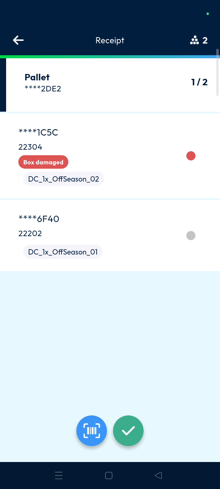
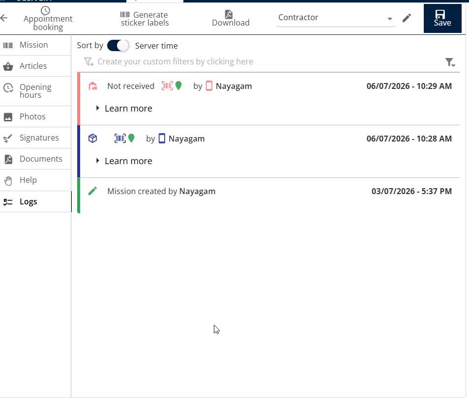

# Receipt

**Nomadia Delivery** Receipt is used to acknowledge parcels arriving at a hub, warehouse, airport, or agency. This feature ensures all incoming shipments are correctly logged and updated in the system. Users can quickly process large volumes of incoming freight through scanning or manual status updates.

#### Getting Started

* A mobile device with the **Nomadia Delivery** app installed.
* Required back-office configurations for sub-statuses.
* Scroll down to the **Receipt** option in the main action menu.
* Tap on **Receipt**.

#### Feature Overview

* **Multiple Receptions Page**: Displays the current list of receptions available for processing.
* **Barcode Scanner**: Uses the device camera to scan and identify parcels.
* **Sub Status**: Provides specific reasons for the receipt status based on company configuration.

#### How To: Scan a Parcel for Receipt

1. Tap the **Barcode Scanner**.
2. Scan the parcel barcode
3. Select the scanned parcel in the list.
4. Tap on the **Tick Mark**.

6. Tap **Confirm** on the pop-up stating "Are you sure you want to finish...".

7. Tap Confirm to acknowledge receipt of the package.
8. Once the package is scanned and confirmed, its status is updated to "**Received"** in the Back Office.

<figure><figcaption></figcaption></figure>

#### How To: Update Status Manually

1. Use this option when the physical barcode is unreadable or damaged.
2. Tap the **Barcode Scanner**.
3. Scan the parcel barcode.
4. Long press the parcel you wish to update.
5. Toggle the **Received** status.

6. Toggle the specific **Sub Status** required (e.g., "Drop the hub").

7. Tap the **Tick Mark**.
8. Tap **Confirm** on the confirmation pop-up.

9. The scanned package status is updated to **Received** in the Back Office when the **Manual Scan** sub-status is set to **Yes**.

<figure><figcaption></figcaption></figure>

#### How To: Record Damaged Parcels

1. Long press the target parcel.
2. Tap on **Not Received**.
3. Toggle a reason such as **Box Damaged** or **Product Damaged**.

4. Tap the **Tick Mark**.

5. Tap **Confirm** to finish the process.
6. The scanned package status is updated to **Not Received** in the Back Office.

<figure><figcaption></figcaption></figure>

#### Productivity Tips

* 💡 **Back Office Monitoring**: View all reception updates and machine logs in the back office immediately after confirmation.
* ⚠️ **Configuration Limits**: Sub-statuses are limited to what has been defined in your back-office configuration.
* ⚠️ **Mandatory Proof Collection**: Ensure all mandatory proof, such as customer signatures or photos, is captured according to the Back Office sub-status configuration.
