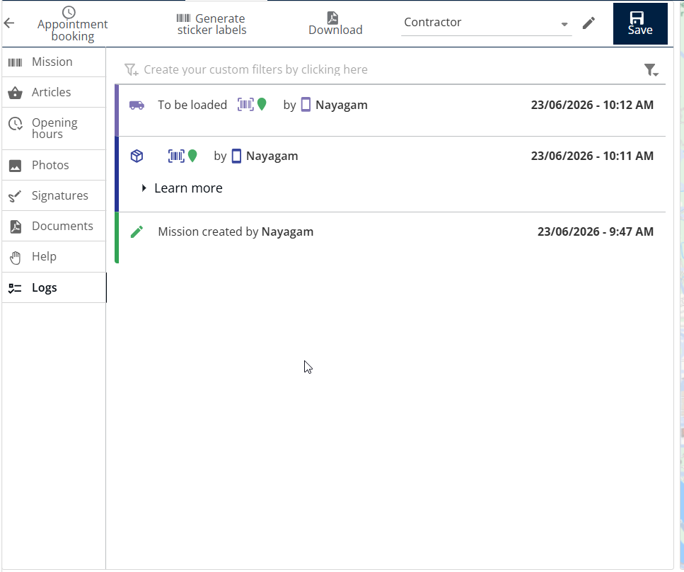

# Prepare Packages

Prepare Packages is used to organize and prepare parcels before they are loaded onto delivery routes. This feature helps warehouse and logistics teams ensure that parcels are ready for dispatch and correctly assigned for delivery operations.

Unlike Docking Area, Prepare Packages can be performed regardless of whether a route has been created. This provides greater flexibility for preparing parcels in advance and streamlining warehouse operations.

#### Getting Started

* Mobile device with the Nomadia Delivery app installed.
* Access to the Main Actions menu.
* Parcels with scannable barcodes.
* Open the Nomadia Delivery app.
* Navigate to the **Main Actions** screen.
* Tap **Prepare Packages**.

#### Feature Overview

**Barcode Scanner**: Use the barcode scanner to scan parcel identifiers and add them to the preparation process.

**Package Validation Indicator**: A visual indicator confirms that a parcel has been successfully scanned and prepared.

**Confirmation Action**: Allows users to validate and complete the package preparation process.

**Back Office Tracking**: Prepared packages can be monitored from the Back Office for operational visibility and tracking.

#### How To: Prepare Packages

1. Tap **Prepare Packages** from the Main Actions menu.

<figure><figcaption></figcaption></figure>

2. Tap the **Barcode Scanner** icon.
3. Scan the parcel barcode(s) that need to be prepared.
4. Verify that the parcel has been successfully added to the preparation list.

<figure><figcaption></figcaption></figure>

5. Tap the **Tick Mark** to proceed.
6. Tap **Confirm** to complete the package preparation process.

<figure><figcaption></figcaption></figure>

7. A confirmation message appears indicating that the packages have been successfully prepared.

<figure><figcaption></figcaption></figure>

#### Productivity Tips

#### 💡 Prepare Packages vs. Docking Area

Understanding the difference between these two features helps you choose the correct workflow:

* **Docking Area** can only be used when a route is available and parcels need to be assigned to a specific route for a particular day.
* **Prepare Packages** can be used whether a route exists or not, allowing parcels to be prepared in advance before route planning is completed.

#### 💡 Back Office Verification

Verify the prepared package status in the Back Office to ensure that all parcels have been successfully processed and are ready for the next stage of the delivery workflow.

<figure><figcaption></figcaption></figure>
