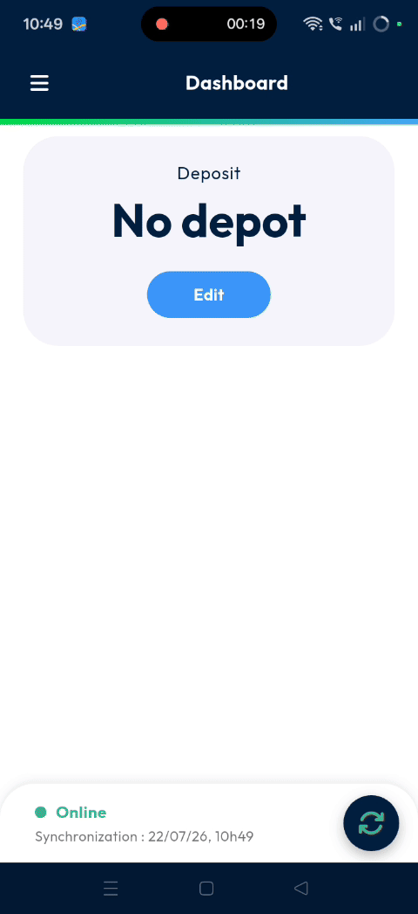
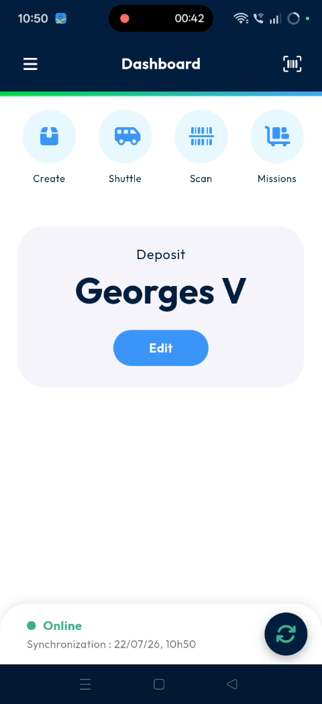
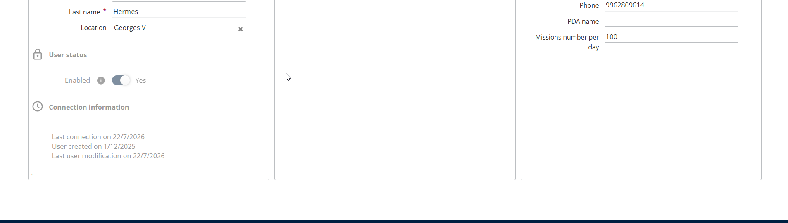

# Assign the Depot

This feature allows you to assign a specific depot or building to a user profile through the mobile application, It ensures that building assignments stay consistent by synchronizing data between the app and the back office, Using this tool helps dispatchers maintain accurate location records for all field personnel.

#### Getting Started

* Active login credentials for the **Nomadia Delivery** mobile application.&#x20;
* Access to the back office management portal to verify assignments.&#x20;
* Open the mobile application and enter your login details.&#x20;

#### Feature Overview

* **No depot**: Displays on the dashboard when a user has no building currently assigned.&#x20;
* **Edit**: Opens the selection menu to choose a building from the assigned list.&#x20;
* **Manage Users**: The back office section where you can view and confirm user location assignments.&#x20;
* **Location**: The specific field in the back office that displays the synchronized building name.&#x20;

#### How To: Assign a Depot

1. Log in to the mobile application.&#x20;
2. Locate the **no deport** option on the **Dashboard.**&#x20;
3. Tap the **Edit** option located directly under **no deport.**&#x20;

4. Review the list of buildings that have been assigned to your account.&#x20;
5. Select a building name, such as **Georges V.**&#x20;

6. Verify that the selected building name now appears on the **Dashboard** page.&#x20;

#### How To: Verify Assignment in Back Office

1. Access the back office portal and click on **Manage Users.**&#x20;
2. Click on the specific user you want to check.&#x20;
3. Locate the **Location** field to confirm it matches the building selected in the mobile app.&#x20;

<figure><figcaption></figcaption></figure>

#### Productivity Tips

* 💡 **Automatic Syncing**: Building selections made in the mobile app update the back-office location field automatically.&#x20;

